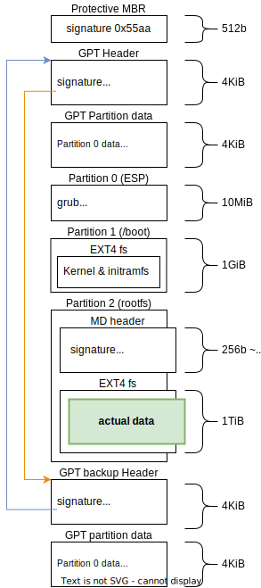

## Introduction

The path from firmware to userland is surprisingly {^complex|consisting of many different and connected parts} and there are _many_ details which are critical for this process to succeed.


In this post I'll explain as many details as possible when booting a fairly standard system with `ESP`, `/boot` and `/` partitions, which has the `/` partition configured with software [RAID](https://en.wikipedia.org/wiki/RAID):


We'll investigate:

- [EDK2](https://github.com/tianocore/edk2): UEFI reference implementation
- [GRUB2](https://www.gnu.org/software/grub/): Bootloader
- [Linux](https://www.kernel.org/): Kernel
- [mdadm](https://en.wikipedia.org/wiki/Mdadm): Software raid implementation

Sadly, not all of these are hosted in a way that I can link to references in a stable way (mostly, released as tarballs). In those cases, I'm going to link to a third-party mirror[^hosting].

[^hosting]: this post includes enough rabbit holes, I didn't want to _also_ go explore how to host these sources in a nice way.

## Storage devices

Storage in computers relies on physical disks, which are usually divided in two[^storage-types] types: mechanical hard drives (with spinning platters which store data magnetically; and solid-state drives (SSDs) which use flash memory for faster access times and improved reliability.

[^storage-types]: You can also have floppy disks, cd-roms, tape, or anything really, but it's not really important here.

Linux exposes these storage devices through the "block I/O layer", which represents storage media as sequences of fixed-size blocks, typically 512 bytes or 4KB in size.

Access to the block layers happens through [device files](https://en.wikipedia.org/wiki/Device_file) which are represented in `/dev` (usually `/dev/sdX` for SATA/SAS drives, `/dev/nvmeXnY` for NVME drives, but you can also find `hdX`, `fdX`, `cdromX`, ...).

These devices are identified as [block devices](https://en.wikipedia.org/wiki/Device_file#Block_devices) during initialization by their respective drivers, which create the device files with type [S\_IFBLK](https://github.com/torvalds/linux/blob/v6.10/include/uapi/linux/stat.h#L13)


## Firmware initialization

x86-64 computers require device-specific [firmware](https://en.wikipedia.org/wiki/Firmware) to perform hardware initialization during power-on, so that they can load the operating system and hand over execution.

There are two standardized types of firmware to handle the [booting](https://en.wikipedia.org/wiki/Booting) process: [(Legacy) BIOS](https://en.wikipedia.org/wiki/BIOS) and [UEFI](https://en.wikipedia.org/wiki/UEFI).

### BIOS

The boot process on Legacy BIOS (1981) is _very_ simple and I won't go into much detail.

BIOS will iterate through all devices and validate whether they are bootable by checking if they have a [Master Boot Record](https://en.wikipedia.org/wiki/Master_boot_record) on the first sector (which is defined as 512 bytes, even if modern devices have non-512b-sectors)

Whether there's an MBR present or not is defined by finding the MBR signature (`0x55 0xAA`) as the last two bytes in the sector. The layout is also quite simple:


If indeed there's an MBR on the disk, the code will be mapped at the physical address `0x7C00`, then BIOS will `jmp` there, good luck!

BIOS is very simple but also _quite_ limited. Having only 16 bytes of information per partition limits their maximum size to 2TiB (along with a maximum of 4 partitions). The small bootstrap area (446 bytes of code is not a lot, even with x86's dense instruction format) requires multiple stages of boot loaders to be chained.

### UEFI

Given the limitations of BIOS, Intel started UEFI [in ~2005](https://en.wikipedia.org/wiki/UEFI#History)[^started[^started]], which _did_ overcome all of these limitations, but also became a _massive beast_[^beast] .

[^started]: they actually started EFI "in the 1990s" but it didn't really take off
[^beast]: The [specification](https://uefi.org/sites/default/files/resources/UEFI_Spec_2_10_Aug29.pdf) is 2145 pages, and mentions things like "bytecode virtual machine", "HTTP Boot", "Bluetooth", "Wi-Fi", "IPsec".


At system power-on, the firmware needs to determine which disk to boot from, so it will check a set of variables (`BootOrder`, `Boot####`) in {^NVRAM|Non-volatile RAM} for a pre-defined boot order (using [gRT->GetVariable()](https://uefi.org/specs/UEFI/2.10/08_Services_Runtime_Services.html#variable-services)).

If no valid boot order is stored in NVRAM, then UEFI will enumerate all connected storage devices by calling `LocateHandle()` with a `SearchType` of `EFI_BLOCK_IO_PROTOCOL`.

Once a disk is selected for booting, the firmware reads the [GUID Partition Table (GPT)](https://en.wikipedia.org/wiki/GUID_Partition_Table) header.


The first 512 bytes of the disk _usually_ contain a "protective" MBR, whose only purpose is to prevent old tools from considering the drive empty (and potentially overwriting data). This is not necessary.

The second **logical block** (LBA 1) contains the GPT header; there's also a backup GPT header at the very end of the disk.


So, we are at a point that UEFI has:

1. Initialized the hardware sufficiently to enumerate all block devices
2. Filtered said devices down to the ones with a valid GPT header
3. Picked a device to boot based on user preference (choice saved to NVRAM) or other algorithm (usually "first valid device")

How does UEFI find the bootloader?

First, it looks for EFI System Partition (ESP) on the disk, which has the GUID `C12A7328-F81F-11D2-BA4B-00A0C93EC93B`.

This partition **must** be formatted as [FAT (12, 16 or 32)](https://uefi.org/specs/UEFI/2.10/13_Protocols_Media_Access.html#file-system-format) (which is probably good, FAT is very simple).

Inside that GUID-tagged, FAT-formatted partition, it will look for a file in the path `\EFI\BOOT\BOOTX64.EFI` (_obviously_, the filename is architecture dependent)[^bootloader-filename].

[^bootloader-filename]: The filename (or a fallback) _may_ be configured in some UEFI implementations, but you can't depend on it, so everyone uses the default.

UEFI will load that file, which is a bootloader[^bootloader] (in our case, this is GRUB2) in [Portable Executable](https://en.wikipedia.org/wiki/Portable_Executable) format,  in memory and prepare to execute it.

[^bootloader]: sometimes you don't need a bootloader, such as when using the [EFI Boot Stub](https://docs.kernel.org/admin-guide/efi-stub.html), running UEFI applications or "hobby" kernels (which are usually UEFI applications).


### The bootloader

In a UEFI system, the bootloader must be a [Position Independent Executable](https://en.wikipedia.org/wiki/Position-independent_code) (PIE), as there is no guarantee of the physical address at which it will be loaded.

When the bootloader is executed, it's still running in the UEFI environment, so it must be careful to not clobber any of UEFI's state, which is defined in a `MemoryMap` and can be obtained by calling the [GetMemoryMap](https://uefi.org/htmlspecs/ACPI_Spec_6_4_html/15_System_Address_Map_Interfaces/uefi-getmemorymap-boot-services-function.html) service.

Allocations should be performed with the [AllocatePages](https://uefi.org/specs/UEFI/2.10/07_Services_Boot_Services.html?highlight=getmemorymap#efi-boot-services-allocatepages) or [AllocatePool](https://uefi.org/specs/UEFI/2.10/07_Services_Boot_Services.html?highlight=getmemorymap#id16) boot services so UEFI has an up to date view on memory usage and does not clobber GRUB's data.

Once GRUB is loaded, it will load its configuration from `$PREFIX/grub.cfg` (prefix is set at build time) which looks something like this:

```
search.fs_uuid 7ce5b857-b91e-4dab-a23c-44b631e6ebab root 
set prefix=($root)'/grub'
configfile $prefix/grub.cfg
```

This configuration must be placed next to the GRUB image (executable), in the ESP.

So, what does GRUB do once this configuration is read? It will scan all block devices for a partition with a matching UUID, then load a new configuration.

But how do you identify the correct partition?

From the GPT header, We know the start & end of every partition, and _very conveniently_ filesystems usually implement a concept of [Super Block](https://en.wikipedia.org/wiki/Unix_File_System#Design), which places significant metadata at a static position within the block, both for self-reference and external identification.

Each filesystem, however, places this information at different offsets[^multi-fs], so we need an initial way of identifying the filesystem, and we can do so through their identifying [Magic numbers](https://en.wikipedia.org/wiki/Magic_number_(programming)) which are defined in their documentation

[^multi-fs]: What happens if you plop down multiple superblocks on the same block device?

|Filesystem|Offset|Magic value|Docs|
|----------|------|-----------|----|
|XFS|  `0x00000` |`"XFSB"` |[link](https://righteousit.com/2018/05/21/xfs-part-1-superblock/) (didn't find official doc)|
|Ext4| `0x00438` |`0xEF53` |[link](https://ext4.wiki.kernel.org/index.php/Ext4_Disk_Layout#The_Super_Block)|
|BTRFS|`0x10040` |`"_BHRfS_M"` |[link](https://archive.kernel.org/oldwiki/btrfs.wiki.kernel.org/index.php/On-disk_Format.html#Superblock)|


When looking at the second partition on my disk

```bash
$ dd if=/dev/nvme0n1p2 bs=1 count=$((1024+64)) | hexdump
00000000  00 00 00 00 00 00 00 00  00 00 00 00 00 00 00 00
*
00000400  00 60 d1 01 00 0a 45 07  4c 0d 5d 00 df 77 7f 02
00000410  b0 01 93 01 00 00 00 00  02 00 00 00 02 00 00 00
00000420  00 80 00 00 00 80 00 00  00 20 00 00 3f d1 09 65
00000430  1f cd b0 63 82 00 ff ff  53 ef 01 00 01 00 00 00
                                   ^^ ^^
```

we can see the `0x53 0xef` (little endian) on the last row, so this is an EXT4 filesystem.

On EXT4 we can find the UUID at `0x468` (`0x68` within the superblock, 1128 in decimal)

```bash
$ dd if=/dev/nvme0n1p2 bs=1 count=16 skip=1128 | hexdump
7c e5 b8 57 b9 1e 4d ab  a2 3c 44 b6 31 e6 eb ab
```

which matches the UUID in GRUB configuration, so this must be the partition we are looking for (and indeed, it is my `/boot` partition).

Through the magic of an EXT4 implementation, GRUB will traverse the filesystem and find the second level configuration, which looks something like this (trimmed):


```bash
menuentry 'Linux'  {
        #       v path to kernel          v cmdline
        linux   /vmlinuz-6.8.0-40-generic root=UUID=9c5e17bc-8649-40db-bede-b48e10adc713
        #       v path to initrd
        initrd  /initrd.img-6.8.0-40-generic
}
```

In the config we see 3 things:

- The kernel image (`/vmlinuz-6.8.0-40-generic`): Kernel that we are booting
- The [kernel cmdline](https://www.kernel.org/doc/html/v6.10/admin-guide/kernel-parameters.html): Boot-time parameters to the kernel
- The [initrd](https://docs.kernel.org/admin-guide/initrd.html): A root filesystem to mount in a RAM-disk, to bootstrap the real root filesystem.


## Loading the kernel and initrd

GRUB will load the kernel image (`vmlinuz-6.8.0-40-generic`) at [LOAD\_PHYSICAL\_ADDR](https://github.com/torvalds/linux/blob/v6.10/arch/x86/include/asm/page_types.h#L35) (which is `0x100_000` = 1MB, based on [the boot protocol](https://www.kernel.org/doc/html/v6.3/x86/boot.html#loading-the-rest-of-the-kernel))

GRUB also needs to load the initrd somewhere, and while any address is valid, GRUB prefers [as high as possible](https://chromium.googlesource.com/chromiumos/third_party/grub2/+/11508780425a8cd9a8d40370e2d2d4f458917a73/grub-core/loader/i386/linux.c#1104)[^grub-loading-addr].

[^grub-loading-addr]: I assume this is due to historical reasons, when booting in real mode, the CPU can only access 1MiB memory, and placing the kernel as high as possible limits memory fragmentation

How does the kernel find out the address and size for the initrd and cmdline arguments?

Again, it's specified in the [boot protocol](https://www.kernel.org/doc/html/v6.3/x86/boot.html#id1) &mdash; the [Kernel's Real Mode header](https://www.kernel.org/doc/html/v6.3/x86/boot.html#the-real-mode-kernel-header) must be read from the kernel image (at offset `0x1f0`) and written back _somewhere_, with updated fields for cmdline/initrd addresses (among others).

But if the header is somewhere, _again_, how does the kernel find it? Well, GRUB must place the **physical** address of the header in the `rsi` register before jumping into kernel code.

### Transferring control to the kernel

In 64-bit boot protocol, the kernel's [entry point](https://github.com/torvalds/linux/blob/v6.1/arch/x86/boot/compressed/head_64.S#L336) is at a fixed offset: `0x200`.

How does the kernel load the initrd?

During [early initialization](https://github.com/torvalds/linux/blob/v6.10/arch/x86/kernel/head_64.S#L420), the kernel will save the `rsi` register into `r15`, which is callee-saved.

After the early initialization is done, the kernel will copy [r15 to rdi](https://github.com/torvalds/linux/blob/v6.10/arch/x86/kernel/head_64.S#L415) (because `rdi` is the first argument to a function in the then [System V calling convention](https://en.wikipedia.org/wiki/X86_calling_conventions#System_V_AMD64_ABI)), then it will `call` [x86\_64\_start\_kernel](https://github.com/torvalds/linux/blob/v6.10/arch/x86/kernel/head_64.S#L420), which is the `C` entrypoint of the kernel.

From there we are on more familiar land, and the kernel will eventually call `copy_bootdata(__va(real_mode_data));` (here `__va` will get the virtual address from a physical address).

`copy_bootdata`, finally, will copy the kernel cmdline and the boot params (which include the initrd address) onto kernel-managed memory.

At this point, the kernel will finally call `start_kernel()` and the non-platform-specific kernel code will start executing.

Eventually, [do\_populate\_rootfs](https://github.com/torvalds/linux/blob/v6.1/init/initramfs.c#L699) is called[^populate-rootfs], after which, the kernel will call `run_init_process(ramdisk_execute_command);`[^rdinit], and we are on (crude) userland!


[^populate-rootfs]: I'm not super clear on how the `__init` calls get scheduled for modules, I see that `rootfs_initcall` generates a function in a specific section, but what ends up calling it?

[^rdinit]: `ramdisk_execute_command` defaults to `/init` but can be overridden in `rdinit_setup`, which looks at the `rdinit=` [kernel commandline argument](https://www.kernel.org/doc/html/v4.14/admin-guide/kernel-parameters.html)

## Early userspace

We are on _a_ PID1, but it's not a _good_ PID1 &mdash; we are in a ramdisk with limited utility; the goal of the initrd is, usually[^alternative-initrds], to perform some bootstrapping action and pivot to a useful workload as soon as possible, so let's see what that looks like.

[^alternative-initrds]: There are use cases for initrds which never pass on to a real userland, for example: [flashing an OS from an initramfs](/posts/flashing-linux-disk-images-from-an-initramfs/)

From the [GRUB config](#the-bootloader) we saw an interesting parameter in the kernel's commandline arguments:

```
linux   /vmlinuz-6.8.0-40-generic root=UUID=9c5e17bc-8649-40db-bede-b48e10adc713
```

`root`, meaning the root filesystem, and is tagged with `UUID=...`, so we get to go on another hunt for disks.

This time though, the previous table of filesystem magic identifier was not useful, when looking at the contents of the drive:

```hexdump
0000000 0000 0000 0000 0000 0000 0000 0000 0000
*
0001000 4efc a92b 0001 0000 0001 0000 0000 0000
...
0003000 0000 0000 0000 0000 0000 0000 0000 0000
*
8100400 e000 0095 7f00 0257 f98c 001d d553 023d
```

We see.. nothing useful?

Let me clarify, what this dump is trying to show is that there are only zeroes in the ranges `0x0000-0x1000` (xfs and ext4 place their signatures in this range) and `0x3000-0x8100400` (btrfs places its signature here), so this must be another way of storing data.

In this case, the root filesystem is on a RAID1 configuration using `mdadm`, how do we verify it? Another magic number table!

|Name|Offset|Magic value|Docs|
|----------|------|-----------|----|
|mdadm|  `0x1000` |`0xa92b4efc` |[link](https://raid.wiki.kernel.org/index.php/RAID_superblock_formats#Section:_Superblock.2F.22Magic-Number.22_Identification_area)|


We know we want to interact with the `md` module to assemble the virtual device, so we first need to load the module.

### Loading kernel modules

Kernel modules are stored as [ELF](https://en.wikipedia.org/wiki/Executable_and_Linkable_Format) (Executable and Linkable Format) files, which allows the kernel to:

- Verify the module's compatibility with the running kernel, by checking the `.modinfo` section
- Resolve symbols (function names, variables) between the module and the kernel
- Perform necessary relocations to load the module at any available kernel address

The userspace task of loading a module is relatively simple; we need to open the file and call the `finit_module` syscall on the file descriptor:

```rust
let file = File::open(path)?;
let fd = file.as_raw_fd();

let params_cstr = std::ffi::CString::new("module parameters")?;

unsafe {
    finit_module(fd, params_cstr.as_ptr() as *const c_char, 0)
};
```

Now the module is loaded, but how do we tell the module to create the virtual device?

First, we need to find the right disks among the sea of block devices, _conveniently_ the kernel will group them up for easy listing in `/sys/class/block`:

```bash
$ ls /sys
ls: cannot access '/sys': No such file or directory
```

Right. Initrd. Okay, we can mount the [sysfs](https://docs.kernel.org/filesystems/sysfs.html) with the `mount` syscall:

```c
unsigned long mountflags = 0;
const void *data = NULL;

mount("none", "/sys", "sysfs", mountflags, data);
```

Now we can actually look at the block devices

```bash
$ ls /sys/class/block
/sys/class/block/nvme0n1   -> ../../devices/pci0000:00/0000:00:03.1/0000:2b:00.0/nvme/nvme0/nvme0n1
/sys/class/block/nvme0n1p1 -> ../../devices/pci0000:00/0000:00:03.1/0000:2b:00.0/nvme/nvme0/nvme0n1/nvme0n1p1
/sys/class/block/nvme0n1p2 -> ../../devices/pci0000:00/0000:00:03.1/0000:2b:00.0/nvme/nvme0/nvme0n1/nvme0n1p2
/sys/class/block/nvme0n1p3 -> ../../devices/pci0000:00/0000:00:03.1/0000:2b:00.0/nvme/nvme0/nvme0n1/nvme0n1p3
/sys/class/block/nvme0n1p4 -> ../../devices/pci0000:00/0000:00:03.1/0000:2b:00.0/nvme/nvme0/nvme0n1/nvme0n1p4
/sys/class/block/nvme1n1   -> ../../devices/pci0000:00/0000:00:03.2/0000:2c:00.0/nvme/nvme1/nvme1n1
/sys/class/block/nvme1n1p1 -> ../../devices/pci0000:00/0000:00:03.2/0000:2c:00.0/nvme/nvme1/nvme1n1/nvme1n1p1
/sys/class/block/nvme1n1p2 -> ../../devices/pci0000:00/0000:00:03.2/0000:2c:00.0/nvme/nvme1/nvme1n1/nvme1n1p2
/sys/class/block/nvme1n1p3 -> ../../devices/pci0000:00/0000:00:03.2/0000:2c:00.0/nvme/nvme1/nvme1n1/nvme1n1p3
/sys/class/block/nvme1n1p4 -> ../../devices/pci0000:00/0000:00:03.2/0000:2c:00.0/nvme/nvme1/nvme1n1/nvme1n1p4

```

but which ones make up the array?

Well, we can look at the first few kilobytes of each and check if they have a valid [superblock](https://raid.wiki.kernel.org/index.php/RAID_superblock_formats#The_version-1_superblock_format_on-disk_layout), which looks something like this:

```rust
pub struct MdpSuperblock1 {
    pub array_info: ArrayInfo,
    pub device_info: DeviceInfo,
    // ...
}
#[repr(C, packed)]
pub struct ArrayInfo {
    pub magic: u32,
    pub major_version: u32,
    set_uuid: [u8; 16],
    set_name: [u8; 32],
    ctime: u64,          // /* lo 40 bits are seconds, top 24 are microseconds or 0*/
    pub level: u32,      /* -4 (multipath), -1 (linear), 0,1,4,5 */
    pub layout: u32,     /* used for raid5, raid6, raid10, and raid0 */
    pub size: u64,       // in 512b sectors
    pub chunksize: u32,  // in 512b sectors
    pub raid_disks: u32, // count
    // ...
}
#[repr(C)]
pub struct DeviceInfo {
    pub data_offset: u64,
    pub data_size: u64,
    pub super_offset: u64,
    pub dev_number: u32,
    pub device_uuid: [u8; 16],
    // ...
}
// Other structs omitted
```

If we interpret the byte range `0x1000-0x1064` as an `ArrayInfo`, we can validate (through the Superblock `magic`) whether the block device is in fact a member of a software RAID, and if yes, member of _which_ array by reading the UUID.

In this case, `nvme0n1p3` and `nvme1n1p3` are members of the array with UUID `3373544e:facdb6ce:a5f48e39:c6a4a29e`.

Having identified the devices, and the properties of the array (2 disks in RAID1), how do we assemble it? I could say `mdadm --assemble`, but I am no chicken.

Due to [_reasons_](https://docs.kernel.org/driver-api/ioctl.html) Linux[^windows-ioctl] has implemented a cop-out syscall: `ioctl` (I/O Control) which allows encoding device-specific "driver calls" (in contrast to "system calls")

[^windows-ioctl]: Windows has the ~same idea with `DeviceIoControl`

In our case, we'll use `ioctl` to interact with the `md` (Multiple Devices) driver for array operations, as defined [in the docs](https://www.kernel.org/doc/html/v6.10/admin-guide/md.html#general-rules-apply-for-all-superblock-formats).

For any ioctl, we need an open file descriptor that is linked to the module, so we are going to make a device node with ["major" device number 0x9](https://www.kernel.org/doc/html/v6.10/admin-guide/devices.html):

```c
const char *devpath = "/dev/.tmp.md.150649:9:0";

mknodat(AT_FDCWD, devpath, S_IFBLK | 0600, makedev(0x9, 0));
int fd = openat(AT_FDCWD, devpath, O_RDWR | O_EXCL | O_DIRECT);
// fd is 4
```

To inform the `md` driver about the array composition we need to populate a struct `mdu_array_info_t`, [defined here](https://github.com/torvalds/linux/blob/v6.10/include/uapi/linux/raid/md_u.h#L73), with information gathered from the superblock (defined above as `ArrayInfo` and `DeviceInfo`), which we read from the block devices.

With this information, we can build the  which only requires basic information for the array (RAID level, disk count, present disks, etc).

We can inform the `md` driver about the array information

```c
const mdu_array_info_t array_info = {
  .major_version = 1,
  .minor_version = 2,
  .level = 1,
  .nr_disks = 2,
  // ...
};
ioctl(4, SET_ARRAY_INFO, &array_info);
```

Then, for each disk, we have to populate a struct `mdu_disk_info_t`, [defined here](https://github.com/torvalds/linux/blob/v6.10/include/uapi/linux/raid/md_u.h#L112); this struct is even more basic than the previous one.

```c
const mdu_disk_info_t disk_info = {
  .number = 0,
  .major = 7, // block device major number
  .minor = 1, // block device minor number
  .raid_disk = 0,
  .state = (1 << MD_DISK_SYNC) | (1 << MD_DISK_ACTIVE),
};
ioctl(4, ADD_NEW_DISK, &disk_info);
```

Then we start the array (confusingly, without populating the `mdu_param_t` struct):

```c
ioctl(4, RUN_ARRAY, NULL);
```

We can verify that the array is up[^procfs]:
```bash
$ cat /proc/mdstat
Personalities : [raid0] [raid1] [raid6] [raid5] [raid4] [raid10] 
md125 : active raid1 nvme1n1p3[0] nvme0n1p3[1]
      157154304 blocks super 1.2 [2/2] [UU]
      bitmap: 2/2 pages [8KB], 65536KB chunk
```

[^procfs]: mount `procfs` like we did with `sysfs`


Like before, we can now call the `mount` syscall to use our newly-assembled filesystem:

```c
unsigned long mountflags = 0;
const void *data = NULL;

mount("/dev/md125", "/rootfs", "ext4", mountflags, data);
```

## REAL userspace

Now we have all our lovely files at `/rootfs` but that's not good enough &mdash; we want a _real_ root filesystem and we want it at `/`.

There's a syscall, `pivot_root` which does precisely what we need:

> moves the root mount to the directory `put_old` and makes `new_root` the new root mount.

```c
syscall(SYS_pivot_root, "/rootfs", "/old-root");
chdir("/")
```

Which marks the end of the tasks for the initrd! Hooray!

Now we only need to replace ourselves by passing control to the real init process[^cleanup]

[^cleanup]: there's some cleanup to do, at least unmounting the `/old-root` to free some RAM

```c
exec("/sbin/init")
```

## Putting it all together

On boot, the processor will start to execute UEFI code, which will:
- Look for bootable block devices
    - By checking for a GPT header
- Pick a device with an `EFI System Partition`
- Execute the bootloader at `\EFI\BOOT\BOOTX64.EFI`
    - Which must be a Portable Executable

The bootloader will:
- Read its configuration within the `EFI System Partition`
- Look for block devices containing partitions referenced in the configuration
    - Checking each partition listed in the GPT for matching UUIDs
    - Load modules for the filesystems in the referenced partitions
- Load second-level configuration (which points to the kernel and initrd)
- Load the kernel and initrd from the filesystem
- Jump into the kernel

The kernel will:
- Populate the root filesystem from the initrd
- Execute `/init` from the (temporary) root filesystem

The (temporary) `init` process will:
- Look for block devices referenced in the `root=` kernel commandline argument
- Mount the device
    - Optionally, assemble a virtual device from RAID members
- Pivot the root filesystem to the real filesystem
- Unmount the temporary rootfs
- Replace itself (`exec`) with the new init (`/sbin/init`)

And the disk layout looks something like this:




# Closing thoughts

I went into this because I noticed that a freshly initialized array has surprisingly little inside of it

```bash
$ mdadm -v --detail --scan /dev/md0
ARRAY /dev/md0 level=raid1 num-devices=2 metadata=1.2 name=framework:arrayname UUID=6865ede1:f1a76b48:45071d66:a55755bd
   devices=/dev/loop2,/dev/loop23
$ hexdump -C /dev/loop2
00000000  00 00 00 00 00 00 00 00  00 00 00 00 00 00 00 00  |................|
*
00001000  fc 4e 2b a9 01 00 00 00  00 00 00 00 00 00 00 00  |.N+.............|
00001010  68 65 ed e1 f1 a7 6b 48  45 07 1d 66 a5 57 55 bd  |he....kHE..f.WU.|
00001020  66 72 61 6d 65 77 6f 72  6b 3a 61 72 72 61 79 6e  |framework:arrayn|
00001030  61 6d 65 00 00 00 00 00  00 00 00 00 00 00 00 00  |ame.............|
00001040  8e f3 b8 66 00 00 00 00  01 00 00 00 00 00 00 00  |...f............|
00001050  00 18 03 00 00 00 00 00  00 00 00 00 02 00 00 00  |................|
*
00001090  08 00 00 00 00 00 00 00  00 00 00 00 00 00 00 00  |................|
000010a0  00 00 00 00 00 00 00 00  a5 cc 7f 3a a6 bc 32 e7  |...........:..2.|
000010b0  97 b7 72 89 75 54 b6 2f  00 00 08 00 10 00 00 00  |..r.uT./........|
000010c0  8e f3 b8 66 00 00 00 00  11 00 00 00 00 00 00 00  |...f............|
000010d0  ff ff ff ff ff ff ff ff  6f 63 64 60 80 00 00 00  |........ocd`....|
000010e0  00 00 00 00 00 00 00 00  00 00 00 00 00 00 00 00  |................|
*
06400000
```

which made me think "Just a couple of bytes? Surely the rest of the boot stack is also small"

I was so naive.

I ended up spending about a week in this rabbit hole, of which about 3 days were reading Kernel, GRUB and util-linux code, and somehow I ended up re-implemeting `mdadm` ([here](https://github.com/davidventura/device-mapper), at a PoC stage) to make sure I understood it, the rest of the time was "thinking"/"processing" and writing this post.

I wanted to go into filesystems (both `FAT` for ESP and `ext4` for rootfs), but it seemed larger than everything else combined and I'm a chicken after all.
[The docs](https://ext4.wiki.kernel.org/index.php/Ext4_Disk_Layout) are "fairly clear".

I am left with some questions and observations:

- This process has three separate entities (UEFI, GRUB, Linux) listing block devices and inspecting their contents 
    - It _feels_ unnecessary, but I'm not sure it can be done flexibly in another way (simpler ways probably lead back to something BIOS or petitboot?)
- Why does the kernel need to be loaded at `LOAD_PHYSICAL_ADDR`? Shouldn't any address be good?
- How _exactly_ does GRUB set the `rsi` register to the real mode header? I didn't get it from the source code.

