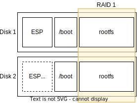

## Introduction

The path from firmware to userland is surprisingly {^complex|consisting of many different and connected parts} and there are _many_ details which are critical for this process to succeed.


In this post I'll explain as many details as possible when booting a fairly standard system with `ESP`, `/boot` and `/` partitions, which has the `/` partition configured with software [RAID](https://en.wikipedia.org/wiki/RAID):



We'll investigate various pieces of software:

- [EDK2](https://github.com/tianocore/edk2): UEFI reference implementation
- [Grub2](https://www.gnu.org/software/grub/): Bootloader
- [Linux](https://www.kernel.org/): Kernel
- [mdadm](https://en.wikipedia.org/wiki/Mdadm): Software raid implementation

Sadly, not all of these are hosted in a way that I can link to references in a stable way (mostly, released as tarballs). In those cases, I'm going to link to a GitHub mirror[^hosting].

[^hosting]: this post includes enough rabbit holes, I didn't want to _also_ go explore how to host these sources in a nice way.

## Storage devices

Storage in computers relies on physical disks, which are _usually_[^storage-types] divided in two types: mechanical hard drives (with spinning platters which store data magnetically; and solid-state drives (SSDs) which use flash memory for faster access times and improved reliability.

[^storage-types]: You can also have floppy disks, cd-roms, tape, or anything really, but it's not really important here.

Linux exposes these storage devices through the "block I/O layer", which represents storage media as sequences of fixed-size blocks, typically 512 bytes or 4KB in size.

Access to the block layers happens through [device files](https://en.wikipedia.org/wiki/Device_file) which are represented in `/dev` (usually `/dev/sdX` for SATA/SAS drives, `/dev/nvmeXnY` for NVME drives, but you can also find `hdX`, `fdX`, `cdromX`, ...).

These devices are identified as [block devices](https://en.wikipedia.org/wiki/Device_file#Block_devices) during initialization by their respective drivers, which create the device files with type [S\_IFBLK](https://github.com/torvalds/linux/blob/v6.10/include/uapi/linux/stat.h#L13)


## Firmware initialization

x86-64 computers require device-specific [firmware](https://en.wikipedia.org/wiki/Firmware) to perform hardware initialization during power-on, so that they can load the operating system and hand over execution.

There are two standardized types of firmware to handle the [booting](https://en.wikipedia.org/wiki/Booting) process: [(Legacy) BIOS](https://en.wikipedia.org/wiki/BIOS) and [UEFI](https://en.wikipedia.org/wiki/UEFI).

### BIOS

The boot process on Legacy BIOS (1981) is _very_ simple and I won't go into much detail.

BIOS will iterate through all devices and validate whether they are bootable by checking if they have a [Master Boot Record](https://en.wikipedia.org/wiki/Master_boot_record) on the first sector (which is defined as 512 bytes, even if modern devices have non-512b-sectors)

Whether there's an MBR present or not is defined by finding the MBR signature (`0x55 0xAA`) as the last two bytes in the sector. The layout is also quite simple:


If indeed there's an MBR on the disk, the code will be mapped at the physical address `0x7C00`, then BIOS will `jmp` there, good luck!

BIOS is very simple but also _quite_ limited. Having only 16 bytes of information per partition limits their maximum size to 2TiB (along with a maximum of 4 partitions). The small bootstrap area (446 bytes of code is not a lot, even with x86's dense instruction format) requires multiple stages of boot loaders to be chained.

### UEFI

Given the limitations of BIOS, Intel started UEFI [in 2005](https://en.wikipedia.org/wiki/UEFI#History), which _did_ overcome all of these limitations, but also became a _massive beast_[^beast] .

[^beast]: The [specification](https://uefi.org/sites/default/files/resources/UEFI_Spec_2_10_Aug29.pdf) is 2145 pages, and mentions things like "bytecode virtual machine", "HTTP Boot", "Bluetooth", "Wi-Fi", "IPsec".


On power on, the firmware needs to determine which disk to boot from, so it will check a set of variables (`BootOrder`, `Boot####`) in NVRAM for a pre-defined boot order (using [gRT->GetVariable()](https://uefi.org/specs/UEFI/2.10/08_Services_Runtime_Services.html#variable-services)).

If no valid boot order is stored in NVRAM, then UEFI will enumerate all connected storage (by calling `LocateHandle()` with a `SearchType` of `EFI_BLOCK_IO_PROTOCOL`).

Once a disk is selected for booting, the firmware reads the [GUID Partition Table (GPT)](https://en.wikipedia.org/wiki/GUID_Partition_Table) header.


The first 512 bytes of the disk _usually_ contain a "protective" MBR, whose only purpose is to prevent old tools from considering the drive empty (and potentially overwriting data). This is not necessary.

The second **logical block** (LBA 1) contains the GPT header; there's also a backup GPT header at the very end of the disk.


So, we are at a point that UEFI has:

1. Initialized the hardware sufficiently to enumerate all block devices
2. Filtered said devices down ones with a valid GPT header
3. Picked a device to boot (based on user preference or other algorithm)

How does UEFI find the bootloader?

First, it looks for EFI System Partition (ESP) on the disk, which has the GUID `C12A7328-F81F-11D2-BA4B-00A0C93EC93B`.

This partition **must** be formatted as [FAT (12, 16 or 32)](https://uefi.org/specs/UEFI/2.10/13_Protocols_Media_Access.html#file-system-format) (which is probably good, FAT is very simple).

Inside that GUID-tagged, FAT-formatted partition, it will look for a file in the path `\EFI\BOOT\BOOTX64.EFI` (_obviously_, the filename is architecture dependent)[^bootloader-filename].

[^bootloader-filename]: The filename (or a fallback) _may_ be configured in some UEFI implementations, but you can't depend on it, so everyone uses the default.


UEFI will load the bootloader[^bootloader] from `\EFI\BOOT\BOOTX64.EFI` (usually a bootloader, in our case GRUB2) in memory and prepare to execute it.

[^bootloader]: sometimes you don't need a bootloader, such as the [EFI Boot Stub](https://docs.kernel.org/admin-guide/efi-stub.html), UEFI applications or hobby kernels.


## GRUB2 bootloader loaded from ESP
  - where is grub loaded? how is it defined? does it matter?
  - finding, FAT partition
  - PE format
## GRUB2 reads its configuration file
 - wacky format
 - show entry example
 - how to find blockdev again ?
 - load /boot kernel
 - 
## GRUB2 loads Linux kernel and initramfs

Grub has support for partitions & filesystems via modules
once the kernel image file is found, it's loaded 
- kernel loaded at LOAD_PHYSICAL_ADDR https://github.com/torvalds/linux/blob/1fb918967b56df3262ee984175816f0acb310501/arch/x86/include/asm/page_types.h#L35
	- which is 0x0c000000 = 192MB

then the initramfs is loaded at 'arbitrary' address, grub2 prefers 'as high as possible':
	- https://chromium.googlesource.com/chromiumos/third_party/grub2/+/11508780425a8cd9a8d40370e2d2d4f458917a73/grub-core/loader/i386/linux.c#1104

grub will jump to the [64bit entry point](https://github.com/torvalds/linux/blob/v6.1/arch/x86/boot/compressed/head_64.S#L336) at 0x200

## kernel loads initramfs
how does it know where the initramfs is?

- initramfs address is communicated via the [boot protocol](https://www.kernel.org/doc/html/v6.3/x86/boot.html), reading the docs did not help me understand anything tbh

this is roughly the callstack i understood from reading code, i'm less certain about it being correct the deeper it goes

1. [Boot parameters](https://github.com/torvalds/linux/blob/v6.10/arch/x86/kernel/head64.c#L408) are saved and processed in `copy_bootdata`
2. `copy_bootdata` is called by `x86_64_start_kernel`, the C entrypoint into the kernel
3. `x86_64_start_kernel` is mapped (?) onto the `initial_code` symbol in [head_64.S](https://github.com/torvalds/linux/blob/v6.10/arch/x86/kernel/head_64.S#L481)
4. `initial_code` is [called](https://github.com/torvalds/linux/blob/v6.10/arch/x86/kernel/head_64.S#L420) on `jump_to_C_code`
5. `jump_to_C_code` is reached from a jmp to `common_startup_64`
6. ...
7. `startup64` is [called](https://github.com/torvalds/linux/blob/v6.10/arch/x86/boot/compressed/head_64.S#L286)  ??
8.  ??
9.  somehow reach `.Lon_kernel_cs` which says
>	 RSI holds a pointer to a boot_params structure provided by the
>	 loader, and this needs to be preserved across C function calls. So
>	 move it into a callee saved register.
10. GRUB [sets up](https://chromium.googlesource.com/chromiumos/third_party/grub2/+/11508780425a8cd9a8d40370e2d2d4f458917a73/grub-core/loader/i386/linux.c#651) the RSI register to point to `real_mode_target` (???) 
	11. how is this the boot_params structure??

mounting rootfs
somehow this works rootfs_initcall(populate_rootfs);
https://github.com/torvalds/linux/blob/v6.1/init/initramfs.c#L762

which eventually calls [do_populate_rootfs](https://github.com/torvalds/linux/blob/v6.1/init/initramfs.c#L696)
which calls `unpack_to_rootfs(__initramfs_start, __initramfs_size);`
- where do start/size come from?
[vmlinux.lds.h](https://github.com/torvalds/linux/blob/master/include/asm-generic/vmlinux.lds.h#L935) but HOW ARE THEY SET

kernel_init calls kernel_init_freeable which calls all the rootfs initramfs stuff
then kernel_init calls `run_init_process(ramdisk_execute_command);` where `ramdisk_execute_command` defaults to `/init` but can be overridden in `rdinit_setup`, which looks at the `rdinit=` [kernel commandline argument]()

## beloved userland

We are on PID1, but it's not a _good_ PID1 -- we are in a ramdisk with limited utility.

Load md module (modprobe)

look at block devices we want to mount (/dev/sda /dev/sdb) - how to list?
interact with module (ioctl)

mount (syscall) the new md block device

pivot_root

exec systemd

## example qemu img
-- - 
Kernel starts and begins initialization
Initramfs is unpacked and executed 
 - init=...
Initramfs loads necessary RAID modules
- modprobe dm/md
mdadm is run to assemble the RAID0 array
ioctl SET_ARRAY_INFO
ioctl RUN_ARRAY
https://github.com/torvalds/linux/blob/v6.10/drivers/md/md.c#L7876
- explain used ioctl
Root filesystem is mounted from the RAID0 array
- explain used syscall
Control is passed to the actual root filesystem
- explain pivot root
Init system (e.g. systemd) starts on the root filesystem
- exec


partition table

GPT

availability

Device-Mapper

david@framework:~/git/blog$ truncate -s 100M device1
david@framework:~/git/blog$ truncate -s 100M device2
david@framework:~/git/blog$ sudo mdadm --create  --level=1 --raid-devices=2 --spare-devices=0 --name='arrayname' device1 device2
mdadm: device device1 exists but is not an md array.
david@framework:~/git/blog$ 

david@framework:~/git/blog$ sudo losetup -f device1
david@framework:~/git/blog$ sudo losetup -f device2
$ sudo losetup -l | grep device
/dev/loop23         0      0         0  0 /home/david/git/blog/device2                       0     512
/dev/loop2          0      0         0  0 /home/david/git/blog/device1                       0     512

david@framework:~/git/blog$ sudo mdadm --create  --level=1 --raid-devices=2 --spare-devices=0 --name='arrayname' /dev/md0 /dev/loop2 /dev/loop23
mdadm: Note: this array has metadata at the start and
    may not be suitable as a boot device.  If you plan to
    store '/boot' on this device please ensure that
    your boot-loader understands md/v1.x metadata, or use
    --metadata=0.90
Continue creating array? yes
mdadm: Defaulting to version 1.2 metadata
mdadm: array /dev/md0 started.
david@framework:~/git/blog$ ls -lhrt /dev/md0
brw-rw---- 1 root disk 9, 0 Aug 11 19:23 /dev/md0
david@framework:~/git/blog$ mdadm -v --detail --scan /dev/md0
mdadm: must be super-user to perform this action
david@framework:~/git/blog$ sudo mdadm -v --detail --scan /dev/md0
ARRAY /dev/md0 level=raid1 num-devices=2 metadata=1.2 name=framework:arrayname UUID=6865ede1:f1a76b48:45071d66:a55755bd
   devices=/dev/loop2,/dev/loop23

```
david@framework:~/git/blog$ hexdump -C device1
00000000  00 00 00 00 00 00 00 00  00 00 00 00 00 00 00 00  |................|
*
00001000  fc 4e 2b a9 01 00 00 00  00 00 00 00 00 00 00 00  |.N+.............|
00001010  68 65 ed e1 f1 a7 6b 48  45 07 1d 66 a5 57 55 bd  |he....kHE..f.WU.|
00001020  66 72 61 6d 65 77 6f 72  6b 3a 61 72 72 61 79 6e  |framework:arrayn|
00001030  61 6d 65 00 00 00 00 00  00 00 00 00 00 00 00 00  |ame.............|
00001040  8e f3 b8 66 00 00 00 00  01 00 00 00 00 00 00 00  |...f............|
00001050  00 18 03 00 00 00 00 00  00 00 00 00 02 00 00 00  |................|
00001060  00 00 00 00 00 00 00 00  00 00 00 00 00 00 00 00  |................|
*
00001080  00 08 00 00 00 00 00 00  00 18 03 00 00 00 00 00  |................|
00001090  08 00 00 00 00 00 00 00  00 00 00 00 00 00 00 00  |................|
000010a0  00 00 00 00 00 00 00 00  a5 cc 7f 3a a6 bc 32 e7  |...........:..2.|
000010b0  97 b7 72 89 75 54 b6 2f  00 00 08 00 10 00 00 00  |..r.uT./........|
000010c0  8e f3 b8 66 00 00 00 00  11 00 00 00 00 00 00 00  |...f............|
000010d0  ff ff ff ff ff ff ff ff  6f 63 64 60 80 00 00 00  |........ocd`....|
000010e0  00 00 00 00 00 00 00 00  00 00 00 00 00 00 00 00  |................|
*
00001100  00 00 01 00 ff ff ff ff  ff ff ff ff ff ff ff ff  |................|
00001110  ff ff ff ff ff ff ff ff  ff ff ff ff ff ff ff ff  |................|
*
00001200  00 00 00 00 00 00 00 00  00 00 00 00 00 00 00 00  |................|
*
06400000
```
david@framework:~/git/blog$ 

david@framework:~/git/blog$ file device1
device1: Linux Software RAID version 1.2 (1) UUID=6865ede1:f1a76b48:45071d66:a55755bd name=framework:arrayname level=1 disks=2
david@framework:~/git/blog$ file device2
device2: Linux Software RAID version 1.2 (1) UUID=6865ede1:f1a76b48:45071d66:a55755bd name=framework:arrayname level=1 disks=2


filesystem

xfs/ext4/..
