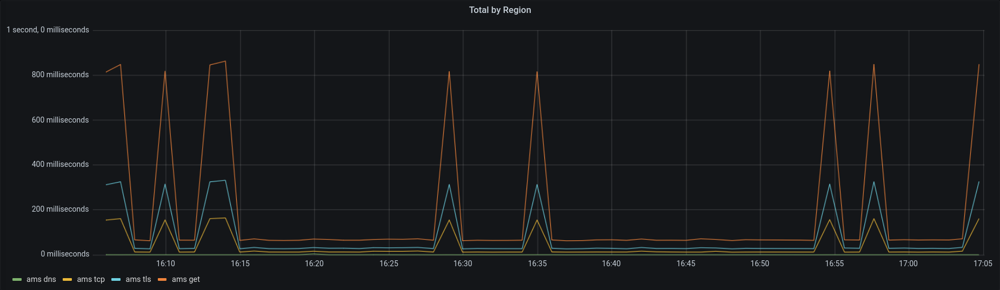

Recently I got the itch to try and see if I could make this site load quicker, and even though there's not much to do
from a content perspective (pages are ~5KiB of content, static files have long caches), the largest
amount of time spent was purely latency based, as this site was served only from Germany, if you were not close
then you are going to have to wait a little bit.

The only way to reduce latency[^transport-medium] is to put the devices that are communicating closer.

[^transport-medium]: Well, you can always try to use a transport medium with a lower light propagation delay, but it's going to cost a few billion

Moving this server to any other point wouldn't make much sense, the only option is to have multiple servers in 
different parts of the world.

As far as I know, the proper way to do this is to have a single IP shared between multiple DNS servers in different locations,
then through [Anycast](https://en.wikipedia.org/wiki/Anycast), the client would route to the "closest" server.

<div class="aside">
"closest" is in quotes because it's not measured by geographical distance, but rather it's a property set by network operators on each physical link.
<br/>
In an ideal world, the cost would match (latency ✕ bandwidth) of the link, but sometimes there are economic deals that make traffic cheaper through slower links.
</div>


I couldn't really find an operator that would sell me an Anycast "service" or even VPS with Anycast IPs. If I was _very_ committed, I could buy a `/24` (255 IPv4 addresses) 
for $5-10k, find a few VPS vendors that also provide BGP services and announce my IP range.

I am not _that_ committed, but it is interesting to consider a "group buy" of something like this; $20-40 for my own IP sounds great.

So, probably as a first, I chickened out and went for the easier route: paying for a DNS service which abstracts the Anycast details away and advertises different A records
based on the location of the DNS server itself.

I tried a few options:

dnsimple promised a nice hobby tier, but gates the Geo DNS records behind $50/mo

Gcore offers a nice free plan, but has no[^no-support] support for Caddy, I added very hacky support, only to notice that the
GeoDNS service they provide uses some kind of reverse-lookup database to analyze where the clients are, and it returns a record based on that.

[^no-support]: Well, it had no support when I first looked into this, around October, 2024.

I don't think this is a good way of providing location-aware DNS: those databases go out of date, and most importantly the concept of "to which location this address belongs to" does not make sense.

I made [a script](https://github.com/DavidVentura/http-measurement) using [fly.io](https://fly.io) to spawn machines all over the world and measure latency:



|client region | response region | total duration ms |   ip address   |
|--------------|-----------------|-------------------|-----------------
|ams           | DE              |         67.077893 | 139.178.72.187 |
|ams           | DE              |         66.384035 | 216.246.119.90 |
|ams           | DE              |         67.950036 | 216.246.119.114|
|ams           | DE              |         66.065846 | 139.178.72.187 |
|ams           | LAX             |        847.931087 | 216.246.119.86 |
|ams           | DE              |         66.322204 | 216.246.119.89 |
|ams           | DE              |         67.290175 | 216.246.119.90 |
|ams           | LAX             |        818.730120 | 216.246.119.86 |
|ams           | DE              |         64.972008 | 139.178.72.187 |
|ams           | DE              |         66.102748 | 139.178.72.187 |

and these spikes are exactly what I was talking about -- apparently Gcore's reverse DNS lookup places `216.246.119.86` somewhere closer to Los Angeles than to Amsterdam. 

I believe that the right way to do this is to use the _DNS server_'s geographical location for the decision, and settled with AWS Route53.

If you know of another DNS provider with this feature, please let me know.


## Providers and costs

For servers, I picked [Greencloud vps](https://greencloudvps.com/) for my VPS in Singapore ($25/year) and [Racknerd](https://www.racknerd.com/kvm-vps) for the VPS in Texas, USA ($12/year). I was already using [Hetzner](https://www.hetzner.com/cloud/) for my VPS in Germany ($36/year)

DNS is Route53, which costs $6/year.

The grand total is $7/month.

## Results

Was it worth it? Yes! Average latency is below 100ms from any[^locations] location

[^locations]: If you carefully pick your locations to exclude South America, South Africa and New Zealand

| LOCATION | Resolved | MIN | MAX | AVG | STD DEV |
|----------|-----|---------|---------|---------|---------|------|
| 🇩🇪 Frankfurt | 78.46.233.60 | 18.61 ms | 24.53 ms | 20.6 ms | 2.78 ms |
| 🇳🇱 Amsterdam | 78.46.233.60 | 11.05 ms | 12.77 ms | 11.64 ms | 0.8 ms |
| 🇬🇧 London | 78.46.233.60 | 18.87 ms | 20.61 ms | 19.47 ms | 0.8 ms |
| 🇺🇸 New York | 155.94.173.109 | 34.54 ms | 37.73 ms | 35.97 ms | 1.32 ms |
| 🇺🇸 San Francisco | 155.94.173.109 | 44.07 ms | 44.6 ms | 44.25 ms | 0.24 ms |
| 🇸🇬 Singapore | 96.9.213.82 | 1.17 ms | 2.14 ms | 1.52 ms | 0.44 ms |
| 🇦🇺 Sydney | 96.9.213.82 | 93.67 ms | 94.24 ms | 93.88 ms | 0.25 ms |
| 🇮🇳 Bangalore | 96.9.213.82 | 38.22 ms | 39.2 ms | 38.56 ms | 0.46 ms |


## Certificates

I use [Caddy](https://github.com/caddyserver/caddy) as my HTTP server, which will by default, ask [Let's Encrypt](https://letsencrypt.org/) for SSL certificates.

For this, I was using the [HTTP-01](https://letsencrypt.org/docs/challenge-types/#http-01-challenge) challenge, which performs a GET request to `/.well-known/acm-echallenge/<TOKEN>`, but now that doesn't work anymore &mdash; all requests get directed to the Texas server, and that doesn't work.

The easy option would be to change and use the [DNS-01](https://letsencrypt.org/docs/challenge-types/#dns-01-challenge) challenge, but that would require all 3 of my servers to have keys to manage my DNS records, which seems unnecessary.

Instead, I opted for disabling SSL certificate management in my "secondary" servers, and instead, I `scp` certificates from the "main" server to them.

This is the config I have specific for the secondary servers

```caddy
blog.davidv.dev {
    tls /var/lib/caddy/blog.davidv.dev.crt /var/lib/caddy/blog.davidv.dev.key
    header +region {$REGION}
    import blog_common
}
```

and a cron job to copy from the primary server:

```bash
scp $CERT root@blog.sg.davidv.dev:/var/lib/caddy/
scp $KEY root@blog.sg.davidv.dev:/var/lib/caddy/
ssh root@blog.sg.davidv.dev "chown caddy /var/lib/caddy/blog.davidv.dev.*"
ssh root@blog.sg.davidv.dev "systemctl reload caddy"
```


## But why not Cloudflare?

Cloudflare offers a free (as in, $0/mo) service for this kind of thing, but I don't like them, and I don't believe they should control more of the internet.
