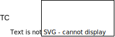

For diagrams in this blog, I use [diagrams.net](diagrams.net) (previously known as `draw.io`/`drawio.com`). Some time ago,
I got frustrated with manually exporting svg files for every page, and made [a little script](https://gist.github.com/DavidVentura/22cb570461178b4046ee4013d0026e4f)
which exports every page in light and dark themes.

This was OK, for a while, but it was slow (~3 seconds per diagram) and it started getting on my nerves.

The diagrams _that I make_ are quite simple, they all look something like this:


Nothing fuels me more than a computer not doing its job properly. Why do I need to spin up a whole Chromium instance to generate 2KiB worth of SVG tags?

It can't be that hard.

## Looking at the drawio file format

The file format used by drawio is just XML, here's the previous diagram in all its glory:

```xml
<mxfile host="Electron" agent="Mozilla/5.0 (X11; Linux x86_64) AppleWebKit/537.36 (KHTML, like Gecko) draw.io/24.7.5 Chrome/126.0.6478.183 Electron/31.3.0 Safari/537.36" version="24.7.5" pages="2">
  <diagram id="CaypJM6uljNCg2ii8YJU" name="simple">
    <mxGraphModel dx="1100" dy="999" grid="1" gridSize="10" guides="1" tooltips="1" connect="1" arrows="1" fold="1" page="1" pageScale="1" pageWidth="850" pageHeight="1100" math="0" shadow="0">
      <root>
        <mxCell id="0" />
        <mxCell id="1" parent="0" />
        <mxCell id="BKDJbydcZCFkUFjeQ1YP-3" style="edgeStyle=orthogonalEdgeStyle;rounded=0;orthogonalLoop=1;jettySize=auto;html=1;entryX=0;entryY=0.5;entryDx=0;entryDy=0;" edge="1" parent="1" source="BKDJbydcZCFkUFjeQ1YP-1" target="BKDJbydcZCFkUFjeQ1YP-2">
          <mxGeometry relative="1" as="geometry" />
        </mxCell>
        <mxCell id="BKDJbydcZCFkUFjeQ1YP-1" value="Some text" style="rounded=0;whiteSpace=wrap;html=1;" vertex="1" parent="1">
          <mxGeometry x="240" y="380" width="120" height="60" as="geometry" />
        </mxCell>
        <mxCell id="BKDJbydcZCFkUFjeQ1YP-2" value="Some other text" style="rounded=0;whiteSpace=wrap;html=1;fillColor=#ffe6cc;strokeColor=#f08c00;" vertex="1" parent="1">
          <mxGeometry x="440" y="320" width="120" height="60" as="geometry" />
        </mxCell>
      </root>
    </mxGraphModel>
  </diagram>
</mxfile>
```

A few things jump out by just looking at this quickly:
- There is some kind of directed relationship: `id` is used for `source` and `target`
- Properties can be expressed through rich objects: the box geometries are represented as `mxGeometry`
- Styles are represented as strings, completely disregarding the previous point


## Parsing the drawio XML

Basic blocks:
- Text
- Shape
- Arrow
- EdgeLabel (Text on arrows)

All basic blocks are represented as `mxCell`, and distinguishing between the variants is easy but unnecessarily complex:
- If the cell has an `edge` property, then it's an `Arrow`
- If the cell **style** has a `text` property, then it's a `Text`
- If the cell **style** has an `edgeLabel` property, then it's an `EdgeLabel`
- Otherwise, it's a shape

If your representation allows for rich objects, why use `mxCell` for everything?

Some things of note:

Some properties have default values, in which case the keys will not be present on the XML, _unless_ you change the value on the editor, then change it back to default. I did this on _every_ property to get the default values.

The order of items in the XML is the rendering order; if two elements overlap, then the last one on the XML should be rendered on top.

Nesting is possible, via the `parent` property, in which case some attributes will be relative to the parent (mostly positioning).

Arrows reference a `source` and a `target`, but the arrow itself can be in the XML before either referenced element, requiring a two-pass parser.

## Rendering

Let's start with a simple element, a box with text inside. The first thing to note is that text can be aligned within its bounding box via the `align` (`left`, `center`, `right`) and `verticalAlign` (`start`, `center`, `end`) properties, which can generate all these options:


The text's bounding box can also be positioned adjacent to the original box with the `labelPosition` (`left`, `center`, `right`) and `verticalLabelPosition` (`top`, `middle`, `bottom`) properties.



this text element still is a property of the box, but it is positioned:
- labelPosition: left (outside of the box, to the left)
- verticalLabelPosition: middle (outside of the box, same Y value)
- align: center (within its bounding box)

If we look at all the options for the bounding box, it looks like this:


So far, implementing this is quite straight forward: based on the bounding box positioning properties, adjust the X and Y coordinates of the SVG `text` element by {+width, -width} and {+height, -height}

The first real problem I faced was when trying to render a "large" box, where its bounding box was adjacent to itself


<small>
The bounding box is colored to make the point obvious, they are not usually visible.
</small>

When rendering this kind of diagram, the viewport for the resulting svg is far too wide; clearly the _entire_ bounding box is not necessary in the viewport.. but how much of it is necessary? The text could be centered, or long, or both!


How does the drawio exporter solve this? If we peek at the generated svg we can see

```html
<div style="display: ...; width: 292px; height: 1px; ...;">
    <!-- 8< 8< -->
    some longer text, centered
```
It measured the text size!

### Measuring text

Text rendering, as we all know, is very simple. It is composed of letters that _only_ go from left to right, and where a pair of letters is _always_ represented as the concatenation of both letters individually. RTL? No. Ligatures? _No_.

[Determining font metrics](https://usage.imagemagick.org/text/#font_info)


## References

- https://learn.microsoft.com/en-us/typography/opentype/spec/
- https://fonttools.readthedocs.io/en/latest/
