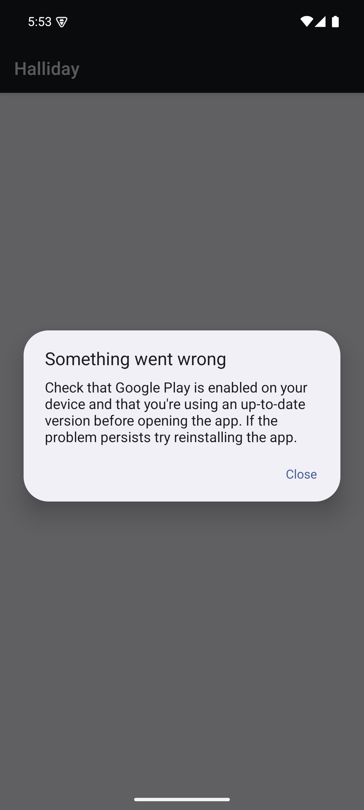

---
---
```
$ adb shell pm list packages | grep -i halli
package:com.halliday.glasses
$ adb shell pm path com.halliday.glasses
package:/data/app/~~egiP-s5DZBUNkpiyBysSCg==/com.halliday.glasses-25HHewScpCVwdZTPgU4rgg==/base.apk
package:/data/app/~~egiP-s5DZBUNkpiyBysSCg==/com.halliday.glasses-25HHewScpCVwdZTPgU4rgg==/split_config.en.apk
package:/data/app/~~egiP-s5DZBUNkpiyBysSCg==/com.halliday.glasses-25HHewScpCVwdZTPgU4rgg==/split_config.nl.apk
package:/data/app/~~egiP-s5DZBUNkpiyBysSCg==/com.halliday.glasses-25HHewScpCVwdZTPgU4rgg==/split_config.x86_64.apk
package:/data/app/~~egiP-s5DZBUNkpiyBysSCg==/com.halliday.glasses-25HHewScpCVwdZTPgU4rgg==/split_config.xxhdpi.apk
$ adb shell pm path com.halliday.glasses | cut -d: -f2 | while read -r line; do adb pull $line; done
/data/app/~~egiP-s5DZBUNkpiyBysSCg==/com.halliday.glasses-25HHewScpCVwdZTPgU4rgg==/base.apk: 1 file pulled, 0 skipped. 218.9 MB/s (114598023 bytes in 0.499s)
/data/app/~~egiP-s5DZBUNkpiyBysSCg==/com.halliday.glasses-25HHewScpCVwdZTPgU4rgg==/split_config.en.apk: 1 file pulled, 0 skipped. 56.8 MB/s (57753 bytes in 0.001s)
/data/app/~~egiP-s5DZBUNkpiyBysSCg==/com.halliday.glasses-25HHewScpCVwdZTPgU4rgg==/split_config.nl.apk: 1 file pulled, 0 skipped. 36.8 MB/s (37273 bytes in 0.001s)
/data/app/~~egiP-s5DZBUNkpiyBysSCg==/com.halliday.glasses-25HHewScpCVwdZTPgU4rgg==/split_config.x86_64.apk: 1 file pulled, 0 skipped. 223.1 MB/s (58131511 bytes in 0.248s)
/data/app/~~egiP-s5DZBUNkpiyBysSCg==/com.halliday.glasses-25HHewScpCVwdZTPgU4rgg==/split_config.xxhdpi.apk: 1 file pulled, 0 skipped. 70.8 MB/s (485631 bytes in 0.007s)
```
The app is huge
```
$ ls -lhrt
total 166M
110M base.apk
 57K split_config.en.apk
 37K split_config.nl.apk
 56M split_config.x86_64.apk
475K split_config.xxhdpi.apk
```

Instantly gives up, needs Google Play Services


Make a new emulator with Google Play this time, and re-install the app:

Tried this 
`adb install-multiple base.apk split_config.en.apk split_config.nl.apk split_config.x86_64.apk split_config.xxhdpi.apk`

but got "get the app from google play" and couldn't make it work otherwise
