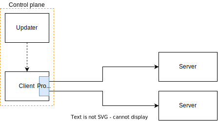

I've been exploring how to provide high availability for some client-server applications with some unusual constraints:

1. I have full control over client configuration (eg: installing packages or making any other system adjustments)
2. I can't modify the client software itself (config is fair game though)
3. I can't re-arrange the client and server physical locations, they may be spaced to mitigate conjoined failures
4. The traffic is TCP and UDP -- not necessarily HTTP.

And a set of goals:

1. Minimize latency (not in an absolute sense, but avoid egregious extra hops)
2. Simple operation (configuration updates, version upgrades)

Let's look at the options:

## Centralized proxy

A centralized proxy (eg: nginx, HAProxy) receives connections from all the clients and distributes them among the servers;
It's a great solution when you have control of the placement, meaning that the proxy does not drastically
extend the path between client and server:


But in some cases, the distributed placement of the clients and servers ends up with unnecessarily long paths, which can add hundreds of milliseconds of latency:


The placement constraint alone would disqualify this solution, but on top of that, dealing with proxy crashes (software or server) 
would require more proxies, and balancing between those.

## DNS

Using DNS for availability solves the previous issue; the data path is now as short as possible, and the cost of record lookups
is amortized over all the connections that are established on each TTL period.


Looks pretty good! No data path issues

There are some downsides still though:

- TTLs cannot be "large" -- you need to accept "1 TTL" of downtime
- Some applications and frameworks misbehave and ignore TTLs, meaning that they resolve the domain _once_ and they cache the results forever
- If the DNS server crashes, the data path will be affected once the TTLs expire
    - Fairly easy to mitigate by having multiple DNS servers and round-robin lookups

## Client-side userspace proxy

all clients connect to `localhost:...` and the data is forwarded to the respective servers. server resolution is out of band.

If we were to install a proxy on every client, we would get rid of the placement issues from the centralized proxies and the "misbehaving" applications issues
from the DNS solution 

We can take the proxy concept and move it to the client, taking the placement issue out of the equation



If this proxy is a userspace component, that is, a program that listens for connections and pipes the data to selected backends we get a few features for free:

- Can detect when a connection to a backend is interrupted and immediately remove it from the backend options
- Low latency, as there are "no" unnecessary network hops (there are some extra memory copies, but that's negligible in this scenario)

But we also have some drawbacks:

- If the proxy crashes, all connections are disrupted
- Updates / Upgrades are hard[^upgrade]

[^upgrade]: Although you _can_ perform a very specific dance and pass open connections to the child process that will replace the running proxy

Can we do better?

## Client-side kernelspace proxy

On the previous example, the proxy software _could_ have issues which would impact the data plane, and we should avoid that if possible.

What we can do instead, is move the "proxying" of the data to kernelspace, by using [IPVS (IP Virtual Server)](http://www.linuxvirtualserver.org/software/ipvs.html), which is a feature
that allows for [Layer-4](https://en.wikipedia.org/wiki/Transport_layer) (so, TCP and UDP) "load balancing"

There are two very important concepts in IPVS:

- `Service`: A virtual IP and port combination that clients connect to
- `Destination`: One or more real backend addresses that handle the traffic

When a client connects to a Service's virtual IP:port, IPVS rewrites the packet destinations to one of the real Destinations instead.

For example, "Service1" can be defined as:

- Virtual IP: 1.2.3.4
- Port: 80
- Destinations:
    - Real IP: 93.184.215.14, Port: 80
    - Real IP: 192.168.2.100, Port: 80


The IPVS rule definitions are kernel datastructures, these can be updated via [netlink](https://docs.kernel.org/userspace-api/netlink/intro.html); to do so, we need a userspace component
(eg: `ipvsadm`) but this component is _specifically_ constrained to the control plane.

The main advantage over the userspace proxy is that there's no "software to upgrade or restart" (well, the kernel, but those upgrades are disruptive anyway)

However, we lost a very nice property from the userspace proxy: being able to quickly detect closed connections and act accordingly (eg: by quarantining the respective destination for some time)

Can we extend the userspace component with the capability to detect closed connections?

Yes, with the solution to all problems: ✨ eBPF ✨.

eBPF is a mechanism in the Linux kernel that allows us to run [verified](https://docs.ebpf.io/linux/concepts/verifier/) programs _within_ the kernel, hooking into events and sending data with userspace applications.

We would like to end up in the magical land where this is possible:

```rust
async fn handle_events(mut events: EventStream) {
    while let Some(event) = events.next().await {
        match event.interpret() {
            ConnectionState::Failed(backend) => {
                quarantine_backend(backend);
            },
            ConnectionState::Established(backend) => {
                record_successful_connection(backend);
            },
        }
    }
}
```

So.. let's build it!

For this project, we'll be using [Aya](https://aya-rs.dev/), which is a library that simplifies writing eBPF code in Rust.

<small> All the examples in this post are summarized, in [the repo](https://github.com/DavidVentura/ipvs-tcp-from-scratch).</small>

## Researching the data path

To maintain high availability, we want to remove unhealthy backends from the clients, and for that we need to understand what's happening with each connection.

Linux provides a mechanism called [tracepoints](https://docs.kernel.org/trace/tracepoints.html) - predefined hooks in kernel code that we can use to observe (and modify!) system behavior.

In this case, we're interested in the `inet_sock_set_state` tracepoint ([defined here](https://github.com/torvalds/linux/blob/v6.12/include/trace/events/sock.h#L141)),
which is triggered every time a TCP connection changes state.

First, we need to define `TcpSocketEvent` which will hold, you guessed it, socket data from the traced events.

<div class="aside">
As eBPF programs run within the kernel, they can't use userspace features like memory allocation or filesystem access.
<br/>
We express these restrictions by using <code>#![no_std]</code>, which disables the standard library.
<br/>
It's not a big deal though -- a significant amount of features are available in the `core` library, which we can still use.
</div>


```rust
#![no_std]
use core::net::SocketAddrV4;

pub enum TcpState {
    Established = 1,
    SynSent = 2,
    // ...
}
pub struct TcpSocketEvent {
    pub oldstate: TcpState,
    pub newstate: TcpState,
    pub src: SocketAddrV4,
    pub dst: SocketAddrV4,
}
```


The handler for the tracepoint hook is fairly trivial:
```rust
#[tracepoint]
pub fn inet_sock_set_state(ctx: TracePointContext) -> i64 {
    if let Some(ev) = make_ev_from_raw(&ctx) {
        let os_name: &'static str = ev.oldstate.into();
        let ns_name: &'static str = ev.newstate.into();
        info!(
            &ctx,
            "TCP connection {}:{}->{}:{} changed state {}->{}",
            *ev.src.ip(), ev.src.port(),
            *ev.dst.ip(), ev.dst.port(),
            os_name, ns_name
        );
    }
    Ok(0)
}
```

We need to access the "raw" data from the opaque `TracePointContext` pointer, which may look daunting at first, but most aya-based examples look like this one.

First, we cast the raw pointer to a typed pointer and that pointer to a reference of a Rust type, later we need to validate some preconditions (eg: IPv4, TCP)

```rust
fn make_ev_from_raw(ctx: &TracePointContext) -> Option<TcpSocketEvent> {
    let evt_ptr = ctx.as_ptr() as *const trace_event_raw_inet_sock_set_state;
    let evt = unsafe { evt_ptr.as_ref()? };
    if evt.protocol != IPPROTO_TCP {
        return None;
    }
    match evt.family {
        AF_INET => Family::IPv4,
        AF_INET6 => {
            // not supporting IPv6 for now
            return None;
        }
        other => {
            info!(ctx, "unknown family {}", other);
            return None;
        }
    };

    let ev = TcpSocketEvent {
        oldstate: evt.oldstate.into(),
        newstate: evt.newstate.into(),
        src: SocketAddrV4::new(evt.saddr.into(), evt.sport),
        dst: SocketAddrV4::new(evt.daddr.into(), evt.dport),
    };
    Some(ev)
}
```

Once we have constructed a "safe" type, and have enforced that the required preconditions are met, we are back to "normal" Rust code.


On the userspace side, we need to connect our tracing function (`inet_sock_set_state`) to the kernel tracepoint,
which we identify by `category` and `name`, and these two values come out of the path to the tracepoint: `/sys/kernel/debug/tracing/events/sock/inet_sock_set_state`.


```rust
let program: &mut TracePoint = ebpf
    .program_mut("inet_sock_set_state")
    .unwrap()
    .try_into()?;
program.load()?;
program.attach("sock", "inet_sock_set_state")?;
```

If we run this program and perform a `curl`, we get a very nice output ([try it!](https://github.com/DavidVentura/ipvs-tcp-from-scratch/commit/177e4388e19ac163e63290126697a13c7498a41d)):
```bash
$ tracer & curl -s example.com
TCP connection 192.168.2.144:0    ->93.184.215.14:80 changed state Close      -> SynSent
TCP connection 192.168.2.144:47256->93.184.215.14:80 changed state SynSent    -> Established
TCP connection 192.168.2.144:47256->93.184.215.14:80 changed state Established-> FinWait1
TCP connection 192.168.2.144:47256->93.184.215.14:80 changed state FinWait1   -> FinWait2
TCP connection 192.168.2.144:47256->93.184.215.14:80 changed state FinWait2   -> Close
```

So far so good! Now let's try tracing an IPVS connection, for which we'll need to set up an IPVS service using `ipvsadm`:

```bash
$ # Create a service for 1.2.3.4:80, an arbitrary address
$ ipvsadm -A  --tcp-service 1.2.3.4:80
$ # Create a destination pointing to 'example.com' (IP from previous point)
$ ipvsadm -a --tcp-service 1.2.3.4:80 -r 93.184.215.14 -m
```
This configuration tells the kernel to rewrite packets with original destination of `1.2.3.4:80` and instead send them to `93.184.215.14:80`.

Now we can try tracing
```bash
$ tracer & curl -s 1.2.3.4:80
TCP connection 192.168.2.144:0    ->1.2.3.4:80 changed state Close      -> SynSent
TCP connection 192.168.2.144:39040->1.2.3.4:80 changed state SynSent    -> Established
TCP connection 192.168.2.144:39040->1.2.3.4:80 changed state Established-> FinWait1
TCP connection 192.168.2.144:39040->1.2.3.4:80 changed state FinWait1   -> FinWait2
TCP connection 192.168.2.144:39040->1.2.3.4:80 changed state FinWait2   -> Close
```

Huh... we see only the virtual IP, not the real destination IP.

Ok, this makes sense, the TCP state tracking code has no visibility into IPVS rewriting the packets,
so it only sees the virtual IP that the application connected to.

Now let's see what failure looks like by adding a destination that won't respond:

```bash
$ ipvsadm -a --tcp-service 1.2.3.4:80 -r 192.168.2.100 -m
TCP connection 192.168.2.144:0    ->1.2.3.4:80 changed state Close   -> SynSent           
TCP connection 192.168.2.144:57478->1.2.3.4:80 changed state SynSent -> Close
```
The connection attempt failed, but can't tell _which_ backend failed! From the TCP layer's perspective, all connections are to 1.2.3.4:80, and we need to know the real destination

We somehow need to enrich the TCP state transition data with IPVS data, looking at the IPVS source code, 
[ip\_vs\_conn\_new](https://github.com/torvalds/linux/blob/v6.12/net/netfilter/ipvs/ip_vs_conn.c#L941) sounds
_very_ promising, it'll be called when IPVS decides which bakend to use.

Though `ip_vs_conn_new` is promising, it's not a tracepoint, it's a plain old kernel function, which will require us to use a kprobe to hook into it.

[Kprobes](https://docs.kernel.org/trace/kprobes.html) let us hook into _any_ kernel function, BUT! They're not part of the kernel's stable API (we'll "address" this later).

Reading the `ip_vs_conn_new` source, we know that we get 3 parameters:
- An [ip\_vs\_conn\_param](https://github.com/torvalds/linux/blob/v6.12/include/net/ip_vs.h#L548) with the connection details
- The chosen destination ([nf\_inet\_addr](https://github.com/torvalds/linux/blob/v6.12/include/uapi/linux/netfilter.h#L72))
- The destination port


Let's make a struct to hold the data
```rust
pub struct IpvsParam {
    src: SocketAddrV4,
    vdest: SocketAddrV4,
    rdest: SocketAddrV4,
}
```
And hook into the function

```rust
#[kprobe]
pub fn ip_vs_conn_new(ctx: ProbeContext) -> u32 {
    let conn_ptr: *const ip_vs_conn_param = ctx.arg(0).ok_or(0u32)?;
    let conn = unsafe { helpers::bpf_probe_read_kernel(&(*conn_ptr)).map_err(|x| 1u32)? };
    let param: IpvsParam = make_ipvs_param_from_raw(conn);
    info!(
        ctx,
        "{}:{} -> virtual={}:{} real={}:{}",
        *param.src.ip(),
        param.src.port(),
        *param.vdest.ip(),
        param.vdest.port(),
        *param.rdest.ip(),
        param.rdest.port()
    );
}
```

If we trace a connection again, we may get lucky and hit the good backend ([try it!](https://github.com/DavidVentura/ipvs-tcp-from-scratch/commit/a5be73e7550ffda9bf1cfe6352764705e01324fc)):
```text
TCP  connection 192.168.2.144:0->1.2.3.4:80 changed state Close->SynSent

IPVS connection 192.168.2.144:39634 -> virtual=1.2.3.4:80 real=93.184.215.14:80

TCP  connection 192.168.2.144:39634->1.2.3.4:80 changed state SynSent->Established
TCP  connection 192.168.2.144:39634->1.2.3.4:80 changed state Established->FinWait1
TCP  connection 192.168.2.144:39634->1.2.3.4:80 changed state FinWait1->FinWait2
TCP  connection 192.168.2.144:39634->1.2.3.4:80 changed state FinWait2->Close
```

Or we may be a little less lucky and hit the bad backend:
```text
TCP  connection 192.168.2.144:0->1.2.3.4:80 changed state Close->SynSent

IPVS connection 192.168.2.144:49512 -> virtual=1.2.3.4:80 real=192.168.2.100:80

TCP  connection 192.168.2.144:49512->1.2.3.4:80 changed state SynSent->Close
```

Cool, now we can see which backend was selected for each connection, and we just need to put both sources of information together.

## Putting event data together

On the traced events, we have two types of information coming at different times:

1. TCP state transitions, which show the real source but only the _virtual_ IP
1. IPVS connection creation, that tells us which backend was chosen

During both `inet_sock_set_state` and `ip_vs_conn_new`, we have access to a 5-tuple that uniquely identifies a connection:
`(proto, source addr, source port, dest addr, dest port)` which we can use to link both events together.

Let's create the type to represent the connection identifier:

```rust
struct TcpKey {
    src: SocketAddrV4,
    // In IPVS context, this is a virtual address
    dst: SocketAddrV4,
}
```

we will represent the _real_ (non-virtual) destination as a stand-alone `SocketAddrV4`.

Now we can update our `TcpSocketEvent` to use the `TcpKey`:
```rust
pub struct TcpSocketEvent {
    pub oldstate: TcpState,
    pub newstate: TcpState,
    pub key: TcpKey,
}
```

And we no longer need `IpvsParam`, as it can now be represented as a pair of `(TcpKey, SocketAddrV4)`.

As a `TcpKey` links these events together, we can store the backend information when IPVS makes a backend selection,
and look it up during subsequent TCP state changes.

First, we declare a special [HashMap](https://docs.rs/aya/latest/aya/maps/hash_map/struct.HashMap.html) for storing this data
 (which could be shared with userspace, but we don't need that property).

```rust
#[map]
static IPVS_TCP_MAP: HashMap<TcpKey, SocketAddrV4> = HashMap::with_max_entries(1024, 0);
```

We store the backend selection during `ip_vs_conn_new`
```rust
IPVS_TCP_MAP.insert(key, value, 0).unwrap()
```

and look it up during `inet_sock_set_state`:
```rust
let key: TcpKey = make_key_from_raw(&ctx, evt);
let ipvs_data: Option<SocketAddrV4> = IPVS_TCP_MAP.get(&key);
```

<div class="aside">
or.. can we? The verifier was <i>not happy</i> about this change:
```text
Error: the BPF_PROG_LOAD syscall failed. Verifier output: last insn is not an exit or jmp
verification time 9 usec
processed 0 insns (limit 1000000) max_states_per_insn 0 total_states 0 peak_states 0 mark_read 0
```

turns out that the verifier can't prove we won't hit the <code>unwrap()</code> branch, even though it's never <i>actually</i> called.

A simple change of

```diff
-IPVS_TCP_MAP.insert(key, value, 0).unwrap()
+IPVS_TCP_MAP.insert(key, value, 0).is_ok()
```

<p>
fixes the issue.
</p>
</div>


If we observe the events now, we can see the real IP after the connection is established ([try it!](https://github.com/DavidVentura/ipvs-tcp-from-scratch/commit/646131f79f7dcb84991f09b5514dca05dc5d75f9))
```bash
TCP connection 192.168.0.185:0    ->1.2.3.4:80 (real unknown)          changed state Close->SynSent
IPVS mapping inserted 192.168.0.185:55264 1.2.3.4:80
TCP connection 192.168.0.185:55264->1.2.3.4:80 (real 93.184.215.14:80) changed state SynSent->Established
TCP connection 192.168.0.185:55264->1.2.3.4:80 (real 93.184.215.14:80) changed state Established->FinWait1
TCP connection 192.168.0.185:55264->1.2.3.4:80 (real 93.184.215.14:80) changed state FinWait1->FinWait2
TCP connection 192.168.0.185:55264->1.2.3.4:80 (real 93.184.215.14:80) changed state FinWait2->Close
```

This information starts looking useful

## Passing data to userspace

So far, we've been printing events to stdout like cavement, but to make decisions based on connection health, we need to pass this data to a userspace program.

Aya provides [PerfEventArray](https://docs.rs/aya/latest/aya/maps/perf/struct.PerfEventArray.html),
a per-CPU ring buffer that lets us stream data from eBPF programs to userspace:

```rust
#[map]
static mut TCP_EVENTS: PerfEventArray<TcpSocketEvent> = PerfEventArray::new(0);

fn push_tcp_event<C: EbpfContext>(ctx: &C, evt: &TcpSocketEvent) {
    unsafe {
        #[allow(static_mut_refs)]
        TCP_EVENTS.output(ctx, evt, 0);
    }
}
```

And replace the logging events:
```diff
 let ev = TcpSocketEvent {
   // ...
 };
-info!(ctx, "{}:{} -> virtual={}:{} real={}:{}", ... );
+push_tcp_event(ctx, &ev);
```

While we are doing this, we need to extend `TcpSocketEvent` with an `ipvs_dest: Option<SocketAddrV4>` field, which we can populate with the values we got from `IPVS_TCP_MAP`.

After setting this up, along with an async poller for the buffer (see the [repo](https://github.com/DavidVentura/ipvs-tcp-from-scratch/commit/b0de4c4ede4faf08b30a86b3e8f5021097b2ebfd#diff-1456b484c642ad36a3582bc2542b90cfd63c111bf00489ecf63f685df7a81ae9R84) for details), we can... log the results? _but in userspace_!

```rust
let mut rx = watch_tcp_events(events).await.unwrap();
for ev in rx.recv() {
    println!("[u] {ev:?}");
}
```

and running it ([try it!](https://github.com/DavidVentura/ipvs-tcp-from-scratch/commit/b0de4c4ede4faf08b30a86b3e8f5021097b2ebfd)):
```text
[u] TcpSocketEvent { oldstate: Close,       newstate: SynSent,     key: TcpKey { src: 192.168.2.145:0,     dst: 1.2.3.4:80 }, ipvs_dest: None }
[u] TcpSocketEvent { oldstate: SynSent,     newstate: Established, key: TcpKey { src: 192.168.2.145:56078, dst: 1.2.3.4:80 }, ipvs_dest: Some(93.184.215.14:80) }
[u] TcpSocketEvent { oldstate: Established, newstate: FinWait1,    key: TcpKey { src: 192.168.2.145:56078, dst: 1.2.3.4:80 }, ipvs_dest: Some(93.184.215.14:80) }
[u] TcpSocketEvent { oldstate: FinWait1,    newstate: FinWait2,    key: TcpKey { src: 192.168.2.145:56078, dst: 1.2.3.4:80 }, ipvs_dest: Some(93.184.215.14:80) }
[u] TcpSocketEvent { oldstate: FinWait2,    newstate: Close,       key: TcpKey { src: 192.168.2.145:56078, dst: 1.2.3.4:80 }, ipvs_dest: Some(93.184.215.14:80) }
```

## Enrich the 'open' event

If you've been paying attention to the logs, you probably saw that the first TCP state transition (Close&rarr;SynSent) does not show the source port.

This is because the state transition is triggered _before_ the source port assignment&mdash;I don't understand why, the kernel has _not_ sent a `SYN` packet with source port 0.

[In the sources](https://github.com/torvalds/linux/blob/v6.12/net/ipv4/tcp_ipv4.c#L297), there's a comment in `tcp_v4_connect` which states this behavior is intended:
```c
/* Socket identity is still unknown (sport may be zero).
 * However we set state to SYN-SENT and not releasing socket
 * lock select source port, enter ourselves into the hash tables and
 * complete initialization after this.
 */
inet_sock_set_state(sk, TCP_SYN_SENT);
```

by reading `tcp_v4_connect`, we can [see](https://github.com/torvalds/linux/blob/v6.12/net/ipv4/tcp_ipv4.c#L341) that the `tcp_connect` function is called:

- With the lock still held
- _After_ the call to `inet_hash_connect` (which assigns the source port, if necessary)
- With the `struct sock*` as argument

Which makes it a _perfect_ target for introspection! Well, _almost perfect_ as we still need to use `kprobe` because there is no tracepoint.


Tracing it is similar to what we've been doing so far
```rust
#[kprobe]
pub fn tcp_connect(ctx: ProbeContext) -> u32 {
    if let Some(key) = tcp_key_from_sk_comm(sk_comm) {
        let ev = TcpSocketEvent {
            oldstate: TcpState::Close,
            newstate: TcpState::SynSent,
            key,
            ipvs_dest: None,
        };
        push_tcp_event(ctx, &ev);
    }
    Ok(0)
}
```
and we get ([try it!](https://github.com/DavidVentura/ipvs-tcp-from-scratch/commit/fe706f44afba2f1bbff99424e3efaf075c14f2db))

```text
[u] TcpSocketEvent {
    oldstate: Close,
    newstate: SynSent,
    key: TcpKey { src: 1.2.3.4:37830, dst: 192.168.2.145:80 },
    ipvs_dest: None
}
```

with a non-zero source-port!

As nice as this is, the `Close->SynSent` transition still happens _before_ the IPVS backend assignment, so we can only use this event for timing information

## Detecting timeouts before they happen
Talking about timing information..

What happens when IPVS selects an unresponsive backend? If we try to connect and trace the events, this is what we get:


```rust
23:25:51 TcpSocketEvent { oldstate: Close,   newstate: SynSent, /* ... */ }
23:28:06 TcpSocketEvent { oldstate: SynSent, newstate: Close,   /* ... */ }
```

There was no data transmitted for 135 seconds, after which, `curl` decided to close the connection:
```bash
$ time curl 1.2.3.4
curl: (7) Failed to connect to 1.2.3.4 port 80 after 135098 ms: Couldn't connect to server
```

We could track at which time the connection opened and whether there were no state transitions before closing, inferring packets being dropped and marking the backend as unhealthy.

Or!

We could actually track the packet retransmits and mark the backend as unhealthy _before the timeout_, as a lot of software will just hang for unreasonable amounts of time.

First, we'll need to refactor `TcpSocketEvent` to account for events which are not just "TCP state changed":

```diff
+pub enum Event {
+    StateChange { old: TcpState, new: TcpState },
+    ConnectRetrans,
+}
 pub struct TcpSocketEvent {
-    pub oldstate: TcpState,
-    pub newstate: TcpState,
     pub key: TcpKey,
+    pub event: Event,
     pub ipvs_dest: Option<SocketAddrV4>,
 }
```

Then, we can look at the actual tracing, and Linux provides the `tcp_retransmit_skb` tracepoint for this exact use case 

```rust
#[tracepoint]
pub fn tcp_retransmit_skb(ctx: TracePointContext) -> Result<i64> {
    let Some((key, state)) = tcp_key_from_sk_skb(ctx) else {
        return Ok(0);
    };
    // We only care about connection opening, to detect timeouts
    if TcpState::SynSent != state {
        return Ok(0);
    }
    let v = unsafe { IPVS_TCP_MAP.get(&key) };
    if v.is_none() {
        // Not IPVS related, we don't care
        return Ok(0);
    }

    let evt = TcpSocketEvent {
        key,
        ipvs_dest: v.copied(),
        event: Event::ConnectRetrans,
    };
    push_tcp_event(ctx, &evt);
    Ok(0)
}
```

There is only one interesting thing here: we only care about retransmits in `SynSent` state,
other states mean that the connection is already established -- maybe we _could_ care, to detect hosts going offline, but it's not necessary for now.

When running again ([try it!](https://github.com/DavidVentura/ipvs-tcp-from-scratch/commit/354dce6a8e42823c5ef69f66ab8f067bb974fedf)):

```bash
$ curl 1.2.3.4
00:26:11 TcpSocketEvent { key: TcpKey { dst: 192.168.2.145:43630, dst: 1.2.3.4:80 }, event: StateChange { old: Close, new: SynSent }, ipvs_dest: None }
00:26:12 TcpSocketEvent { key: TcpKey { src: 192.168.2.145:43630, dst: 1.2.3.4:80 }, event: ConnectRetrans, ipvs_dest: Some(192.168.2.100:80) }
00:26:13 TcpSocketEvent { key: TcpKey { src: 192.168.2.145:43630, dst: 1.2.3.4:80 }, event: ConnectRetrans, ipvs_dest: Some(192.168.2.100:80) }
..
00:27:19 TcpSocketEvent { key: TcpKey { src: 192.168.2.145:43630, dst: 1.2.3.4:80 }, event: ConnectRetrans, ipvs_dest: Some(192.168.2.100:80) }
00:28:27 TcpSocketEvent { key: TcpKey { dst: 192.168.2.145:43630, dst: 1.2.3.4:80 }, event: StateChange { old: SynSent, new: Close }, ipvs_dest: Some(192.168.2.100:80) }

curl: (28) Failed to connect to 1.2.3.4 port 80 after 135807 ms: Couldn't connect to server
```

## But, who closed the connection?

As the last item, we want to handle a bit of an edge-case: the distinction between a client giving up and a client getting a connection refused.

In the connection refused case:
```text
14:15:58 TcpSocketEvent { oldstate: Close, newstate: SynSent, ... }
14:15:58 TcpSocketEvent { oldstate: SynSent, newstate: Close, ... }
```

In the "give up" case:
```text
14:15:49 TcpSocketEvent { event: StateChange { old: Close, new: SynSent }, ... }
14:15:50 TcpSocketEvent { event: ConnectRetrans, ... }
14:15:51 TcpSocketEvent { event: ConnectRetrans, ... }
14:15:53 TcpSocketEvent { event: ConnectRetrans, ... }
14:15:53 TcpSocketEvent { event: StateChange { old: Close, new: SynSent },  ... }
```

While timing can help distinguish these cases (the refused connection fails immediately), this isn't reliable - if a client has a short timeout,
it might give up before we see any retransmits.

To differentiate between these, we can hook into the path that processes a `RST` from the remote: the `tcp_receive_reset` tracepoint.

```rust
#[tracepoint]
pub fn tcp_receive_reset(ctx: TracePointContext) -> i64 {
    if let Some(key) = tcp_key_from_raw_tcp_event_sk(ctx) {
        let v = unsafe { IPVS_TCP_MAP.get(&key) }.copied();
        if v.is_none() {
            return Ok(0);
        }
        let ev = TcpSocketEvent {
            key,
            event: Event::ReceivedReset,
            ipvs_dest: v,
        };
        push_tcp_event(ctx, &ev);
    }
    Ok(0)
}
```

Comparing to the previous examples, the client close event ([try it!](https://github.com/DavidVentura/ipvs-tcp-from-scratch/commit/912bded9120b50fd6a8e74292905b9cec640217a)):
```rust
TcpSocketEvent { event: StateChange { old: SynSent, new: Close }, ... }
```
and the server refused event
```rust
TcpSocketEvent { event: ReceivedReset, ... }
```

## On `kprobe`s and testing

I had some reservations before when using `kprobe`s, as there are no stability guarantees for them,
_we_ need to provide the guarantees! Meaning that we get to add integration testing for each supported kernel version, yay.

I've [written](https://blog.davidv.dev/posts/abusing-firecracker/#running-tests) a little bit about [firetest](https://github.com/DavidVentura/firetest) (a tool to run a binary inside a vm)
before[^firetest], and now is a great time to put it in use:

[^firetest]: The examples are even the same! Just don't compare the publication dates.

We can write a.. rather involved test to validate the expected behavior, let's walk through it:

```rust
#[tokio::test]
async fn trace_ipvs_connection_accepted() {
    let conf = setup_ipvs();
    setup_tcp_test(
        Some(conf.accept_port_dest),
        Some(conf.accept_port),
        |mut rx, server_addr| async move {
            // Test body
        }
    )
    .await
    .unwrap();
}
```

We first set up some necessary IPVS rules, which have 3 services: `Accept`, `Drop`, `Refuse`, to test different scenarios;
then during `setup_tcp_test` we create a TCP server & client, the client immediately connects to the server through IPVS.


For the test body, we assert:

1. That we are seeing the expected events (open, establish, close)
1. That each event carries the expected payload:
    - With/without IPVS info
    - IPVS info matching the rules we set up before
    - source/destination ports

```rust
let event = rx.recv().await.unwrap();
// Expect the connection to open
if let Event::StateChange { old, new } = event.event {
    assert_eq!(old, TcpState::Close);
    assert_eq!(new, TcpState::SynSent);
} else {
    panic!("Unexpected state")
};
assert_eq!(event.key.dst.port(), conf.accept_port);
// We should have source-port on open
assert_ne!(event.key.src.port(), 0);
// No IPVS info available on this transition
assert_eq!(event.ipvs_dest, None);

// Expect connection to establish
let event = rx.recv().await.unwrap();
if let Event::StateChange { old, new } = event.event {
    assert_eq!(old, TcpState::SynSent);
    assert_eq!(new, TcpState::Established);
} else {
    panic!("Unexpected state")
};
assert_eq!(event.key.dst.port(), conf.accept_port);
// Now we have IPVS info
assert!(event.ipvs_dest.is_some());
let svc = event.ipvs_dest.unwrap();
assert_eq!(svc.port(), conf.accept_port_dest);
assert_eq!(svc.port(), server_addr.port());

// Server closes connection
let event = rx.recv().await.unwrap();
if let Event::StateChange { old, new } = event.event {
    assert_eq!(old, TcpState::Established);
    assert_eq!(new, TcpState::CloseWait);
} else {
    panic!("Unexpected state")
};
```

Running the tests will happen inside a virtual machine, which runs the binary inside:
```bash
$ cargo test --config 'target."cfg(all())".runner="firetest"
running 4 tests
test trace_direct_connection ... ok
test trace_ipvs_connection_accepted ... ok
test trace_ipvs_connection_not_responding ... ok
test trace_ipvs_connection_refused ... ok

test result: ok. 4 passed; 0 failed; 0 ignored; 0 measured; 0 filtered out; finished in 1.54s
```

The other tests are implemented [in the repo](https://github.com/DavidVentura/ipvs-tcp-from-scratch/commit/502b3463cf792525916b24e0b0ef43ff8afeb163).

This way we can validate the eBPF & userspace code across kernel versions, and without touching the state of the host machine.

## Other

Getting started was probably the hardest part of a simple eBPF project like this one

1. Which tracepoints are available?
  - You can list them at `/sys/kernel/debug/tracing/events`
1. What are the data types/arguments for the tracepoints?
  - Reading kernel source, searching for `TRACE_EVENT(<tracepoint name>`
1. How to generate bindings for the needed types?
  - `aya-tool generate <event>` will give you a Rust module, but you need to fiddle with the name (eg: prefix it with `trace_event_`)
  - Some structs are not generated (`ip_vs_pe`, `ip_vs_conn_param`), so I used `bindgen`, with a _humongous_ generated header


A programmatic control plane over IPVS is the main function of [kube-proxy](https://kubernetes.io/docs/reference/command-line-tools-reference/kube-proxy/); I guess that at this point you
can say that either I'm in a crusade to implement an "ad hoc, informally-specified, bug-ridden, slow implementation of half of Kubernetes" OR! that I'm getting access to the best parts of technologies (here, Services)
without _needing_ to buy into the rest of the ecosystem.

---

References:
1. [eBPF docs](https://docs.ebpf.io/)
1. [Aya docs](https://aya-rs.dev/book/programs/probes)
1. [Aya crate docs](https://docs.rs/aya/latest/aya)
1. [TCP Tracepoints](https://www.brendangregg.com/blog/2018-03-22/tcp-tracepoints.html)
