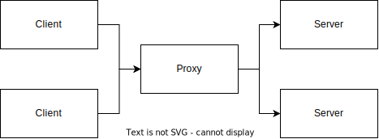
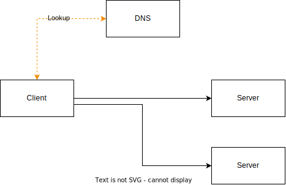

I've been exploring how to provide high availability for some client-server applications with some unusual constraints:

1. I can install software on the client servers (or make any other necessary adjustments)
2. I can't necessarily modify the client software itself (config is fair game though)
    a. If the client software itself does not support multiple back-ends, then it's not really feasible to adjust it
3. I can't re-arrange the client and server physical locations, they may be spaced to mitigate conjoined failures
4. The traffic is TCP and UDP -- not necessarily HTTP.

-, when the _physical_ location of clients and server is not known in advance.

There's a set of constraints:

1. We need to run few instances of many different clients (100 clients, 2-3 instances each)
2. It's not really feasible to modify the clients
3. The clients are intentionally on geographically separate areas (read: different countries)

And a set of goals:

1. Minimize latency (not in an absolute sense, but avoid egregious extra hops)
2. Simple operation (configuration updates, version upgrades)


Let's look at the options:

## Centralized proxy

It's great when you have good placement -- the proxy does not drastically extend the path between client and server


But in some cases...


Disqualifying, bug also:
- Crash bad
- Upgrade hard

### DNS

DNS solves a large part of the issue, even if the DNS resolver is far away, the latency cost is not paid on every message, rather
only when initiating new connections, and even then, it's guaranteed to happen less frequently than "once per TTL"



Looks pretty good! No data path issues

Downsides:

- DNS records need to change, so TTLs cannot be "large" -- you need to accept "1 TTL" of downtime, so.. 5 minutes?
- Some applications and frameworks are badly behaved, meaning that they resolve the domain _once_ and they cache the results forever, ignoring TTL
- If the DNS server crashes, the data path will be affected once the TTLs expire
    - Fairly easy to mitigate by having multiple DNS servers and round-robin lookups

## Client-side userspace proxy

We can take the proxy concept and move it to the client, taking the placement issue out of the equation


If this proxy is a userspace component, that is, a program that listens for connections and pipes the data to selected backends we get a few features for free:

- Can detect when a connection to a backend is interrupted and immediately remove it from the backend options
- Low latency, as there are "no" unnecessary network hops (there are some extra memory copies, but that's negligible in this scenario)

But we also have some drawbacks:

- If the proxy crashes, all connections are disrupted
- Updates / Upgrades are hard -- you can perform a very specific dance and pass open connections to the process that will replace it

## Client-side kernelspace proxy

Working with the above, the data plane was getting mixed with the control plane, which we should try to avoid.

What we can do, is move the "proxying" of the data to kernel space with IPVS.

IPVS (IP Virtual Server) is a Linux feature that allows for [Layer-4]() (so, TCP and UDP) "load balancing"

The way IPVS works is by rewriting destinations on IP packets before they are sent to the network.

how?

There are tables which define a Service (a virtual IP & port) and a set of Destinations (real addresses "backing" the Service)

For example, "Service1" can be defined as:

- Virtual IP: 10.0.0.1
- Port: 1234
- Destinations:
    - Real IP: 1.2.3.4
    - Port: 8888

FIXME


To manage the IPVS rules, we need a userspace component (could be something smart, or a script that just calls `ipvsadm`) but this component is _specifically_ constrained to the control plane.

The main advantage over the userspace proxy is that there's no "software to upgrade or restart" (well, the kernel, but those upgrades are disruptive anyway)

However, lost a very nice property from the proxy: being able to quickly detect closed connections and act accordingly (eg: by quarantining them for a little bit)

Hope is not lost!

We can extend the userspace component, with the capability to detect closed connections; how?

:sparkle: eBPF :sparkle:

Hook into events, get notified of updates, add simple example

We can trace the TCP state machine in the kernel by following [tcp_set_state](TODO)

example:
```
logs of tcp + curl establishment
```

so far so good, now let's try tracing an ipvs connection

```
logs of the tcp state machine use virtual ip
```

huh, that's not so useful, we don't know which backend got selected, so, if we hit a problem we don't know which backend to remove from the service.

let's look at IPVS events first:

we can put a hook on [ip_vs_conn_new]() (which sadly does not have a trace function, and we need a kprobe) (TODO difference)

in here, we get an [ip_vs_conn_param](), a destination address ([nf_inet_addr]()) and a destination port


As this event happens _before_ the TCP connection is started, we can save this data, to later look itup during TCP events

We can store, in a hashmap, a key:
```rust
struct TcpKey {
    // TCP source port
    sport: u16,
    // TCP dest port  (virtual)
    vport: u16,
    // TCP source address
    saddr: u32,
    // TCP dest address (virtual)
    vaddr: u32,
}
```

and a value:
```rust
pub struct IpvsDest {
    pub daddr: IpAddr,
    pub dport: u16,
}
```

now, we have access to this hashmap during the TCP state transitions, and it now looks a lot more promising

if we see transition `CLOSE->OPEN` (TODO) we receive
- Virtual IP destination address and port
- Source IP address and port

We can use these to build the `TcpKey` again, look up the corresponding `IpvsDest` and return that to userspace as a

```rust
#[derive(Debug, PartialEq)]
pub struct TcpSocketEvent {
    pub oldstate: TcpState,
    pub newstate: TcpState,
    pub sport: u16,
    pub dport: u16,
    pub dst: IpAddr,
    pub svc: Option<IpvsDest>,
}
```

crux of the ebpf impl, svc being Option is because the trace of `tcp_set_state` happens _before_ a source port is assigned!

```c
/* Socket identity is still unknown (sport may be zero).
 * However we set state to SYN-SENT and not releasing socket
 * lock select source port, enter ourselves into the hash tables and
 * complete initialization after this.
 */
tcp_set_state(sk, TCP_SYN_SENT);
```

// See:
// https://github.com/torvalds/linux/blob/v6.11/net/ipv4/tcp_ipv4.c#L294
// tcp_connect is called here:
// https://github.com/torvalds/linux/blob/v6.11/net/ipv4/tcp_ipv4.c#L337
// critically, after `inet_hash_connect`, which assigns the source port.

this _sucks_.. but.. we can cheat a little bit, by tracing _any function_ that receives a useful context, while the tcp lock is held,
we can get access to the late-initialized sourceport; in this case, `tcp_connect` is a perfect function for that.


So, in summary, if we trace the IPVS connection establishment, we can enrich further TCP socket transitions with the IPVS Destination (instead of just Service address)

And, if we can push TCP state changes with Service+Destinations to userspace, we can decide what to do.

Something like this
```rust
info!("Waiting for Ctrl-C...");
let mut watcher = ConnectionWatcher::new()?;
let mut rx = watcher.get_events().await?;
while let Some(i) = rx.recv().await {
    println!("{:?} = {:?}", i, i.interpret());
}
signal::ctrl_c().await?;
info!("Exiting...");
```

which has all the upsides of the userspace connection proxy, and none of the downsides (beyond any sanity lost while trying to coerce `aya` + the eBPF verifier into letting me access valid pointers)

---

This precludes having a static set of proxies, as the location may be a problem

Client [France] -> Proxy [Lithuania] -> Server [France] 

would be a problem

we want to minimize latency, hops, and single points of failure.

The solution I "came up with" is to mimic the `Service` concept in Kubernetes, which boils down to: have dedicated "virtual" IPs, which point to the "correct" backend for every client

To make networking simple, these IPs are never actually used as destinations over the wire, instead, the packets are rewritten before leaving the "Client" machine.

This is done with IPVS (explanation), which can rewrite destination addresses before they leave the wire

```
ipvsadm something add
```

## Compared to alternatives

Centralized proxy:
* :X:


## Downsides
- Every **Client** needs to have the IPVS daemon
