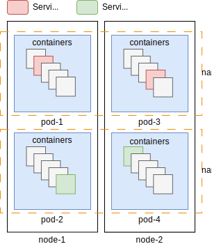
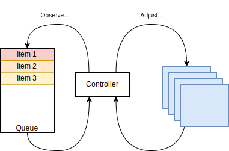

I've been working on systems administration / engineering / infrastructure development for many years and
somehow I've managed to avoid any interaction with Kubernetes. This avoidance wasn't accidental; my work required very tight control of workload placement in physical locations.

Over time, I developed a skeptical view of Kubernetes without really having a solid basis for it, other than a vague notion of it being "a new way of doing things" and "unnecessary complexity".

I decided it was time to base my opinions on facts rather than perception, so here I am, writing what I learned.

While there are a lot of tutorials covering the usage and operation of a Kubernetes cluster, along with basic descriptions of its components, they did not quite work for me. Many of these resources lightly cover _what_ the components do, but often miss the underlying reason or the tradeoffs.

This post aims to cover these concepts from a perspective I would've found useful, and it does not aim to be exhaustive.

## A "standard" description

Kubernetes allows you to run arbitrary workloads, and provides you with the ability to:

- specify requirements (cpu, disk, memory, instance count, ..)
- dynamically scale instance count

but the more important part, is what it _does_ for you:

- picking which host an application runs on
- "self-healing" (crashed instances get restarted, instances automatically moved out of faulty hosts)
- exposes services for DNS-based discovery

and it only _requires_ you to package your workload as a [Docker image](https://kubernetes.io/docs/concepts/containers/images/), which seems like a reasonable price to pay.

The basic building blocks that compose a cluster can be defined as follows:

- [Pod](https://kubernetes.io/docs/concepts/workloads/pods/): a unit of work, consisting of a set of Docker images and their configuration
- [Node](https://kubernetes.io/docs/concepts/architecture/nodes/): a computer running the kubernetes node agent (kubelet). executes Pods.
- [Cluster](https://kubernetes.io/docs/concepts/architecture/); a logical collection of `Node`s along with the Control Plane.
- [Service](https://kubernetes.io/docs/concepts/services-networking/service/): logical grouping of a set of pods
- [Namespace](https://kubernetes.io/docs/concepts/overview/working-with-objects/namespaces/): a logical subdivision of the `Cluster`. provides scope for names (like DNS search domain)


It's easier to observe the relationship between these concepts in diagram form:



While this may be an OK{^-ish|Incomplete, mildly incorrect, etc} explanation, it wasn't really something that would've been useful for me &ndash; a lot of infrastructure platforms look _something_ like this diagram; there's nothing special here

## What I found important

My opinion is that a large part of Kubernetes' value is derived from just two concepts:

### Control loops

[Workloads](https://kubernetes.io/docs/concepts/workloads/) are managed by a set of [control loops](https://en.wikipedia.org/wiki/Control_loop) (named [Controllers](https://kubernetes.io/docs/concepts/architecture/controller/)).

A control loop will continuously perform _actions_ (via a control element), if necessary, to achieve a _desired state_, and it will do this by observing specific variables (via a sensor).

An interesting detail is that the control element does not necessarily _directly_ affect what the sensor observes.

This description is very generic, so here are some examples:

- A workload that needs to process events from a queue
	- Desired state: empty queue
	- Sensor: depth of the queue
	- Control Element: number of event processing servers
- A workload that needs to horizontally scale to handle user load
	- Desired state: Maintain P90 latency below X ms
	- Sensor: Latency metrics from backend
	- Control Element: Spin up new Pods to handle the demand
- Generic Health monitoring
	- Desired state: All Nodes are healthy
	- Sensor: Health metrics from nodes
	- Control Element: Remove Nodes from the cluster




### Services

A [Service](https://kubernetes.io/docs/concepts/services-networking/service/) is a networking-level concept which provides stable access to a set of backing Pods, it offers:

- A **stable identity**: unchanging (virtual) IP address & a DNS record
- Load balancing: distributes incoming traffic across the Pods
- Service discovery: allows other components to find and communicate with the Service

Compared to "classic" clusters, a Service provides a similar abstraction to the combination of:

- N nodes running [Keepalived](https://www.keepalived.org/) + NGINX (with a dynamic set of backends)
- CNAME records for the virtual (Keepalived) IP


Whenever a new Service is created:

1. A Virtual IP will be assigned to it
2. Every Node will update its networking configuration (`netfilter`) to forward any packet destined to each Service's Virtual IP instead to the backing Pods.

The networking configuration is updated by a Controller that runs on every Node: [kube-proxy](https://kubernetes.io/docs/concepts/overview/components/#kube-proxy), whose primary responsibility is to watch the state of all `Service` objects and update the `netfilter` rules on every change.

This design means that all Nodes act as load balancers for Service traffic, so there is no single point of failure in Service traffic forwarding, and that traffic forwarding capacity scales with Cluster size.

For me, an interesting property of this design is that every Node receives the rules for **every** Service, which has some implications:

- Very simple implementation for `kube-proxy`
- The number of rules may be large, which may be problematic for certain traffic forwarding implementations (`iptables` linearly evaluates every rule) 
- Traffic is forwarded multiple times in some scenarios, providing higher availability at the cost of extra load on the cluster
	- When a Pod is moved to another node, the traffic will be forwarded twice until the old DNS entry expires
		- No need to deal with cache invalidation for DNS entries at the `kube-proxy` level
	- Misbehaving clients (eg: ones that do not re-resolve DNS before reconnecting) will continue to work


We can look at the life of a packet that travels from "Pod 1" to "Service 1":

{embed-mermaid assets/packet.mermaid}


## Workload management

or "how, when and where things run"

You can create a Pod manually, using a YAML definition like this one:

```yaml
apiVersion: v1
kind: Pod
metadata:
  name: nginx
spec:
  containers:
  - name: nginx
    image: nginx:1.14.2
    ports:
    - containerPort: 80
```

but by doing that, you are _manually_ scheduling the execution of this pod _once_; which is easy, but has some nasty limitations:

* If the Node that host the Pod dies, the Pod will not get re-scheduled
* If the Pod is terminated due to resource pressure on the Node (via [eviction](https://kubernetes.io/docs/concepts/scheduling-eviction/node-pressure-eviction/)) it also won't get re-scheduled
* You can't go "now I want to have 2 of these"


Instead of creating a Pod directly, you can create a [ReplicaSet](https://kubernetes.io/docs/concepts/workloads/controllers/replicaset/) which is a Controller, and as part of it's control loop it will ensure that the right number of Pod replicas are running at all times, which solves the problem of Node failure/eviction deleting your Pod.

```yaml
apiVersion: apps/v1
kind: ReplicaSet
metadata:
  name: nginx-replicaset
spec:
  replicas: 3
  template:
    spec:
      containers:
      - name: nginx
        image: nginx:1.14.2
```

ReplicaSets allow you to update the desired number of replicas, _and nothing else_ (eg: updating `nginx` version, or exposing another port) &ndash; you would need to delete the resource and re-create it.

To address these limitations, you can use a [Deployment](https://kubernetes.io/docs/concepts/workloads/controllers/deployment/), which is a Controller that will ensure the right number of Pods _with the right image_ are running **eventually**.

The **eventual** part is very important, as Deployments allow you to update which image (or version) the Pod is running and to select the rate of change, covering the standard workflow of a "version upgrade".

Said differently, when you update a Deployment, it creates a new ReplicaSet and gradually scales it up while scaling down the old one, enabling rolling updates.

## Storage management

or "how data persists and moves with your Pods"

By default, containers within a Pod do not share storage/filesystem.

If you want to share storage between containers in a Pod, you can use an [Ephemeral Volume](https://kubernetes.io/docs/concepts/storage/ephemeral-volumes/), whose lifecycle is tied to the Pod - when the Pod shuts down, the data is deleted.

Ephemeral Volumes seemed useless[^1], but they do have some use-cases:

1. Log shipping from a sidecar
2. A sidecar populating caches for the main application

[^1]: I'm only considering "standard storage" here &ndash; I wouldn't consider `ConfigMap`s storage.

If you want to have _actually persistent_ storage, you could use a [Persistent Volume](https://kubernetes.io/docs/concepts/storage/persistent-volumes/), which has a lifecycle that is decoupled[^pv-lifecycle] from the Pod's.

[^pv-lifecycle]: Expected to be "permanent" but nobody stops the admin from `rm -rf` on the wrong server ¯\\\_(ツ)\_/¯.

You'd define such a Volume with a [Claim](https://kubernetes.io/docs/concepts/storage/persistent-volumes/), like this:

```yaml
apiVersion: v1
kind: PersistentVolumeClaim
metadata:
  name: nginx-pvc
spec:
  accessModes:
    - ReadWriteOnce
  resources:
    requests:
      storage: 1Gi
```

and you can then use it in a Pod like this:

```yaml
apiVersion: v1
kind: Pod
metadata:
  name: nginx-with-pv
spec:
  containers:
  - name: nginx
    image: nginx
    volumeMounts:
    - name: html-volume
      mountPath: /usr/share/nginx/html
  volumes:
  - name: html-volume
    persistentVolumeClaim:
      claimName: nginx-pvc
```

Some things seemed interesting:

- Multiple users (Pods) of the same Claim will share storage, as always this is fairly risky if there are multiple writers
- A PersistentVolume is backed by different drivers (NFS, SMB, iSCSI, ..) but which one is being used is not clear to the Pod, so the Pod cannot rely on features (like atomic renames)

If you want to haver per-instance persistent storage, you can use a [StatefulSet](https://kubernetes.io/docs/concepts/workloads/controllers/statefulset/) which defines in a single resource: a workload (Pod), replica count, mount configuration and volume claim _template_.

Some interesting things with `StatefulSet`s:

1. Pods have stable hostnames (`nginx-0`, `nginx-1`, ..)
2. Deployments are executed in order:
	1. Creation of Pods in ascending order (0, 1, ..)
	2. Deletion of Pods in descending order (3, 2, ..)
	3. Updates Pods in descending order (3, 2, ..)

This seemed _weird_, and the explanations that I found online say that apparently lower numbered instances are "core" or "more stable" &ndash; I don't get it, as a crashy Pod will not get renumbered. Maybe it'd be better to update in descending "uptime" order? Maybe this "seniority"/"stability" got retconned for Pods, and Kubernetes just needed _an_ order?

Operationally, at this point it's still unclear to me how you'd manually investigate the contents of a Persistent Volume, other than attaching to the running container & executing commands there; what if my container does not bring a shell?

## The scorecard

We've covered the main parts of Kubernetes - Control loops, Services, Workloads and Storage. Learning about this concepts has allowed me to form the less-baseless opinion I was looking for (though, I still have not operated or used a cluster).

Overall, I think the **concepts** make a lot of sense, specifically I think Services (including the networking model, and kube-proxy) are fantastic, and that keeping the Controller pattern as an engine for resource management is the right way to operate.

I'm left with some open-ended questions/rants, which I'll leave here for your enjoyment

The [Controller docs](https://kubernetes.io/docs/concepts/architecture/controller/) say:

> Your cluster could be changing at any point as work happens and control loops automatically fix failures. This means that, potentially, your cluster never reaches a stable state.
>
> As long as the controllers for your cluster are running and able to make useful changes, it doesn't matter if the overall state is stable or not.

Why does it not matter if the state is unstable? If I'm operating a cluster that can't settle, I'd like to know immediately!

* Given the Controller pattern, why isn't there support for "Cloud Native" architectures?
	- I would like to have a ReplicaSet which scales the `replicas` based on some simple calculation for queue depth (eg: queue depth / 16 = # replicas)
	- Defining interfaces for these types of events (queue depth, open connections, response latency) would be great
	- Basically, [Horizontal Pod Autoscaler](https://kubernetes.io/docs/tasks/run-application/horizontal-pod-autoscale/) but with sensors which are not just "CPU"
* Why are the storage and networking implementations "out of tree" (CNI / CSI)?
	- Assuming it's for "modularity" and "separation of concerns"
* Given the above question, why is there explicit support for Cloud providers?
	- eg: LoadBalancer supports AWS/GCP/Azure/..

And for the largest open topic, even though this is not Kubernetes' fault, I have a rant I need to get out

### Stringy types

The Kubernetes "community" seem to have absolutely hell-bent on making their lives harder by basing tools on **text interpolation** of all things. It's like they saw [Ansible](https://www.ansible.com/) and thought, "Hey, that looks terribly painful. Let's do that!".

Check out this [RabbitMQ scaler](https://keda.sh/docs/2.14/scalers/rabbitmq-queue/) (KEDA, maintained by Microsoft) as an example:

> value: Message backlog or Publish/sec. rate to trigger on. (This value can be a float when mode: MessageRate)

What do you mean that the _type_ for `value` depends on the _value_ of `mode`?? And what do you mean `mode` is a string when it should be an enum??

How did [Helm](https://github.com/helm/helm) manage to become popular?? How is it possible for a tool like this to do _text templating_ of all things that could be done?

Take this [arbitrary NGINX](https://artifacthub.io/packages/helm/bitnami/nginx?modal=template&template=deployment.yaml) chart and check how most values are handled with _manual string indentation_:

```
{{- include "common.tplvalues.render" ( dict "value" .Values.commonAnnotations "context" $ ) | nindent 4 }} 14 {{- end }}
```
or
```
{{- toYaml { "rollingUpdate": {}, "type": "RollingUpdate" } .Values.updateStrategy | nindent 4 }}
```

Why are we generating a structured language (YAML), with a computer, by manually adding spaces to make the syntax valid? There should be no intermediate text-template representation like this one.
