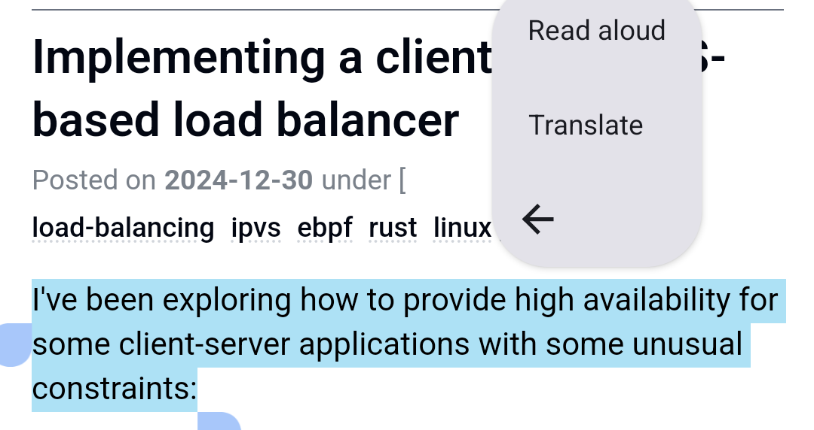

Some time ago, Firefox [introduced](https://www.mozilla.org/en-US/firefox/118.0/releasenotes/) in-browser, on-device translation for webpages. I know that Chrome users have had this forever,
but I'm not comfortable sending all my browsing data to Google.

This new feature was super useful for me, and I started wondering if I could also use it outside of the browser.


I did some research and found out that Mozilla publishes the [firefox-translation-models on GitHub](https://github.com/mozilla/firefox-translations-models/tree/main), and that
there's a piece of software called [bergamot-translator](https://github.com/browsermt/bergamot-translator) which can run these models on-device, by wrapping [marian-nmt](https://marian-nmt.github.io).

With some basic idea of the software landscape, I tried it out

## Running bergamot-translator on Linux

`bergamot-translator` is very straight-forward to build

```bash
$ git clone git@github.com:browsermt/bergamot-translator.git
$ mkdir build
$ sudo apt install libpcre2-dev libopenblas-dev
$ cmake ..
$ make -j
```

but how to _run_ this? I ended up reading a bunch of code for CI/tests/.. on the repo and figured out that I needed a YAML file _exactly_ like this one:

```yaml
bergamot-mode: native
models:
  - firefox-translations-models/models/prod/esen/model.esen.intgemm.alphas.bin
vocabs:
  - firefox-translations-models/models/prod/esen/vocab.esen.spm
  - firefox-translations-models/models/prod/esen/vocab.esen.spm
shortlist:
    - firefox-translations-models/models/prod/esen/lex.50.50.esen.s2t.bin
    - false
beam-size: 1
normalize: 1.0
word-penalty: 0
max-length-break: 128
mini-batch-words: 1024
workspace: 128
max-length-factor: 2.0
skip-cost: true
cpu-threads: 0
quiet: false
quiet-translation: false
gemm-precision: int8shiftAlphaAll
alignment: soft
```

where `esen` is the language pair for the translation, in this case es&rarr;en (Spanish to English).


The models/vocabs/shortlist files _should_ be sourced from the `firefox-translations-models` repository, with `git-lfs`. There's some docs which still point to Google
cloud storage for downloads, but those are stale.

With the models on hand, I could pipe some data through `bergamot-translator`:

```bash
echo "Hola mundo" | ./bergamot-translator --model-config-paths config.yml
Hello world
```

At this point, I thought that using the bergamot shared library would be trivial and I'd be done in _no time_.

## Android app scaffolding

I assumed that building a shared library (`libbergamot.so`) for Android would be trivial; just set some build target variable and be done with it.

It was not entirely accurate, first, I needed to download Android Studio (a shitty Java-based IDE), built a "Hello world" app and, through a bunch of clicking,
I added a "Native Library" module, which created _way too many files_.

Only three of those files are actually important to me:

`bergamot.cpp`, an adaptor from "Java calling convention" to "CPP calling convention" 
```cpp
extern "C" JNIEXPORT jstring JNICALL
Java_com_example_bergamot_NativeLib_stringFromJNI(
        JNIEnv* env,
        jobject /* this */) {
    return env->NewStringUTF("Hello from CPP");
}
```

`NativeLib.kt`, a Kotlin class wrapping the CPP adapter (obviously more wrappers is more good)

```kotlin
package com.example.bergamot

class NativeLib {
    external fun stringFromJNI(cfg: String, data: String): String
    companion object {
        // Used to load the 'bergamot' library on application startup.
        init {
            System.loadLibrary("bergamot-sys")
        }
    }
}
```

`CMakeLists.txt`, the build file for the cpp library:

```cmake
cmake_minimum_required(VERSION 3.22.1)
project("bergamot-sys")
add_library(${CMAKE_PROJECT_NAME} SHARED
        bergamot.cpp)

target_link_libraries(${CMAKE_PROJECT_NAME}
        android
        log
)
```

So, let's go build this `libbergamot`

## The descent into CMake madness

<div class="warning" data-type="Disclaimer">
I have absolutely no idea what I'm doing when it comes to C++, CMake or Android, so likely my struggles are user error.
</div>


I thought that I only needed to do add the source code to my CMake project & link the resulting library, like this:

```diff
 add_library(${CMAKE_PROJECT_NAME} SHARED
         bergamot.cpp)

+add_subdirectory("bergamot-translator/")

 target_link_libraries(${CMAKE_PROJECT_NAME}
         # List libraries link to the target library
+        bergamot-translator
         android
         log
 )
```

Boy, was I wrong.

As soon as I hit the little 🔨 icon to start the build, my computer fans went into overdrive, and all I got out of it was failures on all architectures:

<center>

</center>

Let's try to fix one thing at a time, and build only for `x86_64` for now

On `build.gradle.kts`, under `android.defaultConfig`, we can add the architecture filter
```diff
+    ndk {
+        abiFilters += listOf("x86_64")
+    }
```

Every time there's a change in this file, I get to press "Sync Now" on Android studio, what a great piece of software.

If we try again, we get 42KiB worth of error logs over 438 lines, which seems to be how the average Java/C++ developer goes through their life ¯\\\_(ツ)_/¯

### PCRE2 dependency
Distilling the errors, there are only 3 lines which seem to have any relevance at all:

```text
C/C++: CMake Warning at bergamot-translator/3rd_party/marian-dev/CMakeLists.txt:577 (message):
C/C++:   COMPILE_CUDA=off : Building only CPU version
C/C++: CMake Warning at bergamot-translator/3rd_party/marian-dev/CMakeLists.txt:614 (message):
C/C++:   Cannot find TCMalloc library.  Continuing.
C/C++: CMake Error at bergamot-translator/3rd_party/ssplit-cpp/CMakeLists.txt:46 (message):
C/C++:   Cannot find pcre2 libraries.  Terminating.
```

Warnings are for people with time and working software, let's focus on making `pcre2` work:

I tried to add some CMake commands I found online, but I couldn't get `ssplit-cpp` to pick `pcre2` up after at least an hour of random fiddling;
In my struggles, I opened `bergamot-translator/3rd_party/ssplit-cpp/CMakeLists.txt` and found this very promising line:

```cmake
option(SSPLIT_USE_INTERNAL_PCRE2 "Use internal PCRE2 instead of system's." OFF)
```

so instead of adding `pcre2` as a submodule & building it manually, I turned the option on:

```cmake
set(SSPLIT_USE_INTERNAL_PCRE2 ON)
```

but apparently this is not enough, as it was not being picked up by the build.

The correct way is to do

```cmake
set(SSPLIT_USE_INTERNAL_PCRE2 ON CACHE BOOL)
```

which will make the variable not be overwritten by options declared further down the compile chain.


with this change, the build progressed quite a bit further (and melted my PC again) and got to some non-CMake errors, I consider this a resounding victory.

<div class="aside">
I am definitely confused at having a project to <i>split sentences</i>, and I was doubly confused by having to fiddle with build time issues
for <i>regexes</i> of all things.
<br/>
Seems like things I take for granted in <i>reasonable languages</i> are, for some reason, harder in C++
</div>

### Missing intrinsics

Within the `faiss` library, there are multiple errors about undefined intrinsics, for example:

```text
 error: unknown type name '__m128'
  148 | static inline __m128 masked_read(int d, const float *x)
      |               ^
 error: use of undeclared identifier '_mm_load_ps'
  165 |   return _mm_load_ps(buf);
      |          ^
```

This is fairly simple to solve, by adding a few gated includes on `VectorTransform.h`

```c
#if defined(__x86_64__) || defined(_M_X64)
#include <xmmintrin.h>
#include <emmintrin.h>
#include <pmmintrin.h>
#endif
```

### iconv issues

Similar to the previous step, there's uses of undeclared functions:

```text
 error: use of undeclared identifier 'iconv_open'
  121 |   iconv_t converter    = iconv_open(to_encoding, from_encoding);
      |                          ^
 error: use of undeclared identifier 'iconv'
  152 |     iconv(converter, &inbuf, &inbytes_left, &outbuf, &outbytes_left); // sets outbytes_left to 0 or very low values if not enough space (E2BIG)
      |     ^
...
```

A quick check on the [bionic source code](https://android.googlesource.com/platform/bionic/+/master/libc/bionic/iconv.cpp#341) shows that `iconv_open` is absolutely defined, what's going on?

Without thinking, I spent some time patching this code, as I thought that these code paths are not used, but that just led to an ever-increasing scope creep of how much I needed to patch.

In the end, I found out that `iconv_` functions are defined on Android SDK version 28 or later, so we only need to update the `build.gradle.kts` file:

```diff
 defaultConfig {
-     minSdk = 24
+     minSdk = 28
```

Bumping the `minSdk` will make the app supported on 92% of devices, instead of 97% per [apilevels](https://apilevels.com/) (as of February, 2025), but I don't want to spend more time figuring this out.

with this change, the library built?? I'm shocked it was only these errors

## Runtime fun

The library built, the app starts and... shuts down, with this stacktrace

```text
Fatal signal 4 (SIGILL), code 2 (ILL_ILLOPN), fault addr 0x7109285ca034 in tid 5731 (e.myapplication), pid 5731 (e.myapplication)
Cmdline: com.example.myapplication
pid: 5731, tid: 5731, name: e.myapplication  >>> com.example.myapplication <<<
      #00 pc 0000000000b1c034  base.apk!libbergamot-sys.so (offset 0x1b70000) (std::__ndk1::__compressed_pair_elem<float, 0, false>::__compressed_pair_elem[abi:ne180000]<float, void>(float&&)+20) (BuildId: b691595a5df0e03706a8bc38072b8ce3a6c812da)
      #01 pc 0000000000c24594  base.apk!libbergamot-sys.so (offset 0x1b70000) (std::__ndk1::__compressed_pair<float, std::__ndk1::equal_to<std::__ndk1::basic_string<char, std::__ndk1::char_traits<char>, std::__ndk1::allocator<char>>>>::__compressed_pair[abi:ne180000]<float, std::__ndk1::__default_init_tag>(float&&, std::__ndk1::__default_init_tag&&)+36) (BuildId: b691595a5df0e03706a8bc38072b8ce3a6c812da)
      #02 pc 0000000000c24417  base.apk!libbergamot-sys.so (offset 0x1b70000) (BuildId: b691595a5df0e03706a8bc38072b8ce3a6c812da)
      #03 pc 0000000000c138b0  base.apk!libbergamot-sys.so (offset 0x1b70000) (BuildId: b691595a5df0e03706a8bc38072b8ce3a6c812da)
      #04 pc 0000000000c136d8  base.apk!libbergamot-sys.so (offset 0x1b70000) (BuildId: b691595a5df0e03706a8bc38072b8ce3a6c812da)
      #05 pc 0000000000c13880  base.apk!libbergamot-sys.so (offset 0x1b70000) (BuildId: b691595a5df0e03706a8bc38072b8ce3a6c812da)
      #22 pc 0000000000000d1c  base.apk (com.example.nativelib.NativeLib.<clinit>+0)
      #32 pc 0000000000001870  base.apk (com.example.myapplication.MainActivity.onCreate+0)
```

aren't C++ identifiers a thing of beauty?

Okay, we can power through this, let's add debugger in the `NativeLib.kt` file, which is just a single line: `Debug.waitForDebugger()`

We get dropped to `LLDB`, and the backtrace (from running `bt`) matches the previous log.

We can inspect a little bit, with the annotated source code, and it seems that we are inside a global constructor, in `cli_wrapper.cpp` (a file from the `marian-dev` project):

```cpp
const std::unordered_set<std::string> DEPRECATED_OPTIONS = {
  "version",
  "special-vocab",
// @TODO: uncomment once we actually deprecate them.
//  "after-batches",
//  "after-epochs"
};
```
this seems... innocuous; why would the app die here?

Trying to look at the actual CPU instructions is not useful -- we'd landed in a constructor table which doesn't tell much
```text
...
    0x710921c96877 <+119>: callq  0x710921c96650            ; ::__cxx_global_var_init.68() at cli_wrapper.cpp
    0x710921c9687c <+124>: callq  0x710921c96670            ; ::__cxx_global_var_init.69() at cli_wrapper.cpp
->  0x710921c96881 <+129>: popq   %rbp
    0x710921c96882 <+130>: retq
```

Let's add debug information by adding this to `CMakeLists.txt`:
```cmake
 set(CMAKE_BUILD_TYPE Debug)
```

now when running `disas` we get a better view of the issue:

```asm
    0x710923dc402c <+12>: movq   -0x8(%rbp), %rax
    0x710923dc4030 <+16>: movq   -0x10(%rbp), %rcx
->  0x710923dc4034 <+20>: vmovss (%rcx), %xmm0             ; xmm0 = mem[0],zero,zero,zero 
    0x710923dc4038 <+24>: vmovss %xmm0, (%rax)
    0x710923dc403c <+28>: popq   %rbp
    0x710923dc403d <+29>: retq
```
searching online for [vmovss](https://www.felixcloutier.com/x86/movss), it's an AVX[^avx] instruction to move an `f32` around. wait. WAIT.

SIGILL is an illegal instruction; who said we could use it? Let's check
[^avx]: AVX (Advanced Vector Extensions) is a set of CPU instructions for performing calculations on multiple pieces of data simultaneously ("SIMD").

```bash
$ adb shell cat /proc/cpuinfo
emu64xa:/ $ 
processor       : 0
vendor_id       : AuthenticAMD
cpu family      : 6
model           : 6
model name      : Android virtual processor
cpuid level     : 16
flags           : fpu de pse tsc msr pae mce cx8 apic sep mtrr pge mca cmov pat pse36 clflush mmx fxsr sse ss
e2 ht syscall nx lm nopl cpuid tsc_known_freq pni ssse3 cx16 sse4_1 sse4_2 x2apic popcnt tsc_deadline_timer h
ypervisor lahf_lm cmp_legacy abm 3dnowprefetch vmmcall 
```

do you see it?? yeah, neither do I! `avx` is **not** part of the supported flags for the emulator's processor; of course `vmovss` is an illegal instruction!

I spent _hours_ poking these projects to try and get them to build without emitting AVX instructions and couldn't manage. I guess that's a problem for later ¯\\\_(ツ)\_/¯


### Enabling AVX on the emulator

There was no option in Android Studio to enable `avx` on the emulator&mdash;I understand why, they [specifically](https://developer.android.com/ndk/guides/abis#86-64) tell you to use runtime probing & fallbacks for it.

But.. I'm smarter than a shitty Java IDE, so I started the emulator from Android studio and ran 

```bash
$ ps aux | grep qemu

.../emulator/qemu/linux-x86_64/qemu-system-x86_64 -netdelay none -netspeed full -avd Medium_Phone_API_35 -qt-hide-window -grpc-use-token -idle-grpc-timeout 300 -no-snapshot-load
```

with this command, I tried to run the emulator directly
```bash
./emulator/qemu/linux-x86_64/qemu-system-x86_64 ....

error while loading shared libraries: libtcmalloc_minimal.so.4: cannot open shared object file: No such file or directory
```

but it depends on shared libraries that are not part of the system, typical.

I found the lib in `ANDROID_SDK/emulator/lib64`, so added I added the path to `LD_LIBRARY_PATH` and hit the same error with `libQt6WebChannelAndroidEmu.so.6`, repeating the process, adding `ANDROID_SDK/emulator/lib64/qt/lib` to `LD_LIBRARY_PATH`, the emulator starts up!

Now, we just need to convince this `qemu` wrapper to enable AVX on the guest. Reading the emulator's `--help`, I found out that there's a flag `-qemu ..` which passes all further arguments directly to qemu, so let's spawn an emulator with AVX support

```bash
cd $ANDROID_SDK/emulator
export LD_LIBRARY_PATH=$PWD/lib64:$PWD/lib64/qt/lib
./qemu/linux-x86_64/qemu-system-x86_64 ... \
    -no-snapshot-load -qemu \
    -cpu "max"
```
once it starts up
```bash
$ adb shell grep -q /proc/cpuinfo && echo success
success
```

<div class="aside">
The <code>-no-snapshot-load</code> flag was important -- otherwise the <code>AVX</code> instructions would work <i>sometimes</i>. It seems like <code>/proc/cpuinfo</code> is not updated if the emulator boots a "snapshot" (fair, maybe it's a RAM dump)... but even then, why would the instructions <code>SIGILL</code> if the CPU supports them? Maybe there's something specific the kernel has to do at boot time to enable AVX?
</div>


We start the emulator and are greeted by a most beautiful sight:
<center>  </center>

Now we just need to get the app to do something.

## A basic android app

Now that the app was launching, I copied the [example bergamot-translator application](https://github.com/browsermt/bergamot-translator/blob/main/app/bergamot.cpp) to this project.

The example application needs some yaml (🤢) with paths to the models, and obviously, the app will need to be able to read the models from disk.

How do you even get a file to the emulator?? `adb push` didn't have access to the app's paths, and the app didn't have access to the "general storage" (`/storage/emulated/0/...`)

In the end, it was easier to download the files straight from the Github repo if they are not present on disk `(._.)`

```kotlin
val base = "https://media.githubusercontent.com/media/mozilla/firefox-translations-models/main/models/prod"
val lang = "esen"
val model = "model.esen.intgemm.alphas.bin"
val vocab = "vocab.esen.spm"
val lex = "lex.50.50.esen.s2t.bin"
val files = arrayOf(model, vocab, lex)
val dataPath = File(baseContext.filesDir, "bin")
dataPath.mkdirs()

lifecycleScope.launch {
    files.forEach { f ->
        val file = File(dataPath, f)
        if (!file.exists()) {
            val url = "${base}/${lang}/${f}.gz"
            downloadAndDecompress(url, file)
        }
    }
}
```

Now I can also generate the YAML and call the function

```kotlin
val cfg = """
models:
  - ${dataPath}/${model}
vocabs:
  - ${dataPath}/${vocab}
  - ${dataPath}/${vocab}
shortlist:
    - ${dataPath}/${lex}
    - false
...
"""
val input = "Hola mundo"
val nl = NativeLib()
val output: String
val elapsed = measureTimeMillis {
    output = nl.stringFromJNI(cfg, input)
}
```


aaaand the translation immediately aborts the program:

```text
ABORT("Marian must be compiled with a BLAS library");
```

Gaaaaaaaaah

Reading [marian-dev's CMakeLists.txt](https://github.com/marian-nmt/marian-dev/blob/master/CMakeLists.txt),
there are a few supported matrix multiplication libraries; while the default is `MKL`, Intel's optimized library
for x86-64, I'd rather use a single library on both x86-64 and aarch64.

How to figure out why this library isn't being linked/found though?? well, the code that `ABORT`ed before looks like this:

```cpp
#if BLAS_FOUND
    // ...
#elif USE_ONNX_SGEMM
    // ...
#elif USE_RUY_SGEMM
    // ...
#else
    ABORT("Marian must be compiled with a BLAS library");
#endif
```

So we "just" need to `set(USE_RUY_SGEMM ON)` and this error is gone.

<div class="aside">
I wasted many hours (and a bit over 1000 words) patching BLAS to compile for x86-64, before giving up and trying RUY.
<br/>
<br/>
Guess what? The RUY backend works perfectly on x86-64, so I got to delete my patches and the rambling.
</div>


After the matrix multiplication library finished building, there was one last error:

```text
error: call to undeclared function 'pthread_cancel';
```

Turns out that marian-dev hardcodes thread usage for non-WASM builds; but there's an intentionally [limited](https://android.googlesource.com/platform/bionic/+/master/docs/status.md)
`pthread` API on Android. [Removing `-pthread` from CFLAGS](https://github.com/browsermt/marian-dev/pull/112) was sufficient to complete the build succesfully.

With the translation library finally working on Android, we can focus on actually making this useful by building a proper Android application.

# Making an app

This was the "easiest" part, mostly because I "auto-generated" a generic layout:

<center>
<picture>
  <source style="width: 20rem; max-width: 100%" media="(prefers-color-scheme: dark)" srcset="assets/app-dark.png" />
  
</picture>
</center>

and just had to hook up the `Translate` button to `libbergamot`.

This is _fine_ but there are two features which are _super_ nice for a translator app

## Translating directly from other apps

Since [Android 6.0](https://developer.android.com/reference/android/content/Intent#ACTION_PROCESS_TEXT) it's been possible for apps to offer
actions on text selection, and it's super easy to do, just need to add this blob in `AndroidManifest.xml`

```xml
<intent-filter
    android:icon="@mipmap/ic_launcher"
    android:label="@string/translate_text">
    <action android:name="android.intent.action.PROCESS_TEXT" />
    <action android:name="android.intent.action.PROCESS_TEXT_READONLY" />
    <category android:name="android.intent.category.DEFAULT" />
    <data android:mimeType="text/plain" />
</intent-filter>
```

and you get a 'Translate' button on any[^thunderbird] text you highlight:

[^thunderbird]: Except on Thunderbird, [apparently](https://github.com/thunderbird/thunderbird-android/issues/8778). For that one you can "Share" the text to the app.

<center>
<picture>
  <source style="width: 30rem; max-width: 100%" media="(prefers-color-scheme: dark)" srcset="assets/process_text_dark.png" />
  
</picture>
</center>

which will open the app and pre-populate `Intent.ACTION_PROCESS_TEXT` with the highlighted text.

## Detecting input language

A _very_ nice feature in Google Translate is auto-detecting source language, so that only one language choice is required (target language).

I did some research, and both Firefox and Chrome seem to use [Compact Language Detector](https://github.com/CLD2Owners/cld2/tree/master)
per [MDN](https://developer.mozilla.org/en-US/docs/Mozilla/Add-ons/WebExtensions/API/i18n/detectLanguage).

For this, I needed to write another Java to CPP wrapper:
```cpp
extern "C" JNIEXPORT jobject JNICALL
Java_com_example_bergamot_LangDetect_detectLanguage(
        JNIEnv* env,
        jobject /* this */,
        jstring text) {
    const char* c_text = env->GetStringUTFChars(text, nullptr);

    jclass resultClass = env->FindClass("com/example/bergamot/DetectionResult");
    jmethodID constructor = env->GetMethodID(resultClass, "<init>", "(Ljava/lang/String;ZI)V");

    DetectionResult result = detectLanguage(c_text);
    jstring j_language = env->NewStringUTF(result.language.c_str());
    jobject j_result = env->NewObject(resultClass, constructor, j_language, result.isReliable, result.confidence);
    env->ReleaseStringUTFChars(text, c_text);
    return j_result;
}
```

but note that the output is not a scalar (before, the output was a `String`), it is a `DetectionResult`, which is defined as:

```kotlin
data class DetectionResult(
    val language: String,
    val isReliable: Boolean,
    val confidence: Int
)
```

running this code, worked... in debug mode!

In release mode, instead, I got:

```text
 JNI DETECTED ERROR IN APPLICATION:
   JNI NewStringUTF called with pending exception java.lang.NoSuchMethodError:
     no non-static method "Lcom/example/bergamot/DetectionResult;.<init>(Ljava/lang/String;ZI)V"
```

Turns out that the `DetectionResult` class was not being used anywhere in Java land, so it got pruned out of the build.

Adding 
```text
-keep class com.example.bergamot.DetectionResult { *; }
```

to `proguard-rules.pro` made the class be kept in the bundle, and the app now works.

<center>
<video style="width: 20rem; max-width: 100%" controls>
  <source type="video/webm" media="(prefers-color-scheme: dark)" src="assets/magic_dark.webm" />
  <source type="video/webm" src="assets/magic_light.webm" />
</video>
</center>

## On speed

A 252-word English text takes 489ms to translate to Spanish; but even single words take ~250ms, why is that?

Here's a flamegraph from a similar[^similar] machine:

[^similar]: An ARM devboard with an S922X CPU running Linux - I didn't want to figure out how to run perf on Android

<a href="assets/flamegraph.svg"></a>

The green areas highlight what I think are "initialization costs", loading models and preparing the translation pipeline. These currently are executed on _every_ translation request, which explains the fixed overhead.

By caching the initialized models on the C++ side (an `std::unordered_map<std::string, std::shared_ptr<TranslationModel>>` the performance increased dramatically:

- Initial load: still ~100ms
- Subsequent translations:
  - Short phrases (1-3 words): 5ms
  - Medium text (50-100 words): 20ms
  - Long text (200+ words): 80+ms

With this speedup, it's reasonable to enable translation on "real time" (as the user is typing), which makes for a nicer experience.

## Results

The app ends up being ~15MB, without any language model. ~12MB are due to the shared libraries.

The models themselves need to be downloaded separately (within the app) and are about 40MB each, though `marian-dev` _seems_ to support compressed models (gzip), it would be good to test out the performance difference.

Translation quality wise, the models are _good_, but they fall short of Google Translate and Claude/ChatGPT.

It's also important to note that not many languages are supported; [The models repo](https://github.com/mozilla/firefox-translations-models/tree/main) lists 20 languages
with bidirectional support and 7 languages which only translate one way.

You can find the app [on GitHub](https://github.com/DavidVentura/firefox-translator); and on [F-Droid](https://f-droid.org/en/packages/dev.davidv.translator/).


## Miscellaneous ranting

- I wouldn't wish CMake on my enemies
- Android studio should be burned to the ground
    - Buttons that sometimes take SECONDS to be responsive
    - Randomly uses 1200% CPU, I assume indexing some files
    - Needing to click 'Sync' every time I modify `CMakeLists.txt` -- if it can show me a pop-up, it can sync the file itself!
    - Sometimes an internal process would get stuck spinning with CPU at 100% -- only solution is to restart the IDE
    - Sometimes "paste" stops working?? You need to copy something inside Android Studio for it to start working again
    - Working without Vim mode is pain
- I actually had to scavenge some RAM from another computer, with 32GiB my machine kept running out of memory
