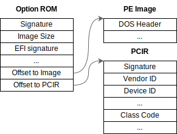

In this series, we've been implementing a PCI-e GPU and so far we were able to put some pixels on the (emulated) screen via purpose-built userspace programs.

Now it's time to make the GPU available to the system, and we'll start by making it available to {^UEFI|Unified Extensible Firmware Interface}, which is the system firmware that initializes hardware and loads the operating system. UEFI does not have built-in drivers for our custom GPU, but it allows for PCI devices to bring their own driver packaged in something called an [Option ROM](https://en.wikipedia.org/wiki/Option_ROM).

The format for an option rom is defined by two data structures, a 28-byte-long PCI Option ROM and a 24-byte-long PCI Data Structure ("PCIR"), followed by the driver's executable which must be in {^PE|Portable Executable} format:




## A 'Hello world' driver

For this post, we are going to implement the UEFI driver with [EDK2](https://github.com/tianocore/edk2), to set up the dev environment,
we follow the [official instructions](https://github.com/tianocore/tianocore.github.io/wiki/Common-instructions):

```bash
git clone git@github.com:tianocore/edk2.git
git submodule update --init --recursive
make -C BaseTools
source edksetup.sh
```

To build the driver, we need to specify in `Conf/target.txt` our platform's target:

```ini
ACTIVE_PLATFORM=OvmfPkg/OvmfPkgX64.dsc
TARGET_ARCH=X64
TOOL_CHAIN_TAG=GCC5
```

and following the [skeleton example](https://github.com/tianocore-docs/edk2-UefiDriverWritersGuide/blob/master/7_driver_entry_point/README.md#example-87-uefi-driver-inf-file) we can create

in `OptionRom/Rom.inf`

```ini
[Defines]
  INF_VERSION    = 0x00010005
  BASE_NAME      = OptionRom
  FILE_GUID      = f1f6026b-aa59-4e68-9fbe-6be92e37a225
  MODULE_TYPE    = UEFI_DRIVER
  VERSION_STRING = 1.0
  ENTRY_POINT    = OptionRomEntry

[Sources]
  rom.c

[Packages]
  MdePkg/MdePkg.dec

[LibraryClasses]
  DebugLib
  PrintLib
  UefiDriverEntryPoint
  UefiLib
```

in `OptionRom/rom.c`

```c
#include <Uefi.h>
#include <Library/UefiLib.h>
#include <Library/DebugLib.h>

EFI_STATUS EFIAPI OptionRomEntry (
  IN  EFI_HANDLE        ImageHandle,
  IN  EFI_SYSTEM_TABLE  *SystemTable) {
    DEBUG((EFI_D_INFO, "MyOptionRom loaded\n"));
    return EFI_SUCCESS;
}

EFI_STATUS EFIAPI MyOptionRomUnload (IN  EFI_HANDLE  ImageHandle) {
    return EFI_SUCCESS;
}
```

and build the driver with `build -m OptionRom/Rom.inf` (yes, they named their build command `build`), which will generate the driver, as a PE file at `./Build/OvmfX64/DEBUG_GCC5/X64/OptionRom.efi`

We can now take the driver and build it into an Option Rom with `EfiRom` by passing the Vendor ID (`0x1337`) and the Device ID (`0x1234`):

```bash
./BaseTools/Source/C/bin/EfiRom -f 0x1337 -i 0x1234 -o ./Build/OptionRom.rom -e ./Build/OvmfX64/DEBUG_GCC5/X64/OptionRom.efi
```

Let's dump the Option Rom metadata to confirm:

```bash
./BaseTools/Source/C/bin/EfiRom -d ./Build/OptionRom.rom 
Image 1 -- Offset 0x0
  ROM header contents
    Signature              0xAA55
    PCIR offset            0x001C
    Signature               PCIR
    Vendor ID               0x1234
    Device ID               0x1337
    Length                  0x001C
    Revision                0x0003
    DeviceListOffset        0x00
    Class Code              0x000000
    Image size              0x2400
    Code revision:          0x0000
    MaxRuntimeImageLength   0x00
    ConfigUtilityCodeHeaderOffset 0x00
    DMTFCLPEntryPointOffset 0x00
    Indicator               0x80   (last image)
    Code type               0x03   (EFI image)
  EFI ROM header contents
    EFI Signature          0x0EF1
    Compression Type       0x0000 (not compressed)
    Machine type           0x8664 (X64)
    Subsystem              0x000B (EFI boot service driver)
    EFI image offset       0x0100 (@0x100)
```

### Testing the 'Hello World' driver

Let's put the driver in a FAT filesystem:

```bash
truncate -s 32M disk.raw
mkfs.fat disk.raw
mcopy -o -i disk.raw Build/OptionRom.rom ::OptionRom.rom
```

Now we can load it manually with QEMU:


```bash
$ qemu-system-x86_64 -hda disk.raw -bios /usr/share/ovmf/OVMF.fd
UEFI Interactive Shell v2.2
Shell> fs0:
FS0:\> loadpcirom OptionRom.rom
MyOptionRom loaded
Image 'FS0:\OptionRom.rom' load result: Success
```

This confirms that the toolchain is working, and we can now start the real implementation of the driver, let's jump into how UEFI drivers interact with the system.

## Driver model

UEFI drivers are expected[^1] to follow the driver model which provides a [standardized](https://uefi.org/specs/UEFI/2.10/11_Protocols_UEFI_Driver_Model.html) way to initialize hardware during the boot process.
These drivers are only really _required_ to implement the Driver Binding protocol, which handles the attachment and detachment of drivers to devices by requiring three functions:

* `Supported()`: Check whether the driver supports a particular device, usually by checking Vendor/Device IDs and/or device class. Must undo any changes it applies to the device before returning.
* `Start()`: Initialize the device, allocate resources, install [protocols](https://uefi.org/specs/UEFI/2.10/02_Overview.html#protocols), etc. Must store the original state of the device.
* `Stop()`: Free all allocated resources & restore the device to its original state.

First, UEFI scans the PCI bus for all present devices, registering each Option ROM as a driver.

Once all Option ROMs are registered, UEFI calls the `Supported` function on each driver, _for every PCI device_. When `Supported` returns `true`, UEFI proceeds with initializing the device by calling the driver's `Start` function.

In a diagram, something like this:


The goal of drivers is to install [protocols](https://uefi.org/specs/UEFI/2.10/02_Overview.html#protocols) on their respective device's handle. These protocols abstract away the hardware, into higher level operations that the device supports.

## A real driver

The goal of a graphics driver is to abstract away the specific PCI commands needed to interact with the device, and provide a more convenient interface, such as a linear framebuffer.

In our case, we want to get a handle to our device via the [Pci I/O protocol](https://uefi.org/specs/UEFI/2.10/14_Protocols_PCI_Bus_Support.html#efi-pci-io-protocol) on top of which we want to install [Graphics Output Protocol](https://uefi.org/specs/UEFI/2.10/12_Protocols_Console_Support.html#efi-graphics-output-protocol).

To build a driver that follows the UEFI model, first we want to define the driver's state:

```c
typedef struct {
  // Driver's own handle
  EFI_HANDLE Handle;
  // PCI device
  EFI_PCI_IO_PROTOCOL *PciIo;

  // Our installed GOP
  EFI_GRAPHICS_OUTPUT_PROTOCOL Gop;

  // Graphics mode (resolution)
  EFI_GRAPHICS_OUTPUT_MODE_INFORMATION Info;
} MY_GPU_PRIVATE_DATA;
```

along with the type to hold our Driver Binding definition:

```c
EFI_DRIVER_BINDING_PROTOCOL gGpuVideoDriverBinding = {
  GpuVideoControllerDriverSupported,
  GpuVideoControllerDriverStart,
  GpuVideoControllerDriverStop,
  0x10, // version
  NULL,
  NULL
};
```

_As UEFI code is quite verbose, all code samples are abbreviated, the sources are [in the Github repo](https://github.com/DavidVentura/pci-device/tree/master/OptionRom)_

Then imlpement the `Supported()` function to determine which PCI devices work with this driver:

```c
EFI_STATUS EFIAPI GpuVideoControllerDriverSupported(...) {
  EFI_PCI_IO_PROTOCOL  *PciIo;
  PCI_TYPE00           Pci;
  // Get a handle for the PCI I/O Protocol
  gBS->OpenProtocol(&gEfiPciIoProtocolGuid, (VOID **)&PciIo, ...);
  // Read the PCI Configuration Header from the PCI Device
  PciIo->Pci.Read(PciIo, EfiPciIoWidthUint32, 0, sizeof (Pci) / sizeof (UINT32), &Pci);

  // Release the PCI I/O Protocol
  gBS->CloseProtocol(&gEfiPciIoProtocolGuid, ...);

  // Validate we are talking with the custom GPU
  if (Pci.Hdr.VendorId == 0x1234 && Pci.Hdr.DeviceId == 0x1337) {
    return EFI_SUCCESS;
  }
  return EFI_UNSUPPORTED;
}
```

and we get to the meat of the driver &mdash; configuring the device:

```c
EFI_STATUS EFIAPI GpuVideoControllerDriverStart (...) {
  // Raise task priority to prevent `Start` from being interrupted
  EFI_TPL OldTpl = gBS->RaiseTPL (TPL_CALLBACK);
  MY_GPU_PRIVATE_DATA *Private = AllocateZeroPool(sizeof(MY_GPU_PRIVATE_DATA));;
  // Get a handle for the PCI I/O Protocol
  gBS->OpenProtocol(&gEfiPciIoProtocolGuid, (VOID **)&Private->PciIo, ...);

  // Read supported attributes
  UINT64 SupportedAttrs;
  Private->PciIo->Attributes(Private->PciIo, EfiPciIoAttributeOperationSupported, 0, &SupportedAttrs);

  // Update attributes
  SupportedAttrs |= EFI_PCI_DEVICE_ENABLE;
  Private->PciIo->Attributes (Private->PciIo, EfiPciIoAttributeOperationEnable, SupportedAttrs, NULL);

  // Install Graphics Output Protocol on this driver
  gBS->InstallMultipleProtocolInterfaces(&Private->Handle, &gEfiGraphicsOutputProtocolGuid, Private->Gop, NULL);

  // Restore the priority of this task
  gBS->RestoreTPL (OldTpl);
}
```

Now we only need to connect our Driver to the EFI application's entrypoint:

```c
EFI_STATUS EFIAPI OptionRomEntry(...) {
  EFI_STATUS Status = EfiLibInstallDriverBindingComponentName2 (
	  ...,
      &gGpuVideoDriverBinding,
      ...,
      );
  ASSERT_EFI_ERROR (Status);
  return Status;
}
```

at this point we have a driver that registers itself as a Graphics Output (GOP) and does _nothing_.

## Configuring the output adapter

To do _something_, we need to set up the information for the output adapter (the QEMU device we implemented in [part 1](/learning-pcie.html)) in the GOP structure

```c
EFI_STATUS EFIAPI GopSetup(IN OUT MY_GPU_PRIVATE_DATA *Private) {
  EFI_STATUS Status;
  // Initialize the GOP protocol with our 3 callbacks
  Private->Gop.QueryMode = MyGpuQueryMode;
  Private->Gop.SetMode = MyGpuSetMode;
  Private->Gop.Blt = MyGpuBlt;

  // Fill in the available modes, for now, this is single, static entry
  Private->Info.Version = 0;
  Private->Info.HorizontalResolution = 640; // hardcoded on the adapter
  Private->Info.VerticalResolution = 480;
  Private->Info.PixelFormat = PixelBlueGreenRedReserved8BitPerColor;
  Private->Info.PixelsPerScanLine = Private->Info.HorizontalResolution;

  Private->Gop.Mode = AllocateZeroPool(sizeof(EFI_GRAPHICS_OUTPUT_PROTOCOL_MODE));
  Private->Gop.Mode->MaxMode = 1;
  Private->Gop.Mode->Mode = 0;
  Private->Gop.Mode->Info = &Private->Info;
  Private->Gop.Mode->SizeOfInfo = sizeof(EFI_GRAPHICS_OUTPUT_MODE_INFORMATION);

  UINT32 FbSize = Private->Info.HorizontalResolution * Private->Info.VerticalResolution * sizeof(EFI_GRAPHICS_OUTPUT_BLT_PIXEL);
  Private->Gop.Mode->FrameBufferBase = AllocateZeroPool(FbSize);
  Private->Gop.Mode->FrameBufferSize = FbSize;
}
```

and making sure the GOP is set up before we install the protocol

```diff
@@ GpuVideoControllerDriverStart (
  Private->PciIo->Attributes (Private->PciIo, EfiPciIoAttributeOperationEnable, SupportedAttrs, NULL);
 
+ GopSetup(Private)

  // Install Graphics Output Protocol on this driver
  gBS->InstallMultipleProtocolInterfaces(&Private->Handle, &gEfiGraphicsOutputProtocolGuid, Private->Gop, NULL);
```


With the GOP structure populated, we need to implement the 3 callbacks for the protocol:

### QueryMode

Returns a _newly-allocated_ `EFI_GRAPHICS_OUTPUT_MODE_INFORMATION**` which specifies the supported graphics resolutions, as we only support 1 resolution, we copy it from the driver state

```c
EFI_STATUS EFIAPI MyGpuQueryMode(..., OUT UINTN *SizeOfInfo, OUT EFI_GRAPHICS_OUTPUT_MODE_INFORMATION **Info) {
  MY_GPU_PRIVATE_DATA *Private = MY_GPU_PRIVATE_DATA_FROM_THIS(This);
  *SizeOfInfo = sizeof(EFI_GRAPHICS_OUTPUT_MODE_INFORMATION);
  // Info must be a newly allocated pool
  *Info = AllocateCopyPool (*SizeOfInfo, &Private->Info);
  return EFI_SUCCESS;
}
```

the emphasis in _newly-allocated_ is because I spent _hours_ trying to figure out why the return from the `QueryMode` call was tripping this assertion

```text
ASSERT edk2/MdeModulePkg/Core/Dxe/Mem/Pool.c(721): Head->Signature == ((('p') | ('h' << 8)) | ((('d') | ('0' << 8)) << 16)) ||
												   Head->Signature == ((('p') | ('h' << 8)) | ((('d') | ('1' << 8)) << 16))
```

when not using the `AllocatePool`  family for the output buffer (eg: `*Info = &Private->Info`); the [docs](https://uefi.org/specs/UEFI/2.10/12_Protocols_Console_Support.html#efi-graphics-output-protocol-querymode) _do_ state:

> `Info\*` is a pointer to a callee allocated buffer that returns information about ModeNumber.

which seems to imply `FreePool()` will be called on the pointer after the return of the function.


### SetMode

Re-configure the output to one of the supported modes -- but as we don't really support other resolutions, it's a no-op:

```c
EFI_STATUS EFIAPI MyGpuSetMode(...) {
    return EFI_SUCCESS;
}
```

### Blt

{^Blt|BLock Transfer} a rectangle of pixels, through [multiple](https://uefi.org/specs/UEFI/2.10/12_Protocols_Console_Support.html#efi-graphics-output-protocol-blt) seemingly-unnecessary modes.

Let's start by only supporting full blits, with the most naive implementation: setting the value of each pixel, one at a time, via raw PCI writes

```c
EFI_STATUS EFIAPI MyGpuBlt(
    IN  EFI_GRAPHICS_OUTPUT_PROTOCOL       *This,
    IN  EFI_GRAPHICS_OUTPUT_BLT_PIXEL      *BltBuffer  OPTIONAL,
    IN  EFI_GRAPHICS_OUTPUT_BLT_OPERATION  BltOperation,
	...) {
	MY_GPU_PRIVATE_DATA *Private = MY_GPU_PRIVATE_DATA_FROM_THIS(This);
	for(int y=0; y<Private->Info.VerticalResolution;y++){
		for(int x=0; x<Private->Info.HorizontalResolution;x++){
			UINT32 i = (Private->Info.HorizontalResolution * y + x) * 4;
			UINT32 r = ((char*)Private->Gop.Mode->FrameBufferBase)[i+2];
			UINT32 g = ((char*)Private->Gop.Mode->FrameBufferBase)[i+1];
			UINT32 b = ((char*)Private->Gop.Mode->FrameBufferBase)[i+0];
			UINT32 pixval = b | (g << 8) | (r << 16);
			Private->PciIo->Mem.Write (
					Private->PciIo,       
					EfiPciIoWidthUint32,  // Width
					0,                    // BarIndex
					i,                    // Offset
					1,                    // Count
					&pixval       		  // Value
					);
		}
	}
}
```

And now, for the grand reveal (_be patient_):

<center><video controls><source  src="assets/no-dma.mp4"></source></video></center>

which is _amazing_ as it shows the option ROM works with a completely unmodified UEFI.

It also _may_ be a _tad_ slow, so I spent about 45 min researching and implementing DMA transfers, as we did in [the last entry](/pcie-driver-dma.html), which ended up looking something like this:

```diff
@@ MyGpuBlt (
-    for(int y=0; y<Private->Info.VerticalResolution;y++){
-    	for(int x=0; x<Private->Info.HorizontalResolution;x++){
-           ...
-       }
-    }
+    CopyBufferDMA()
```

and it was _so much faster_

<center><video controls><source  src="/videos/optionrom/with_dma.mp4"></source></video></center>


**However.**

at this point I realized that:
- GOP is a **Boot** Service
- `ExitBootServices` is a thing

### A sidetrack on UEFI services & framebuffers

UEFI provides a bunch of "services", which are just functions. These services are split into two categories: Boot services and Runtime services.

[Boot Services](https://uefi.org/specs/UEFI/2.10/07_Services_Boot_Services.html) are the functions which are _only_ available **before** the operating system takes control, and these are the functions for interacting with hardware, registering drivers, protocols, allocating memory, etc.

[Runtime Services](https://uefi.org/specs/UEFI/2.10/08_Services_Runtime_Services.html) are the functions that remain available **after** the operating system has taken control, but these are simple management functions to deal with UEFI variables, system time, etc.

The operating system "taking control" is defined as the point in time on which `ExitBootServices` is called.

So, whenever Linux starts booting, it'll call `ExitBootServices()`, and our GOP's `Blt` function will no longer be callable.

There's light at the end of the tunnel though, as the resources which were allocated during Boot Services do not get automatically cleaned up, so, the operating system is free to find 
the framebuffer's hardware address and keep writing to it (which assumes memory-mapped IO)

If we look at how `Gop->Mode` is defined:
```c
typedef struct {
	UINT32 MaxMode;
	UINT32 Mode;
	EFI_GRAPHICS_OUTPUT_MODE_INFORMATION *Info;
	UINTN SizeOfInfo;
	EFI_PHYSICAL_ADDRESS FrameBufferBase;
	UINTN FrameBufferSize;
} EFI_GRAPHICS_OUTPUT_PROTOCOL_MODE```

we can see that there's a physical address (`FrameBufferBase`) and len (`FrameBufferSize`), if we can map our PCI device's framebuffer memory here, we no longer need to call `Blt` (and we lose DMA, so it'll be less efficient)

### Memory mapped framebuffer

On the PCI device which we implemented in QEMU, we can now map the framebuffer (`GpuState->framebuffer`[^2]) as a new memory region, and assign it BAR#1

```diff
@@ pci_gpu_realize(
+    memory_region_init_ram_ptr(&gpu->fbmem, OBJECT(gpu), "gpu-fb-mem", 16 * MiB, (void*)ptr);
+    pci_register_bar(pdev, 1, PCI_BASE_ADDRESS_SPACE_MEMORY, &gpu->fbmem);
```

Now the UEFI driver can map GOP's framebuffer to the address referenced by BAR#1

```diff
@@ GpuVideoControllerDriverStart (
   Private->PciIo->Attributes (Private->PciIo, EfiPciIoAttributeOperationEnable, SupportedAttrs, NULL);
 
+  UINTN FbBarIdx = 1;
+  EFI_ACPI_ADDRESS_SPACE_DESCRIPTOR *Resources;
+  Private->PciIo->GetBarAttributes(Private->PciIo, FbBarIdx, NULL, (VOID **)&Resources);
+  Private->PciFbMemBase = Resources->AddrRangeMin;

   GopSetup(Private)
```

and the only thing that's left is to render into the buffer directly, without using DMA or single pixel writes &mdash; conveniently EDK2 provides the function [FrameBufferBlt](https://bsdio.com/edk2/docs/master/_frame_buffer_blt_lib_8h.html#a8e08215de98d96d17c7de64864d59d8a), which is succintly documented to "Perform a UEFI Graphics Output Protocol Blt operation".

```diff
@@ MyGpuBlt (
-  CopyBufferDMA()
+  // This Configure points to PciFbMemBase
+  // so FrameBufferBlt is writing to the PCI FB directly,
+  // which is what efifb will do later
+  FrameBufferBlt(Private->FrameBufferBltConfigure, ...)
```

with that, we should be done!

## Results

This is an **UEFI** system, booting an unmodified kernel (no custom drivers), with the PCI option rom:

<center><video controls><source  src="/videos/optionrom/cdrom-boot.mp4"></source></video></center>

and _even Windows_

<center><video controls><source  src="/videos/optionrom/win-boot.mp4"></source></video></center>

### A detour into a framebuffer driver

The above video shows that any system booting with `efifb` or able to use the `efi` framebuffer will be able to use the adapter, but what about other systems?
Those may either be systems which were booted via BIOS, but also systems that are not using [EFISTUB](https://wiki.archlinux.org/title/EFISTUB) to boot.

In these cases, it'd still be nice to be able to use the adapter after the system has booted &mdash; luckily, the kernel has a [framebuffer API](https://docs.kernel.org/driver-api/frame-buffer.html), which allows implementing custom
framebuffer drivers [very easily](https://github.com/DavidVentura/pci-device/commit/f2ed4fdb956eb41029d684ee61c1f85abf0323d0)

We don't need to do almost anything, as there are existing functions for the actual blitting (`cfb_fillrect`, `cfb_copyarea`, `cfb_imageblit`) -- the main thing that we need to do is populating a `struct fb_info`
with the physical and virtual addresses for the PCI-e BAR address, but we already had those:

```c
    // virtual
	gpu->info->screen_base = gpu->fbmem;
    // physical
	gpu->info->fix.smem_start = gpu->fb_phys;
```

then, calling `register_framebuffer` with this `struct fb_info`.

With that adjustment to the driver, now we can also boot a **BIOS** system, with the driver module

<center><video controls><source  src="/videos/optionrom/framebuffer-boot.mp4"></source></video></center>


That's it for now, next time, we go _physical_.

## References

1. [UEFI Specification](https://uefi.org/sites/default/files/resources/UEFI_Spec_2_1.pdf)
1. [Uefi Driver Writer's Guide](https://tianocore-docs.github.io/edk2-UefiDriverWritersGuide/draft/)
1. [Using an Option ROM to overwrite SMM/SMI handlers in QEMU](https://casualhacking.io/blog/2019/12/3/using-optionrom-to-overwrite-smmsmi-handlers-in-qemu)
1. [UEFI Option ROM Bootkit](https://x86sec.com/posts/2022/09/26/uefi-oprom-bootkit/)
1. [UEFI Driver Development Guide for Graphics Controller Device Classe](https://www.intel.co.uk/content/dam/doc/guide/uefi-driver-graphics-controller-guide.pdf)
1. [UEFI GDB](https://github.com/artem-nefedov/uefi-gdb)


[^1]: but you can also completely ignore the driver model and just install a protocol during your entrypoint ¯\\\_(ツ)\_/¯
[^2]: the framebuffer should be 4k aligned, as a QEMU requirement
