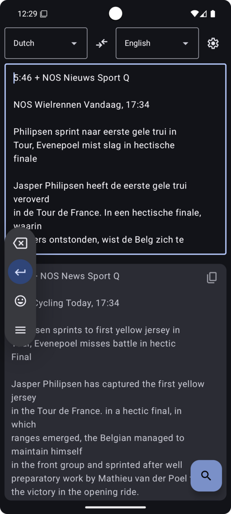
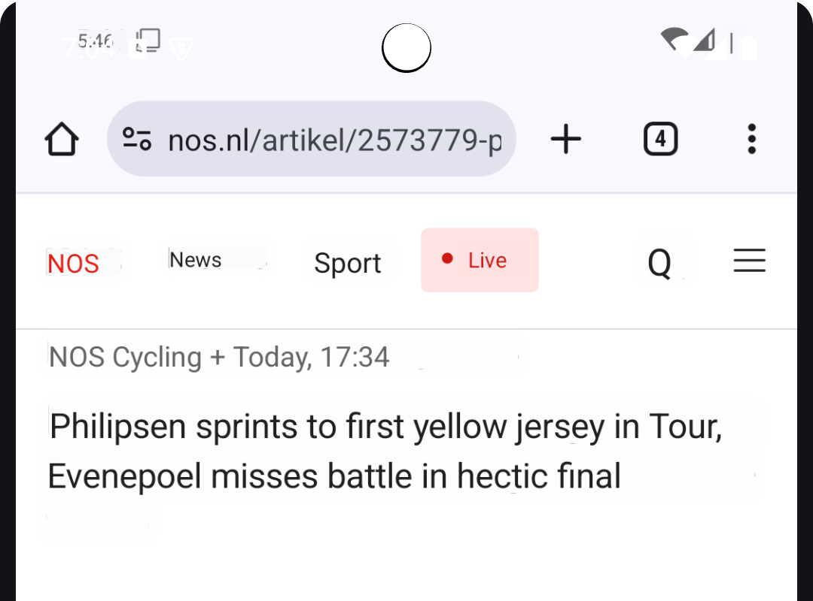
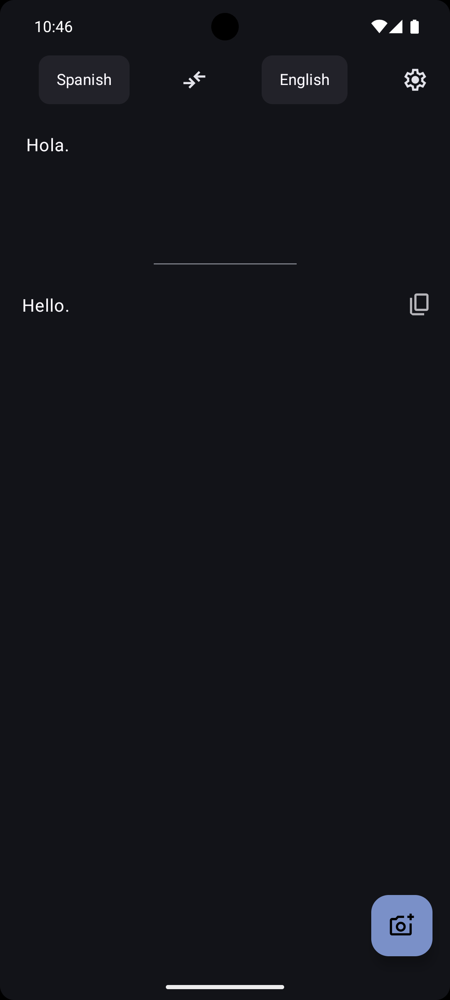

[Some months ago](/posts/mobile-translator), I made a simple offline-only [translator app](https://github.com/DavidVentura/firefox-translator) using [Mozilla's models](https://github.com/mozilla/firefox-translations-models/tree/main).

I wanted to add the capability to translate images, similar to Google translate, so here we are.

I started with some basic research, and found that the most popular libraries for OCR are [Tesseract](https://github.com/tesseract-ocr/tesseract) and [EasyOCR](https://github.com/JaidedAI/EasyOCR). I _immediately_ discarded EasyOCR because it's Python (maybe there's a way to run the models without Python? Unclear) and because it has much higher resource requirements; I'm not sure that the average phone can handle it.

Luckily, this time I didn't need to go down the CMake death spiral[^spiral], as there's [Tesseract4Android](https://github.com/adaptech-cz/Tesseract4Android), which already takes care of the build & generating bindings for Java.

[^spiral]: Couldn't resist a _little_ bit of cursed, so I made [a PR](https://github.com/adaptech-cz/Tesseract4Android/pull/76/files) for Tesseract4Android
I didn't document the process as I was going along, so this post won't be too detailed, and the code blocks are "synthesized" from the current codebase.

Let's pick an easy starting point, a screenshot of some news article, in some undecipherable language:

<center>  </center>

We can use `Tesseract4Android` to get all the text in the image with `getUTF8Text`

```kotlin
val p = File(context.filesDir, "tesseract").toPath()
val tessdata = Path(p.pathString, "tessdata")
val dataPath: String = p.absolutePathString()
tessdata.createDirectories()

// Here we somehow would need to download the tessdata files

val tess = TessBaseAPI()
tess.init(dataPath, "eng+nld")
tess.setImage(bitmap)
tess.setPageSegMode(TessBaseAPI.PageSegMode.PSM_AUTO_OSD)
println(tess.getUTF8Text())
```

<center>  </center>

This already works pretty well!

The goal though, is to render the translation on top of the original image

A reasonable starting point is to identify the lines of text within the image, and which block they belong to

```kotlin
// Populates internal Tesseract structures, so we can use resultIterator
tess.getHOCRText(0)
val iter = tessInstance.resultIterator
iter.begin()
do {
  val boundingRect = iter.getBoundingRect(RIL_TEXTLINE)
  canvas.drawRect(boundingRect, paint)
  if (iter.isAtFinalElement(RIL_BLOCK, RIL_TEXTLINE)) {
    paint.color = nextColor
  }
} while (iter.next(RIL_TEXTLINE))
```

<center>  </center>

### Extracting text and positions

We need to extract every word, and then decide whether it's part of the previous block or not, at the same time, we need to get the bounding boxes for
every line, so that we can later render text in the same place.

This code accumulates words into lines and lines into blocks; the bounding box of each line can be 'stretched' vertically by followup words

```kotlin
val blocks = mutableListOf<TextBlock>()
var lines = mutableListOf<TextLine>()
var line = TextLine("", Rect(0, 0, 0, 0))
do {
    val firstWordInLine = iter.isAtBeginningOf(RIL_TEXTLINE)
    val lastWordInLine = iter.isAtFinalElement(RIL_TEXTLINE, RIL_WORD)
    val lastWordInPara = iter.isAtFinalElement(RIL_PARA, RIL_WORD)
    val word = iter.getUTF8Text(RIL_WORD)
    val boundingBox = iter.getBoundingRect(RIL_WORD)
    if (firstWordInLine) {
        line = TextLine(word, boundingBox)
    } else {
        line.text = "${line.text} ${word}"
        line.boundingBox = Rect(
            // left is immutable
            line.boundingBox.left,
            // top can be stretched upwards ('g' -> 'T')
            min(
                line.boundingBox.top,
                boundingBox.top
            ),
            // Right takes the right of the new word always
            boundingBox.right,
            // bottom can be stretched ('a' -> 'g')
            max(
                line.boundingBox.bottom,
                boundingBox.bottom
            )
        )
    }
    if (lastWordInLine && line.text.trim() != "") {
        lines.add(line)
        line = TextLine("", Rect(0, 0, 0, 0))
    }

    if (lastWordInPara && lines.isNotEmpty()) {
        blocks.add(TextBlock(lines.toTypedArray()))
        lines = mutableListOf()
    }
} while (iter.next(RIL_WORD))
```

To test how well this extraction works, we can re-render the original text on top of the respective lines.. let's hardcode the background as white and the text as black for now

```kotlin
textBlocks.forEach { textBlock ->
    textBlock.lines.forEach { line ->
      canvas.drawRect(line.boundingBox, bgPaint)
      canvas.drawText(line.text, 0, line.text.length,
                      line.boundingBox.left.toFloat(),
                      line.boundingBox.top.toFloat(),
                      textPaint)
    }
}
```

<center>  </center>

First, the alignment is off, this is because we need to consider the font's [ascent](https://developer.android.com/reference/android/graphics/Paint.FontMetrics#ascent) in its Y position; but we'll strategically ignore this for now.

Second, the font-size changes quite a bit between lines, we can average the font size for each block:

```kotlin
textBlocks.forEach { textBlock ->
    val blockPixelHeight = textBlock.lines.map { textLine -> textLine.boundingBox.height() }
    textPaint.textSize = blockPixelHeight.average().toFloat()
    textBlock.lines.forEach { line ->
        canvas.drawRect(/**/)
        canvas.drawText(/**/)
    }
}
```

<center>  </center>

Now, we want to actually translate the content, not just re-render the original text, so we take each block and call `translate` on it individually.

However, we can't place the text on the previously detected "lines" anymore, as there's no 1-1 mapping between the original and translated text.

For now, we can use [StaticLayout](https://developer.android.com/reference/android/text/StaticLayout), which, when provided with a bounding box and some text, will properly render the text (including word wrapping, inter-line spacing, etc) and see pretty good results:

<center>  </center>

It's nice, but we can _at least_ make the blocks the same size using inter-line spacing (compare each line's top to previous line's bottom, get an average).
<center>  </center>


Let's do a comparison so far

<div style="display: flex; justify-content: center; gap: 1rem; flex-wrap: wrap;">


</div>

It's not _perfect_ but it's pretty good!

## Harder test case

Let's move from an easy screenshot to something that's still easy, but much harder: a picture of some text[^dmca]

[^dmca]: This is not an elaborate ruse to infringe copyright, please don't send me a DMCA takedown, thanks

<center>  </center>

If we use the code we have so far with this image, we can see a few issues
<center>  </center>

- Assuming black text on white background was fine before, but now it's really not.
- There's some misalignment on the text vs lines
- The assumption that the text occupies a square (left and right edges are constant for every line) does not hold.


### Manual layout

First, let's stop using `StaticLayout`, it's not good enough. We will need to manually lay the text out.

A simple way to start, is to measure how many letters from the translated text we can fit in each line with [breakText](https://developer.android.com/reference/android/graphics/Paint#breakText(char[],%20int,%20int,%20float,%20float[])), then draw them in the correct position.

Something like this

```kotlin
textBlock.lines.forEach { line ->
    val measuredWidth = FloatArray(1)
    val countedChars = textPaint.breakText(
        translated, start, translated.length, true,
        line.boundingBox.width().toFloat(), measuredWidth
    )
    canvas.drawText(
        translated,
        start,
        translated.length,
        line.boundingBox.left.toFloat(),
        line.boundingBox.top.toFloat() - textPaint.ascent(),
        textPaint
    )
}
```

would work, as long as we can guarantee that the new text will fit within the space of the original lines.

The property "the translated text fits in the same space as the original text" is very useful, and we can make it hold with a very simple technique: shrink the font size until the new text fits the original space.

```kotlin
val totalBBLength = textBlock.lines.sumOf { line -> line.boundingBox.width() }

// Ensure text will fit the existing area
while (textPaint.measureText(translated) >= totalBBLength) {
    textPaint.textSize -= 1
}
```

### Background / foreground color detection

For a simple mechanism, I think that _most of the time_ you can get the background color of a line of text by sampling the image _around_ the text (not including the actual text).

But then, how do you pick the foreground color? Probably[^contrast] it will be the color with the highest contrast relative to the background we just picked, but this time, we only sample the lines of text, instead of their surroundings:

[^contrast]: Some web designers seem focused on _minimizing_ contrast, but I guess you can't have a heuristic that always works

```kotlin
fun getForegroundColorByContrast(bitmap: Bitmap, textBounds: Rect, backgroundColor: Int): Int {
    val pixels = IntArray(textBounds.width() * textBounds.height())
    bitmap.getPixels(pixels, 0, textBounds.width(), textBounds.left, textBounds.top, textBounds.width(), textBounds.height())

    val bgLuminance = getLuminance(backgroundColor)

    return pixels.maxByOrNull { pixel ->
        getColorContrast(pixel, bgLuminance)
    } ?: Color.BLACK
}

fun getColorContrast(color1: Int, bgLuminance: Float): Float {
    val lum = getLuminance(color1)
    val brighter = maxOf(lum, bgLuminance)
    val darker = minOf(lum, bgLuminance)

    return (brighter + 0.05f) / (darker + 0.05f)
}

```

with all of this in place, it starts looking much better!
<center>  </center>

The only thing missing, is word wrapping (the second sentence splits `allowing` into `allo` and `wing`); we can do this fairly trivially:

1. Count how many letters we can render in this line
2. If the last letter we can fit is not a space, backtrack until the previous word.

The only "tricky" thing, is that now the text may spill over the allocated area, because we are "wasting" some space at the end of each line for word-wrapping.

My solution for this was to consider the total available space to be 95% ¯\\\_(ツ)_/¯:

```kotlin
// 5% padding for word wrap
val totalBBLength = textBlock.lines.sumOf { line -> line.boundingBox.width() } * 0.95f
```
<center>  </center>

## Beyond "one block per line"

If multiple items are on the same line, but there are horizontal gaps between them (for example: UIs), it would render as a single line of text (without spaces).

For this, I added a new heuristic: calculate whether each word is "at least 3 characters to the right" from the previous word.

The "3 characters" thing is tricky, because it uses _the current word_ for measurement, and letters have different widths.. but it seems OK on my test cases.

Check the header ("NOS", "Nieuws", "Sport", "Live")

<div style="display: flex; justify-content: center; gap: 1rem; flex-wrap: wrap;">


</div>

This conveniently also fixes the color of the "Live" button, as each block is analyzed independently for foreground/background colors.

## UI Detour

At this point, the app was perfectly functional but the UI was pretty bad, so I spent some time making it a bit nicer

<div style="display: flex; justify-content: center; gap: 1rem; flex-wrap: wrap;">


</div>

## Limitations

In the end, the app works _well enough_; Tesseract is limited in many ways, and it won't work with handwriting, certain fonts, or uneven lighting. Some of this is solvable with pre-processing; maybe I'll work on that in the future.

## Performance

As for performance, images of ~1500x2500px take about a second to run through Tesseract, and another ~300ms to translate, depending on how much text is on it.

I must admit, that I'm a little bit jealous of the offline models that are present on Google Translate, and even on Mac / iOS for OCR, both are much better at detecting text and much faster; but I don't know of any open models which are better than Tesseract.

---

# References

- [Tesseract OCR text position - Stack Overflow](https://stackoverflow.com/questions/51282214/tesseract-ocr-text-position)
- [Tess4J TessPageSegMode Documentation](https://tess4j.sourceforge.net/docs/docs-1.2/net/sourceforge/tess4j/TessAPI1.TessPageSegMode.html)
- [Tesseract4Android Sample Implementation](https://github.com/adaptech-cz/Tesseract4Android/blob/master/sample/src/main/java/cz/adaptech/tesseract4android/sample/ui/main/MainViewModel.java#L66)
- [Tesseract Documentation - Improve Quality](https://tesseract-ocr.github.io/tessdoc/ImproveQuality.html)
- [Android OCR Utils - Image Processing](https://github.com/SubhamTyagi/android-ocr/blob/4d24a0a3538016f39b9280165dfd27d2694c6c4f/app/src/main/java/io/github/subhamtyagi/ocr/utils/Utils.java#L55)
- [Android Drawing Multiline Text on Bitmap](https://www.skoumal.net/en/android-drawing-multiline-text-on-bitmap/)
- [How is StaticLayout used in Android - Stack Overflow](https://stackoverflow.com/questions/41779934/how-is-staticlayout-used-in-android/41779935#41779935)
