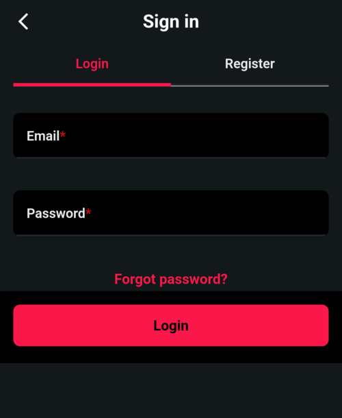
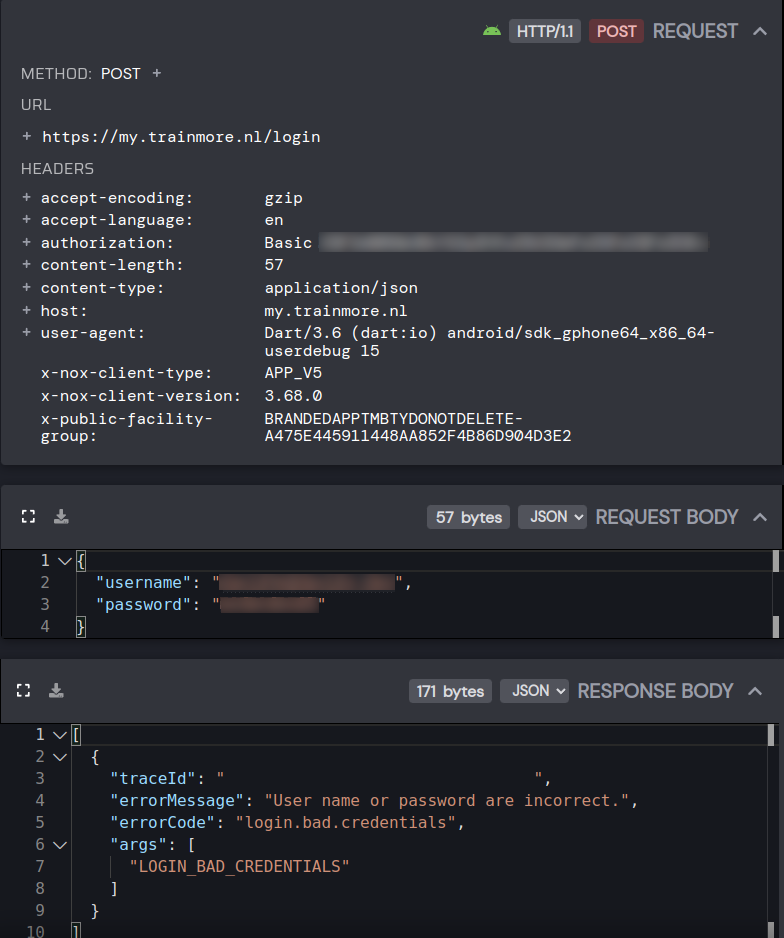
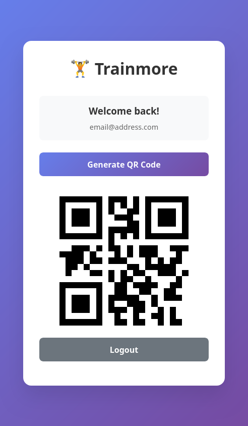

My gym replaced the perfectly functional NFC entry system with a mandatory app that displays a QR code, which rotates every 30 seconds.

The old system was great: scan the NFC tag (which contained just a unique ID) and walk in.

Now, you _need_ to have a phone (with Google services), an internet connection and somehow it clocks in at 108MB. It's worse in every way; but hey, now they can say they "have an app".

I don't like installing random shit on my phone, so on the day of the app release, I downloaded it on the emulator and got greeted by this

<center>

</center>

I _assumed_ this app got outsourced to the lowest bidder, and probably didn't implement any security features, so I set up [HTTP Toolkit](https://httptoolkit.com/) which lets you intercept traffic from your device to inspect it.

When opening HTTP toolkit, you can see on the left a list of all the requests that are being made
<center>

</center>

and if you click on one, you can see the detailed request and response
<center>

</center>

<small>The screenshots are here in case you've never seen how _easy_ it is to start reversing some simple applications. We'll continue in text mode.</small>

The first thing I did was to replay the 'official' request from the network capture, to check if any of the values are [nonces](https://en.wikipedia.org/wiki/Cryptographic_nonce) or otherwise sequential in nature. As I expected, the replay worked fine, so I started looking into where the request values come from.

Headers:
- `authorization` is using ['Basic' Authentication](https://datatracker.ietf.org/doc/html/rfc7617), which is just `username:password` encoded with base64.
- `x-nox-client-type`, `x-nox-client-version` and `x-public-facility-group` seem app related, let's keep them as they are[^headers]
- The rest are generic headers, usually not necessary, but we can keep them

[^headers]: I did try skipping these, and some endpoints return 500 if the headers are missing

The payload is just `{"username": "...", "password": "..."}`

Why is the username+password both part of the payload and part of the headers?

If we send a properly formatted request:

```python
FACILITY_GROUP = "BRANDEDAPPTMBTYDONOTDELETE-..."
HEADERS = {
    "x-public-facility-group": FACILITY_GROUP,
    "x-nox-client-type": "APP_V5",
    "x-nox-client-version": "3.68.0",
}


class LoginRequest(BaseModel):
    username: str
    password: str


basic = HTTPBasicAuth(username, password)
r = requests.post(LOGIN_URL, headers=HEADERS, auth=basic,
                 json={"username": username, "password": password})
```

then we get back
```json
{"login_response": "aaaaaaaa-aaaa-aaaa-aaaa-aaaaaaaaaaaa"}
```

where `login_response` is just a token we will need to use from now on. It seems like this token does not have a time to live -- it does not expire as time passes.

The actually useful endpoint that I need, is the one to generate a QR code, and the request changes slightly:
```python
r = requests.get(QR_CODE_URL, headers={**HEADERS, "x-auth-token": login_response})
```

Here we dropped the basic auth, and instead we are passing the `x-auth-token` header.

The response we get back is 
```json
{
  "format": "QR_CODE",
  "expiryDate": "2025-07-23T17:05:30Z",
  "content": "{\"code\":\"0000000000000000000\"}"
}
```

Yes, the QR code wraps the actual payload in JSON.

The codes always last until the next 30s window (every minute, until `:00` or `:30`), so if you request a code at `:29`, it will expire after one second, sucks for you, try again.

If we look at the app, the QR code looks like this

<center>

</center>

I don't know how limited the machines that scan the code are, so I used [Binary Eye](https://github.com/markusfisch/BinaryEye) to get metadata[^qr] about the QR code itself, and got:
[^qr]: It was surprisingly hard to get this data from libraries, I'm not sure why the ones I tried don't expose it.

- Error correction level: "low"
- Version: 2
- Mask: 7


With this, I had everything I needed to generate QR codes, so I made a [basic HTML application](https://github.com/DavidVentura/trainmore/) that will do what I need:

<center>

</center>


The app worked perfectly and I managed to get into the gym with it, but I was still not sure about whether the constants in the request headers (`BRANDEDAPPTMBTYDONOTDELETE-...`, `APP_V5`, `3.68.0`) were device/account specific, so I extracted the APK from the emulator:

```bash
$ adb shell pm list packages | grep trainmore
package:com.mysports.branded.trainmore
$ adb shell pm path com.mysports.branded.trainmore
package:/data/app/~~u3zcUID1XGr2ZfGNqbGeRA==/com.mysports.branded.trainmore-XcIwZriiEGt-2yOWBdTZjg==/base.apk
package:/data/app/~~u3zcUID1XGr2ZfGNqbGeRA==/com.mysports.branded.trainmore-XcIwZriiEGt-2yOWBdTZjg==/split_config.arm64_v8a.apk
package:/data/app/~~u3zcUID1XGr2ZfGNqbGeRA==/com.mysports.branded.trainmore-XcIwZriiEGt-2yOWBdTZjg==/split_config.en.apk
package:/data/app/~~u3zcUID1XGr2ZfGNqbGeRA==/com.mysports.branded.trainmore-XcIwZriiEGt-2yOWBdTZjg==/split_config.xxhdpi.apk
$ adb pull /data/app/~~u3zcUID1XGr2ZfGNqbGeRA==/com.mysports.branded.trainmore-XcIwZriiEGt-2yOWBdTZjg==/split_config.arm64_v8a.apk
```

I took this `split_config.arm64_v8a.apk` and fed it through [this decompiler](http://www.javadecompilers.com/apk), running `grep` on the result is promising

```bash
$ grep -R BRANDEDAPP
grep: split_arm64v8a/resources/lib/arm64-v8a/libapp.so: binary file matches
```

and reading the strings from the file, we can find that these values are part of the build, so, not account specific.
```bash
$ strings split_arm64v8a/resources/lib/arm64-v8a/libapp.so| grep -E 'BRANDEDAPPTMB|APP_V5'
APP_V5
BRANDEDAPPTMBTYDONOTDELETE-...
```

at least they stripped symbols from the library, but I wonder why would they even pack the functionality in a shared object like this. Maybe to reuse functionality with their iOS app? Imagine if there was some kind of platform agnostic tag that you could give people..

## That's it

If you're intimidated by reverse engineering a shitty app, don't be. _Most_ mobile apps are held together with hopes and dreams.

Turns out replacing an NFC tag with a "modern" app solution is as stupid as it sounds.
