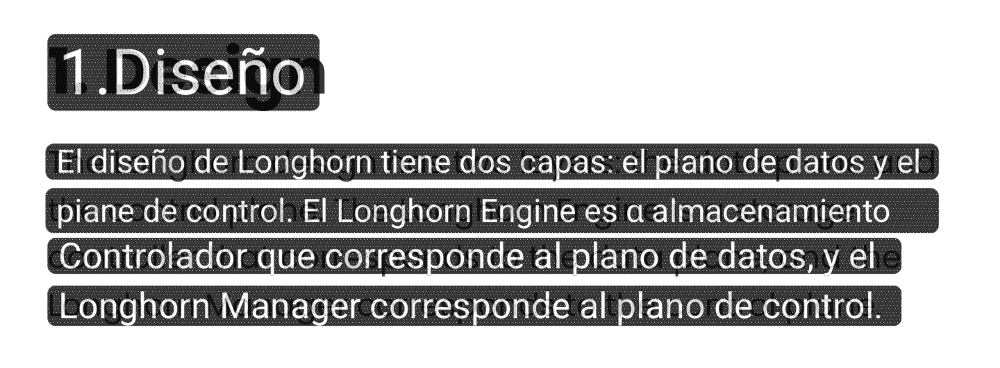

In the previous post, we got some high quality image translation, running reasonably fast, on-device.

We can push it further though, and avoid the need to take a picture, select it, and translate in discrete steps.

This post contains a bunch of jittery video, you might get motion-sick 🙃.

As a starting point, running a screenshot full of text _on my phone_ takes:

- Detection at 1400x3200: 500ms
- Recognition: 1.5s

As usual, there are some easy tweaks that can give a large speed boosts.

First, the detection model scales linearly with pixel count and is _quite_ resilient to noise. So we can shrink the image as much as possible[^pix-budget] and get it to run in ~80ms.

[^pix-budget]: I picked 650k pixels as my budget, seemed fine. 0.14x the pixel count of the full size screenshot.

Then, the recognition model can be quantized. The published version uses `fp32` for its calculations, and it can be quantized to either `fp16` or `int8`, both of which have instructions that accelerate common operations at the hardware level ([sdot](https://developer.arm.com/documentation/ddi0596/2020-12/SIMD-FP-Instructions/SDOT--vector---Dot-Product-signed-arithmetic--vector--) and [fp16](https://developer.arm.com/documentation/101754/0624/armclang-Reference/Other-Compiler-specific-Features/Supported-architecture-features/Floating-point-extensions)). By quantizing to int8, the same screenshot executes in ~800ms.

While this is a huge win for low effort, this brings us down to ~1s, which is not fast enough.

Though, the recognition scales with text length (obviously, more text = more to recognize), so for small signs / few words, it's actually.. okay.

In this example, recognition has little work to do, and it finishes in 50~100ms, which is good enough to try out a live overlay:

<video controls>
    <source src="assets/first-h-2.mp4" />
</video>

I spent a long while here, trying to match the contours back to their positions, doing heuristics to map 'previous frame detection' to 'current frame detection', smoothing the movement, etc. but it was never going to work.

The heatmap obtained from the inference pass is too jittery to track across frames, and anyway the inference pass is too slow to run every frame.

What to do?

if there's not enough info (or there's too much variance) to use contours as trackers, then we need to discard the idea and use something else for tracking.

and if the inference steps are too slow, well, then we need to run them less often and compensate with tricks.

the plan:

Run detection/recognition/translation _once_, on a single "anchor" frame, then, for every frame, keep track of how the scene has moved, and project the translated text warped accordingly.

Given that we want to translate text, and text is usually on some kind of plane (a sign, paper, etc), we saw in the previous post that there's a single [Homography](https://en.wikipedia.org/wiki/Homography_(computer_vision)) that can express the exact transformation between two planes.

We can take this homography and apply it to the original text detection/recognition overlay, which warps it _exactly_ in the same way that the image itself has changed relative to the anchor.

How do we get there though?

Detect some [image features](https://en.wikipedia.org/wiki/Feature_(computer_vision)) using [FAST](https://en.wikipedia.org/wiki/Features_from_accelerated_segment_test), which is a "corner" detecting algorithm. And it's fast. 

Then, describe the surroundings of each feature using [rotated BRIEF](https://sites.cc.gatech.edu/classes/AY2024/cs4475_summer/images/ORB_an_efficient_alternative_to_SIFT_or_SURF.pdf), which is a way of converting the neighbors of the feature into a bunch of bits in a way that is rotation invariant and cheap.

This gives us features + surroundings _on the anchor_, but some time has passed, and we now have a new, slightly different frame.

To match features between the two frames, we compare each of the new features to each of the original features, if we find a [good match](https://en.wikipedia.org/wiki/Scale-invariant_feature_transform#Keypoint_matching) then we know how the single feature has transformed, otherwise, ignore the new feature.

From the surviving matches, we can apply [RANSAC](https://en.wikipedia.org/wiki/Random_sample_consensus) to fit a Homography: try matches at random and see how many agree to the proposed homography, keep the one with the most agreements.

The first version of this was almost like a miracle

<video controls>
    <source src="assets/almost-working.mp4" />
</video>

Even though this is amazing, it's still jittery. Due to motion, sensor noise, etc, FAST finds slightly different corners each frame on top of this, we generate a new homography each frame, which must be fit from the slightly different set of matches these corners produce, causing variation and the resulting transform wobbles.

To mitigate it, we can restrict the idea; these frames are not independent. They are a continuous sample of a video stream, there's temporal/spatial continuity between them.

There's an algorithm, [Lucas-Kanade](https://en.wikipedia.org/wiki/Lucas%E2%80%93Kanade_method), which solves this by carrying the previous frame's confirmed matches onto the new frame.

We are also producing independent homographies each frame, for this, we can use an
[Extended Kalman Filter](https://en.wikipedia.org/wiki/Extended_Kalman_filter) on the previous homography state, which allows us to merge both the old and proposed homographies smoothly, giving different merge coefficients for different DoF (translation, rotation, perspective, ...).

With these new algorithms, the homography is stable over consecutive frames:

<video controls>
    <source src="assets/pinned.mp4" />
</video>

This works _amazingly well_

## Improving performance

There are two modes in this live translation; the single-shot detection/recognition/translation, and the continuous homography tracking+overlay rendering.

For the single-shot det/rec, we already discussed quantization and scaling, I also worked on replacing [marian-nmt](https://github.com/marian-nmt/marian-dev) with a fork of [slimt](https://github.com/DavidVentura/slimt) which is about ~4x faster, though translation is not the bottleneck, recognition is.

To improve the speed of the recognition model, it runs in batches; the problem here is that some lines are much wider than others, causing the whole batch to be delayed by the longest strip.

A good way to ensure no single strip is 'too wide' is to cap the max-width, by splitting on spaces. Spaces are cheap to compute, per dewarped strip, find lines perpendicular to reading direction in which there's no sharp contrast (text usually has sharp contrast to its background).

The continuous overlay warping+rendering went through many phases of optimization, mostly because my initial solution was extremely naive.

The overlay was initially rendered on CPU, taking about ~15ms per frame just to blit. Moving it to be an OpenGL texture, and doing the warping+blitting on GPU made it 0.3ms.

Then, the actual FAST+BRIEF+RANSAC was taking ~10ms per frame, which was fine on my phone (~5 years old), but when I tried on my Pixel 3a, it was taking around ~35ms.

Turns out, that once we have a high quality set of descriptors, we can get by for a few frames with just KLT+EKF, so I moved the expensive FAST+BRIEF+RANSAC to execute asynchronously, resetting the accumulated drift every time it runs.

## Improving _perceived_ performance

The videos so far were carefully cropped to show the tracking after the detection/recognition/translation steps.

Those steps are not _too_ slow, but the user does not have any idea if the app is working at all, there's no progress indication:

<video controls>
    <source src="assets/first_translation.mp4" />
</video>

Here it takes 1.5 seconds between the homography lock (pill goes to green, debug view only) and the translation showing on screen.

We can do two things to make this _seem_ faster; show the detection boxes ("text seems to be here") _and_ stream the text as it's recognized/translated:

<video controls>
    <source src="assets/streamed_translation.mp4" />
</video>

Here, the detection is shown ~200ms after the homography lock, the translation takes the same time, but it _feels_ much better.

## Bonus: screen translation

If we already have all these tricks to work on the camera.. can it also work on translating the screen?

Kind of. The homography trick works on a plane, is the screen a plane? Sometimes! If you are scrolling a website, it is. Content is only translated (no rotation/perspective changes).

But if you are watching a video.. the subtitles are on a plane and the content is on another. What should be tracked? Definitely don't make the subtitles pan horizontally following the camera pan!

So, okay, we disable homography and figure out a different way of doing content tracking.

There is a big problem: When capturing screen content on Android, you can't exclude your own windows, so after rendering the overlay once, the app continuously masks the content under it, and starts running recognition on the translated overlay!

The first trick I thought about was to make the overlay semi-transparent, then, some of the underlying content can be seen, and if we subtract our (known) overlay, we would be left with only the original content. However, this compresses the original signal dramatically, making detection/recognition not really reliable.

Thinking about it, transparency means make every pixel is N% opaque. What if instead we defined it as N pixels 0% opaque and (M-N) pixels 100% opaque?

This is interesting, because modern phones have ridiculously high pixel densities.

My phone's screen is ~160mm tall, while displaying at a resolution of 1440x3216. This means each pixel is roughly, 50µm x 50µm (or 2 mils, if you are from the land of the free).

What if, we define a grid of 1x1 pixel 'holes' in the overlay, and observe the world through that? It'd be the equivalent of a nearest-neighbor downscale of the original image.

It could look something like this

and the view through the overlay looks like this:

The see-through view is not good enough to run text detection/recognition, though it feels like it should be. I can definitely read under it. But when it's not perfect contrast, it gets murky.

What we can do is detect when obscured content changes, drop _that specific area_, recapture it, and run it through the pipeline.

An example, which drops & re-renders the overlays as subtitles change:

<video controls>
    <source src="assets/screen-1.mp4" />
</video>

## On impostor syndrome

I have mixed feelings about this part of the project. The _whole_ of the homography was written by a friendly robot. Doing this by myself would've taken something like 2~6 months, but I'd probably not even started it. This took exactly 2 _weeks_.

During these two weeks, I was spoon fed information about existing literature, how it can be combined to do what I want, things I need to be careful, etc.

It felt like having someone with infinite patience answer all my questions.

The weird part, was that after getting an idea of how everything would fit together, I did not implement it myself.

This felt like giving projects to juniors/interns at work. Give them a task, they come up with some result which maybe behaves right, but even a quick skim of the decisions raises flags (allocating and copying a 16MB bitmap every frame???)

At the same time, it's _not_ like giving a project to someone else. Then, it'd be clear that someone else built it, and I just guided them to get there. 

This combination of the AI teaching me concepts and guiding my understanding, followed by me micromanaging how it implements _those same things_ falls into a bucket I have no name for.

It's empowering, because I've never learned so fast, nor gotten results so fast. It's also depressing, to sit there, micromanaging a computer, waiting 15 minutes for it to make extremely dumb mistakes, or forget to set an environment variable.
