On the previous post, we got OCR "working", in quotes, because it does not tolerate silly things like 
slight rotation, perspectives, non-book fonts or even (very) bold text. If the image was not a screenshot or a book scan, then it'd basically not work.

I'd seen that there are models, such as [PaddlePaddle OCR](https://github.com/PADDLEPADDLE/PADDLEOCR) which supposedly work _much_ better, thanks to ✨AI✨.

Though my initial experience was that it.. didn't really work.

<center>
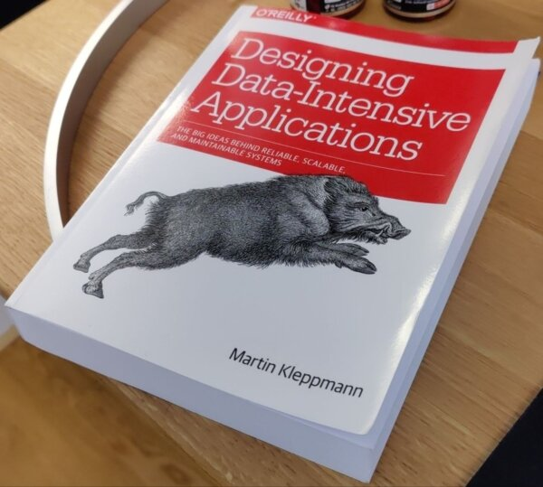
</center>

This image, processed as-is returns... bad matches.

## Understanding the failure

The Paddle models run in two steps; first, there is a detection model that outputs a heatmap of different areas
which are _likely_ to contain text. If we overlay the heatmap:

<center>
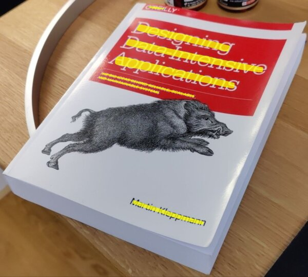
</center>

So far, it looks pretty good.

The second step in the pipeline is to run a _recognizer_ model, which takes a 48px tall image and outputs the recognized text.


<center>
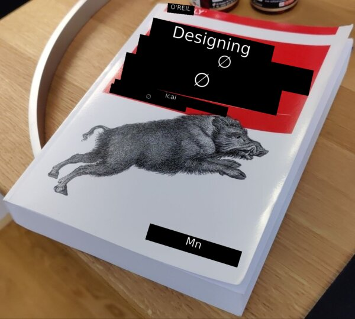
</center>

As you can see it does... something. But it's obviously not right.

The first, and quite silly, problem I had was due to feeding the bounding box of the contour as the input image; yes, it does technically
contain text, but for text that is rotated/in perspective, the box is mostly whitespace.

<center>
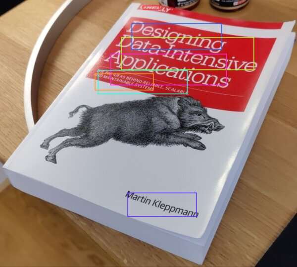
</center>

<center>
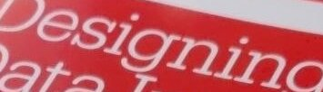
</center>

We have this arbitrarily rotated text, how do we straighten it?

If we run the detection step's heatmap through `imageproc::find_contours`, we can get its outline, then do [principal component analysis](https://en.wikipedia.org/wiki/Principal_component_analysis) on the outline points.

PCA gives us two axes: one along the direction the points spread most (the reading direction), and a second one, perpendicular to it.

<center>
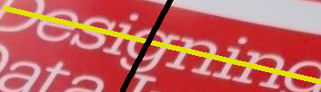
</center>


To straighten the image, we map each pixel of a new upright rectangle back to the original: a pixel at offset `(sx, sy)` in the new image comes from `centroid + sx*PC1 + sy*PC2` in the original, where PC1/PC2 are the two axis vectors.


<center>
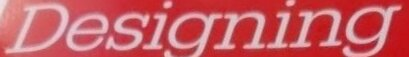
</center>

now, when running the recognizer, it works properly.
<center>
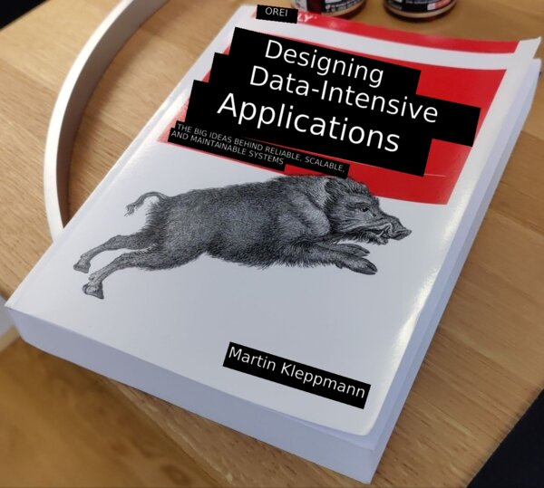
</center>

While this is a big improvement, this basic mapping can only rotate/slide the image; it can't describe perspective.

To do that, we need something called "[homography](https://en.wikipedia.org/wiki/Homography_(computer_vision))": a 3x3 matrix that maps one flat plane onto another, covering rotation, scale, shear and perspective foreshortening.

Because we know the four corners of the document (the user can pick them on the UI), and we know the target points (a rectangle), we can solve for H (the 3x3 matrix).

Given `H`, it's the same idea as before: for each pixel `(sx, sy)` of a clean output rectangle, we map it back to the original via `H * (sx, sy, 1)`, which gives a result `(x', y', w')`; the source pixel is `(x'/w', y'/w')`.

Because `w'` is different per-pixel, the far side of the document shrinks more than the near side.


So, we let the user pick corners (a bit of sloppiness is fine):

<center>
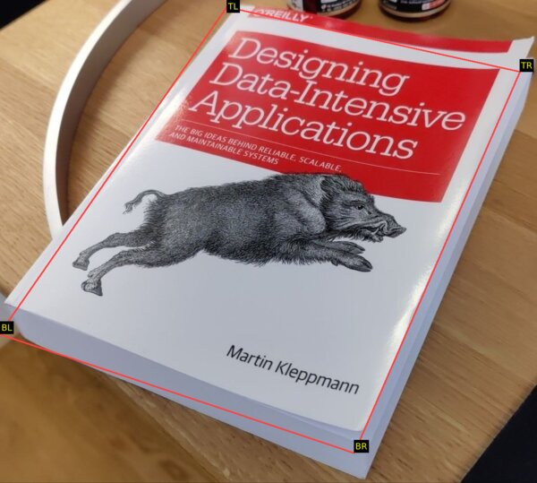
</center>

And the image can be made pretty much fronto-parallel:
<center>
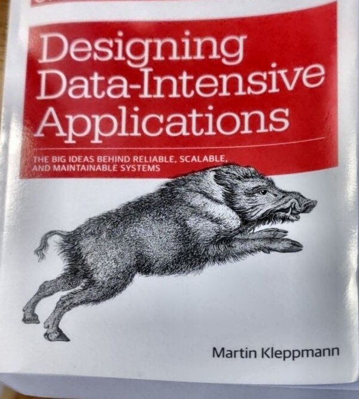
</center>

and a single-box crop is now much higher quality (see how the `D` is straight?)
<center>
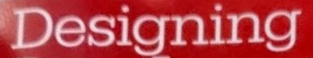
</center>

While a user _can_ manually pick the 4 corners of their image, I found this [DocAligner](https://github.com/DocsaidLab/DocAligner) model which, most of the time, will find the document on the image and the user just needs to accept.


### Beyond rectangles

Guess what, round stuff exists! And people put labels on it. Insanity.

When scanning a bottle, there's no 'deskewing' or 'quadrilateral perspective adjustment' that will help, the whole thing is bent! I have proof!

<center>
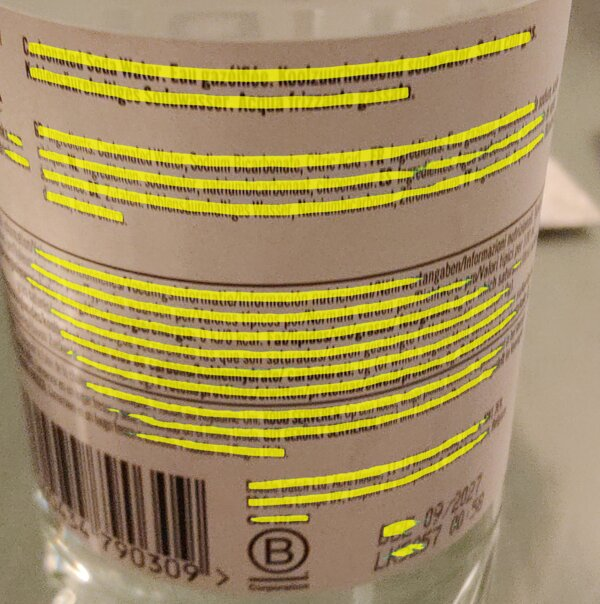
</center>


The previous deskew idea was based on one assumption: the text runs along a straight line, which PCA can find. But you can see here that we can't rely on "a straight line" anymore.

If we can loosen the assumption from "text follows a straight line" to "text follows any one line", any reasonable curve can be approximated by some equation, and luckily for labels and bottles a parabola is enough. No big brain math needed.

All we need to do is find a parabola that passes as close as possible to the contour points. We'll call this curve the "spine" of the text.

The beauty of generalizing the previous approach is that the 'flat' case doesn't need special handling: its spine just comes out as a straight line.

To rectify the curve, we apply exactly the same idea as before, but add the spine's curve to the perpendicular step.

The deskew was `centroid + sx*PC1 + sy*PC2`; here a pixel `(sx, sy)` comes from `centroid + sx*PC1 + (sy + spine(sx))*PC2`, where `spine(sx)` is how high the curve sits at that column. 

<center>
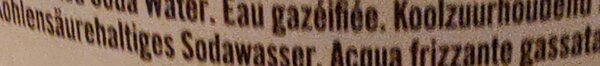
</center>

becomes

<center>
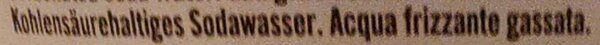
</center>

## A nicer user experience

Paddle also released a [script recognition model](https://github.com/PaddlePaddle/PaddleClas/blob/release/2.6/docs/en/PULC/PULC_language_classification_en.md) that takes a 160x80 image and returns the script it is written in (as in, Latin, Cyrillic, Korean, ...).

The model, however, has some downsides: it's not particularly fast, and it's not very accurate (spuriously classifies text as Chinese or Cyrillic in my tests).

The solution I've found is quite basic: run it on the 5 longest strips.

On multi-script input, the strips will not reach consensus of which recognizer model to use, so I'm just going to assume that mixed script content is a mix of latin and a single non-latin script.

Why this assumption? Well, all the recognizer models from Paddle support both their primary script AND latin, which makes my life much easier 🙂.


Once we know the script, we still don't really know which language it is ("Hola, cómo está?" and "Hello, how are you?" are both Latin), so we can run it
through the pre-existing [CLD2 language detector](https://github.com/CLD2Owners/cld2) and run the translation with that source.

The 'auto-detect language' mode adds a small delay to the recognition, but it is quite nice.

For example, when visiting Brussels, a lot of signs are in either (or both!) Dutch and French. I didn't need to switch the app's language for each sign.

### Reading direction

Given an arbitrary image, how do we know which way it's rotated?

With the previous models, I didn't have any answer for this, but having a detection model that is orientation agnostic simplifies the problem dramatically.

In general, the longest side in the detection masks indicates writing direction.

Sometimes, however, people get creative and put text which is not axis-aligned, so any single detection is not reliable. If we get a few detections, we can use the alignment that _most_ agree on.

This tells us whether the text is horizontally or vertically aligned.

But it does not tell us _which way it's facing_, both of these are x-axis-aligned text labels:

<center>hello, how are you?</center>
<center>¿noʎ ǝɹɐ ʍoɥ 'ollǝɥ</center>


Initially, I tried to use [Paddle's textline orientation model](https://paddlepaddle.github.io/PaddleX/3.3/en/module_usage/tutorials/ocr_modules/textline_orientation_classification.html#i-overview), but I found that it's hopelessly biased to return "0 degrees" (not mirrored).

My clever idea was to run it both on the normal text AND on the mirrored version; if both say "it's upright" then either the text is symmetrical ("oxo") or the model is too biased.

Because it takes some time to run, I capped it to the top 5 largest matches, but most of the time, 4 out of 5 matches would return 'Biased, discarding'.

Then I realized... the recognition model already tells me if it finds valid text and its confidence level!

So, run the normal and mirrored versions through the recognizer and get consensus on the orientation. This works much better.

## Hiccups

I have this sign we bought at a flea market many years ago:

<center>
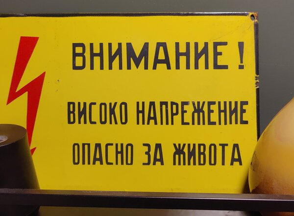
</center>

The model was consistently reading it as 

```
ВНИМАНИЕ
ВИСОКО НАПРЕЖЕНИЕ
ОПAСНО ЗА ЖИBOTA
```

and translating it as

```
ATTENTION
HIGH TENSION
OPUS FOR ZHIBOTA
```

why does the last line not work? turns out that in the last line there are ASCII `A` `O` and `B` instead of the correct cyrillic letters.

Unicode keeps a [confusables](https://www.unicode.org/Public/security/8.0.0/confusables.txt) list for exactly this reason.
For now, I've filtered it down to a subset (confusable with latin letters) and applied a heuristic:

If the latin letter is surrounded by non-latin letters, and the latin letter is a confusable, replace with the script-appropriate version.


### Layouts are hard

When translating some block of text, if we do line-by-line translation we lose critical context, resulting in a low quality translation.

The problem is that we don't really know, given a picture, which lines should be joined or not.

I made some heuristics as I was scanning stuff around my house, things like:

- Lines which are tight together and of similar width are probably in a paragraph
- Vertical gaps between lines of >2.4x line-height are paragraph breaks
- If a line is succeeded by another and the ratio of their heights is large, then the first one was a heading

but obviously this breaks. Sometimes the title-paragraph gap is 2x, and sometimes, the inter-line spacing is 2x. There's no single number that will work.

I added carve-outs for things that look like menus (prices are right-aligned? always? sometimes?), but I think the real answer is to use something like a layout model.

I couldn't find any _small_ layout model though, most models operate on the image, and are not suitable for this application (too big, too slow).

I found [this paper](https://arxiv.org/pdf/2304.11810.pdf) ([with this repo](https://github.com/NormXU/Layout2Graph)) which talks about computing the layout based on geometry only, so it should be extremely fast. However, they did not release the actual model/weights, and I'm not sure how to replicate it.

If you know of any such model or algorithm for layout classification, please let me know!


## Continuous mode

With these improvements, I can actually use the app at the supermarket and to read street signs. 

It's still a bit annoying though! Using the app feels like a set of discrete events: take photo, confirm, crop, align.

Google Lens is much smoother, it translates what's on your camera's viewfinder "live". There are no take-photo or confirm steps, you get cropping and alignment by moving your phone, without fiddling with the UI.

How to get there? This whole pipeline takes about a second to run at the moment, so we'd be looking at 1 FPS.

Or would we? ... see you next time.
