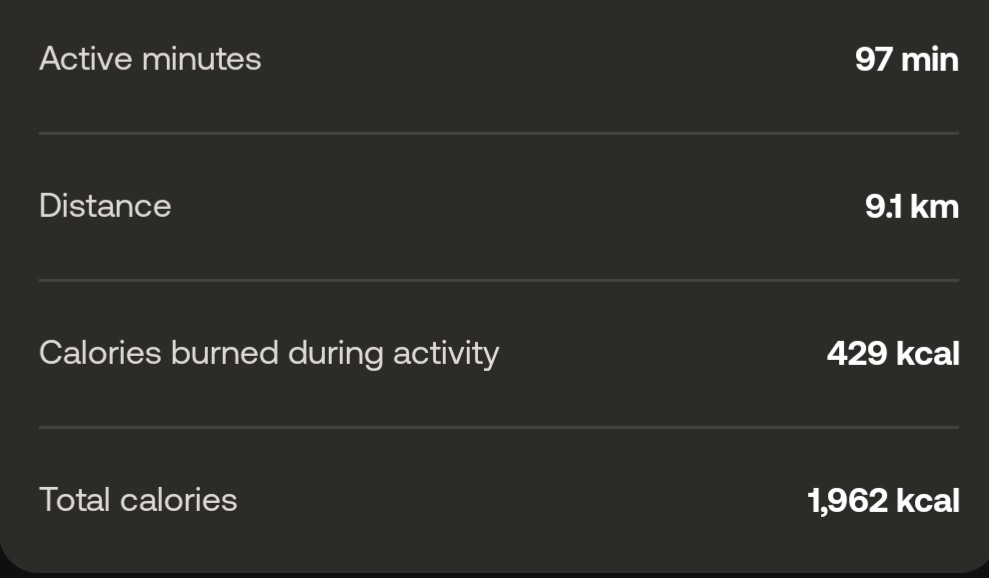

I bought a Withings ScanWatch 2, but I don't really like downloading apps on my phone -- they are usually shitty _and_ a privacy nightmare, so I set out to reverse the protocol and see if I can pull the data that I want in a nice way.

To get started, install the app and pull the APK for analysis:

```bash
adb shell pm list packages | grep -i withings
package:com.withings.wiscale2

adb shell pm path com.withings.wiscale2 | cut -d: -f2 | while read -r line; do adb pull $line; done
/data/app/.../base.apk: 1 file pulled, 0 skipped. 36.6 MB/s (90246106 bytes in 2.350s)
/data/app/.../split_config.arm64_v8a.apk: 1 file pulled, 0 skipped. 36.7 MB/s (5875537 bytes in 0.153s)
/data/app/.../split_config.en.apk: 1 file pulled, 0 skipped. 34.6 MB/s (1417754 bytes in 0.039s)
/data/app/.../split_config.xxhdpi.apk: 1 file pulled, 0 skipped. 36.6 MB/s (61316747 bytes in 1.598s)

$ ls -lhSr
total 152M
-rw-r--r-- 1 david david 1.4M Jul 29 10:38 split_config.en.apk
-rw-r--r-- 1 david david 5.7M Jul 29 10:38 split_config.arm64_v8a.apk
-rw-r--r-- 1 david david  59M Jul 29 10:38 split_config.xxhdpi.apk
-rw-r--r-- 1 david david  87M Jul 29 10:38 base.apk
```

Then run both `base.apk` and `split_config.arm64_v8a.apk` through [jadx](https://github.com/skylot/jadx) (we ignore `.en.apk` and `xxhdpi.apk` because they only contain language data and images/videos respectively).

In the `arm64_v8a.apk`, we can find the native libraries

```bash
arm64-v8a$ ls -lhSr
total 12M
4.7K libcrashlytics-trampoline.so
4.8K libsurface_util_jni.so
7.0K libdatastore_shared_counter.so
9.9K libandroidx.graphics.path.so
 11K libnerveHealthScore.so
 14K libvo2-lib.so
 22K libsleep-lib.so
 29K libimage_processing_util_jni.so
 70K libete.so
 88K libecgw2-lib.so
142K libecg-lib.so
218K libcrashlytics-handler.so
227K libcrashlytics.so
402K libfilament-utils-jni.so
413K libhealthmate.so
846K libcrashlytics-common.so
1.7M libfilament-jni.so
3.2M libgltfio-jni.so
4.8M libbarhopper_v3.so
```

## Poking through the protocol declaration
and when decompiling `base` we can get a large part of the protocol (`wpp`) implementation at `com/withings/comm/wpp/i.java`

```java
public byte readByte(ByteBuffer byteBuffer)
public byte[] readByteArray(ByteBuffer byteBuffer)
public int readInt(ByteBuffer byteBuffer)
public int[] readIntArray(ByteBuffer byteBuffer)
// ...
public void writeByte(ByteBuffer byteBuffer, byte b12)
public void writeByteArray(ByteBuffer byteBuffer, byte[] bArr)
public void writeInt(ByteBuffer byteBuffer, int i12)
public void writeIntArray(ByteBuffer byteBuffer, int[] iArr)
// ...

```

and a treasure trove of constants at `com/withings/comm/wpp/generated/Wpp.java`

```java
short CMD_ADC = 523;
short CMD_ALARM_GET = 290;
short CMD_ALARM_SET = 283;
short CMD_ALGO_PARAM_SET = 2474;
short CMD_ANS_GET = 2372;
short CMD_ANS_SET = 2373;
short CMD_APP_CAPABILITIES = 2445;
short CMD_APP_IS_ALIVE = 2412;
// ...
```

if we look at two pairs:
```java
short CMD_SET_ALARM = 292;
short CMD_GET_ALARM = 293;

short CMD_GET_ALARM_ENABLED = 2330;
short CMD_SET_ALARM_ENABLED = 2331;
```

they don't seem to be consistent (SET is not GET+1)

there's also types:
```java
short TYPE_ALARM = 1298;
short TYPE_ALARM_ENABLED = 2329;
short TYPE_BATTERY_PERCENT = 263;
short TYPE_BATTERY_STATUS = 1284;
```

and what I assume are enums

```java
short BATTERY_STATUS_CHARGING = 0;
short BATTERY_STATUS_CRITICAL = 3;
short BATTERY_STATUS_LOW = 1;
short BATTERY_STATUS_OK = 2;
short BATTERY_STATUS_SAMPLES_NB_MAX_VAL = 32;
```


Let's look at the WppMessage definition

```java
/* compiled from: WppMessage */
public final class f {

    /* renamed from: a  reason: collision with root package name */
    private final byte f44780a;

    /* renamed from: b  reason: collision with root package name */
    private short f44781b;

    /* renamed from: c  reason: collision with root package name */
    private List<i> f44782c;
```


Didn't find much on the first argument, assume it is probably some kind of protocol/version flag (single byte)

second argument is used in `com/withings/comm/wpp/f.java`
```java
public final int a() {
  return (short) (this.f44781b & Wpp.CMD_CHANNEL_MASK);
}
public final short b() {
  return (short) (this.f44781b & 16383);
}
public final void g() {
    this.f44781b = (short) (b() | Wpp.CMD_CHANNEL_SLAVE_REQUEST);
}
```

where 
```java
short CMD_CHANNEL_MASK = -16384;
short CMD_CHANNEL_SLAVE_REQUEST = 16384;
```

this implies that the upper two bits are for channel (`-16384 == 0xC000`), and the lower 14 bits are probably for 'command'. why command? a lovely `toString`:

```java
public final String toString() {
    StringBuilder sb2 = new StringBuilder();
    sb2.append(Wpp.prettyByte(this.f44780a));
    sb2.append(" ");
    sb2.append(Wpp.prettyCommand(this.f44781b));
    sb2.append(" ");
    sb2.append(Wpp.prettyCommand((short) c()));
    for (i iVar : this.f44782c) {
        sb2.append("  ");
        sb2.append(iVar.toString());
    }
    return sb2.toString();
}
```

(but prettyCommand is used for `c()` also, so it's just a guess)

then, the third argument is `List<i> f44782c`

from usage, we can see that `i` has `getSize` and `toString`
```java
public final int c() {
    int i12 = 0;
    for (i size : this.f44782c) {
        i12 += size.getSize();
    }
    return i12;
}
```

and running `grep -R getSize sources/com/withings/comm/wpp` only returns the `WppObject` class in `i.java`

so, we have 

```java
WppMessage = {
    byte version;  // or protocol
    short command; // channel info (2 bits) | Command ID (14 bits) 
    List<WppObject> objects;
}
```

moving to `WppObject` we know there are 4 bytes of metadata:
```java
short getSize() {
    return (short) (getDataSize() + 4);
}
```

and some hints to imply it's TLV (type-length-value):
```java
int SIZE_SIZE = 2;
int TYPE_SIZE = 2;
```

implying that the cleaned up wire types are
```java
WppMessage = {
    byte version;  // or protocol
    short command; // channel info (2 bits) | Command ID (14 bits) 
    List<WppObject> objects;
}
WppObject = {
    short type;
    short length;
    byte[] value;
}
```

## Traffic analysis

Around this point, I received my watch, and started looking at the live traffic with the amazing [btsnoop-extcap](https://scalews.withings.net/cgi-bin/association?action=getbyaccountid), which
lets Wireshark access your phone's live capture through ADB.


The first step to analyze a protocol is to capture some data and get a feel for the format, so here are some packets:

Enabling the 'long press' feature:
```
01 09 89 00 09 09 a1 00 01 06 01 00 00 00
```

Disabling the 'long press' feature:
```
01 09 89 00 09 09 a1 00 01 00 01 00 00 00
                           ^^ only this byte changed
```

this is fantastic: no encryption, no nonces, just a nice protocol.

Now, with the 'long press' feature enabled, enabled this is setting it to 'Start a breathe session'
```
01 09 89 00 09 09 a1 00 01 05 01 00 00 00
```
and this is setting it to 'Start the stopwatch'
```
01 09 89 00 09 09 a1 00 01 06 01 00 00 00
                           ^^ changed
```

these values (`05`, `06`) match `com/withings/comm/wpp/generated/object/ShortcutAction.java`
```java
short BREATH = 5;
short STOPWATCH = 6;
// ...
```

in that file, we can also find the function `getType()` which just returns `2465` (== `0x9a1`) and `getDataSize()` which just returns `1`.

which means we know
```
0000   01 09 89 00 09 09 a1 00 01 06 01 00 00 00
                                  ^^ payload
                            ^^^^^ data size (big endian)
                      ^^^^^ type (big endian)
                ^^^^^ payload len (big endian)
          ^^^^^ CMD_SHORTCUT_SET (2441 == 0x0989)
        ^^ PROTOCOL (guess)
```

and we have 4 bytes at the end (`0x1000000), and no idea what those are.. for now they are static.


Let's do this again to see if the pattern holds up, by turning auto-brightness off
```
01 09 41 00 06 09 37 00 02 01 64
```
and on
```
01 09 41 00 06 09 37 00 02 00 64
                           ^^
```

let's try to decode again
```
01 09 41 00 06 09 37 00 02 00 64
                           ^^^^^ payload
                     ^^^^^ data size
               ^^^^^ type
         ^^^^^ payload len
   ^^^^^ CMD_SET_LUMINOSITY_LEVEL (2369 == 0x941)
^^ protocol (guess)
```

so.. this matches the same as before, and no extra `0x1000000` padding

and setting the brightness to 100%
```
0000   01 09 41 00 06 09 37 00 02 01 64
```

to 0%
```
0000   01 09 41 00 06 09 37 00 02 01 00
```
and to ~50%
```
0000   01 09 41 00 06 09 37 00 02 01 2e
```

so this shows that the last byte ranges from 0 to 100 (`0x64`), regardless of whether auto-brightness is enabled or not

### Automated packet dissecting

Manually decoding each packet is a pain, we can make a dissector to follow the patterns that we guessed and see if they hold up.

There's not a lot of magic in a dissector, it's a Lua program that takes a packet in, decides whether to handle it or not, and decodes the bytes.

Here's a little part of the dissector
```lua
protocol = buffer(0,1):uint()
command_raw = buffer(1,2):uint()
payload_len = buffer(3,2):uint()

command = bit.band(command_raw, COMMAND_MASK)
channel = bit.rshift(bit.band(command_raw, CHANNEL_MASK), 14)

command_name = commands_by_id[command]
offset = 5

while offset < payload_len do
    obj_type = buffer(offset,2):uint()
    obj_size = buffer(offset+2,2):uint()

    type_name = type_names[obj_type]
    if obj_type == types_by_name.TYPE_SHORTCUT_ACTION then
        action_val = data_buffer(0,1):uint()
        action_name = shortcut_actions[action_val]
        action_label = "Action: " .. action_name .. " (" .. action_val .. ")"
        obj_subtree:add(buffer(offset+4, 1), action_label)
    end
end
```

if you place your dissector in `~/.local/lib/wireshark/plugins/` and hit `CTRL-SHIFT-L` in WireShark, then the packets will be decoded, and the payload

```
01 09 92 00 09 09 a1 00 01 06 01 00 00 00
```

will now show as

```
Withings Proprietary Protocol
    Protocol Version: 0x01 (0x01)
    Command: 0x0992 (CMD_SHORTCUT_GET)
    Payload Length: 9
    TYPE_SHORTCUT_ACTION
        Object Size: 1
        Object Data: 06
        Action: STOPWATCH (6)
    TYPE_NO_DATA
        Object Size: 0
```

Now it's just a matter of spending a few hours adding a ridiculous amount of constants and trivial destructuring.


During those hours, I found some _weird_ stuff, first I thought it was some conversion factor that I don't understand, but.. even the app and watch disagree?

<div style="display: flex; justify-content: center; gap: 1rem; flex-wrap: wrap;">


</div>
<center><small>Watch says 1810 calories, app says 1962 calories</small></center>

As for distance, my packet captures don't match up with what the phone/app show

<table>
<tr>
<th>App</th> <th>Packet capture</th> <th>Ratio</th>
</tr>
<tr> <td>7.6km</td> <td>6888m</td> <td>0.9184</td> </tr>
<tr> <td>7.8km</td> <td>7098m</td> <td>0.91</td> </tr>
<tr> <td>9.1km</td> <td>8399m</td> <td>0.92</td> </tr>
</table>

I don't know why this is off, but 0.91&ndash;0.92 is _awfully close_ to the yard:meter ratio (0.9144), so the dissector shows both the raw value and one coming from "yards".


Other interesting stuff:

- Data about the user (name, height, weight, preferred units, etc) is sent _every time_ the app is used
- The current time is set _every time_ the app is used (isn't it a _watch_??)
- The phone send "images" to the watch?! I assume they are icons (metadata says 32x32 or 8x8), but I did not understand the format yet

Sometimes the packets are too long for the MTU and get fragmented
```
Bluetooth Attribute Protocol
    [Expert Info (Warning/Protocol): Packet size exceed current ATT_MTU]
        [Packet size exceed current ATT_MTU]
        [Severity level: Warning]
        [Group: Protocol]
    Opcode: Handle Value Notification (0x1b)
    Handle: 0x0013
```

so the dissector needs to be able to understand this, and concatenate the packets.

I _thought_ that WireShark had support for automatic reassembling of fragmented PDU, but I couldn't make it work; I even followed the [ONE EXAMPLE](https://wiki.wireshark.org/uploads/__moin_import__/attachments/Lua/Examples/fpm.lua) they have in the docs.

I found some comments implying that the automatic reassembly depends on the lower level transport, and comments saying that it works fine _for TCP_.

My solution was to manually accumulate bytes in a buffer until the required amount is present, it's not nice, but it seems to work fine.


## Connecting to the watch

connection process is mutual authentication

{embed-mermaid assets/mutual-auth.mermaid}

<details>
<summary>Click here if you prefer to see the mutual auth in packet format</summary>
Start comm
```bash
Command: 0x0101 (CMD_PROBE)
 TYPE_APP_PROBE
     OS: ANDROID (1)
     App: HEALTHMATE (1)
     Version: 7050201
 TYPE_APP_PROBE_OS_VERSION
     OS Version: Unknown (35)
```

get challenge
```bash
Command: 0x0128 (CMD_PROBE_CHALLENGE)
 TYPE_PROBE_CHALLENGE
     MAC Address: a4:7e:fa:44:xx:xx
     Challenge Data: 3FE94B29BD69F0A3FE2B0B18401941CF
```

reply & send challenge
```bash
Command: 0x0128 (CMD_PROBE_CHALLENGE)
 TYPE_PROBE_CHALLENGE_RESPONSE
     Answer Data: ECC5AF489073ED62879E0184E4DE411A4B36A10A
 TYPE_PROBE_CHALLENGE
     MAC Address: a4:7e:fa:44:xx:xx
     Challenge Data: 69BDB44D10ECB2EB5A6E06960ECD066C
```

receive final response
```bash
Command: 0x0101 (CMD_PROBE)
 TYPE_PROBE_CHALLENGE_RESPONSE
     Answer Data: 93692C1AF192832A453B228CE435F691754CF04F
 TYPE_PROBE_REPLY
     Name: ScanWatch 2
     Manufacturer ID: 00280074
     Software Version: 2871
     ...
 TYPE_FACTORY_STATE
     Object Data: 00
```
</details>


In this flow, there's an "answer" to the challenge, and we need to figure out how it's calculated
```bash
$ grep -R setAnswer
wpp/generated/object/ProbeChallengeResponse.java:    public ProbeChallengeResponse setAnswer(byte[] bArr) {
grep: base/resources/classes6.dex: binary file matches
grep: base/resources/classes3.dex: binary file matches
```

This is promising, we can decompile `classes3.dex` with jadx check what matches:

```java
private static ProbeChallengeResponse a(ProbeChallenge probeChallenge, String str) {
    byte[] bArrDigest;
    ByteBuffer byteBufferAllocate = ByteBuffer.allocate(...);
    byteBufferAllocate.put(probeChallenge.challenge);
    byteBufferAllocate.put(probeChallenge.mac.getBytes());
    byteBufferAllocate.put(str.getBytes());
    try {
        bArrDigest = MessageDigest.getInstance("SHA1").digest(byteBufferAllocate.array());
    } catch (NoSuchAlgorithmException e) {
        qm0.b.q(e);
        bArrDigest = null;
    }
    ProbeChallengeResponse probeChallengeResponse = new ProbeChallengeResponse();
    probeChallengeResponse.answer = bArrDigest;
    return probeChallengeResponse;
}
```

Seems simple enough: `SHA1(challenge + mac + str)`, but.. what is `str` here?

We can follow the call-graph a bit and find some mac-address based lookup, with a lovely exception if that's not found
```java
public class NoKlSecretProvidedException extends IOException {
    public NoKlSecretProvidedException() {
        super("The device sent a probe challenge but we don't have klSecret for it");
    }
}
```

and we can find that `kl` is stored during association
```java
public void initWithAssociation(Association association) {
    initWithDeviceProperties(association.deviceproperties);
    setAssociationDate(association.created);
    setKlSecret(association.klSecret); // <--
```

so: it's _some value_ that we receive during association (pairing?), and store, keyed by the device's (watch's) MAC address.


I got the secret key from a previous capture (censored because i don't know if it's sensitive); where the phone _told_ the watch what the key would be

```
Command: 0x0134 (CMD_ASSOCIATION_KEYS_SET)
TYPE_ACCOUNT_KEY
    Secret: aaaaaaaaaaaaaaaaaaaaaaaaaaaaaaaa
TYPE_ADV_KEY
    Secret: aaaaaaaaaaaaaaaaaaaaaaaaaaaaaaaa
```

What's the point of the phone telling the watch the key, then asking the watch to confirm it has it? The only thing I can think of, is that `CMD_ASSOCIATION_KEYS_SET` can only be done
shortly after pairing..

To verify the algorithm, we can run this script:
```
challenge = "3FE94B29BD69F0A3FE2B0B18401941CF" # from watch
mac = "a4:7e:fa:44:xx:xx" # from watch
secret = "aaaaaaaaaaaaaaaaaaaaaaaaaaaaaaaa" # from CMD_ASSOCIATION_KEYS_SET
combined = unhexlify(challenge) + mac.encode() + secret.encode()
response = hashlib.sha1(combined).hexdigest().upper()
                                             
print(f"Response:       {response}")                                                                            
```

and... get `ECC5AF489073ED62879E0184E4DE411A4B36A10A` back.. which is the expected value!

I felt _very lucky_ getting this in one go, I usually waste a lot of time getting things like casing, or string formatting (ie: removal of `:` from the mac address) correctly.

## Some BLE stuff

Withings service UUID
`00001101-0000-1000-8000-00805F9B34FB` on `sources/on/i.java`

iterate through services where the uuid contains `5749-5448` (`WITH`) `tm/b.java`

then get a handle from the characteristic depending on if it contains "494E4753" (`INGS`)

```
list-attributes CF:89:D9:5D:36:3F
Primary Service service000e
        00000000-0000-5749-5448-494e47530000
Characteristic service000e/char001c
        00000008-0000-5749-5448-494e47530000
Characteristic service000e/char001a
        00000007-0000-5749-5448-494e47530000
Characteristic service000e/char0018
        00000006-0000-5749-5448-494e47530000
Characteristic service000e/char0015
        00000005-0000-5749-5448-494e47530000
Descriptor service000e/char0015/desc0017
        00002902-0000-1000-8000-00805f9b34fb
        Client Characteristic Configuration
Characteristic service000e/char0012
        00000004-0000-5749-5448-494e47530000
Descriptor service000e/char0012/desc0014
        00002902-0000-1000-8000-00805f9b34fb
        Client Characteristic Configuration
Characteristic service000e/char000f
        00000003-0000-5749-5448-494e47530000
Descriptor service000e/char000f/desc0011
        00002902-0000-1000-8000-00805f9b34fb
        Client Characteristic Configuration
Primary Service service000a
        00001801-0000-1000-8000-00805f9b34fb
        Generic Attribute Profile
Characteristic service000a/char000b
        00002a05-0000-1000-8000-00805f9b34fb
        Service Changed
Descriptor service000a/char000b/desc000d
        00002902-0000-1000-8000-00805f9b34fb
        Client Characteristic Configuration
```

---

guesses / interesting
```
CMD_STORED_MEASURED_SIGNAL_GET
```

WAM = withings activity monitor
WSD = withings service discovery
WPM = withings protocl manager
WSM = withings sleep monitor

---
## Poking at the API

I installed [HTTP Toolkit]() and saw that _of course_ there are dozens of requests sent to a few domains on every click.

Particularly curious were `/cgi-bin/association`; and not just because they seem to be using fucking CGI-bin in 2025, but because the payload contains

```json
{
  "associations": [
    {
      "associationid": 0,
      "deviceid": 0,
      "devicename": "",
      "kl": "aaaaaaaaaaaaaaaaaaaaaaaaaaaaaaaa",
      "deviceproperties": {
        "id": 15908999,
        "sn": "SN-a4:7e:fa:44:xx:xx",
        "macaddress": "a4:7e:fa:44:xx:xx",
        "deviceproperties": {
          "latitude": 52,
          "longitude": 4
        }
      }
    }
  ]
}
```

it's:
- leaking my watch's secret key
- leaking my mac address (= somewhat trackable)
- leaking my location (i didn't give the app location access, so what is this?)

i don't know why i thought a french company would be less bad than an american/chinese company. seems like it's not the case.
